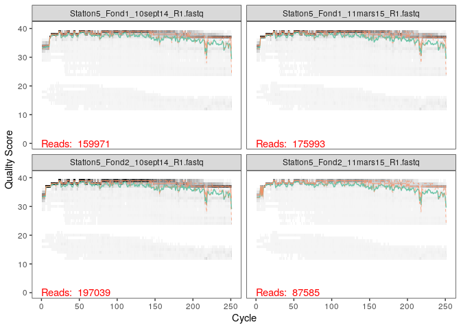
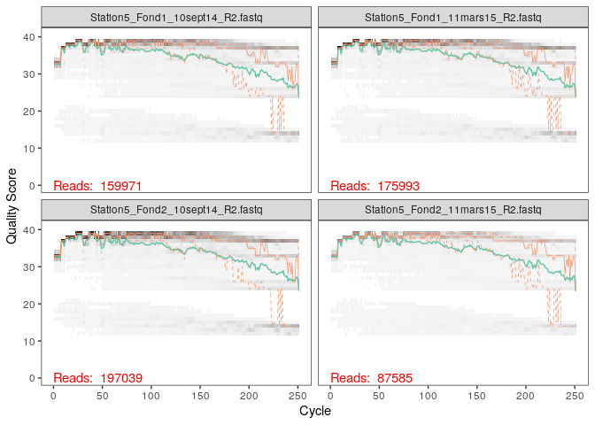
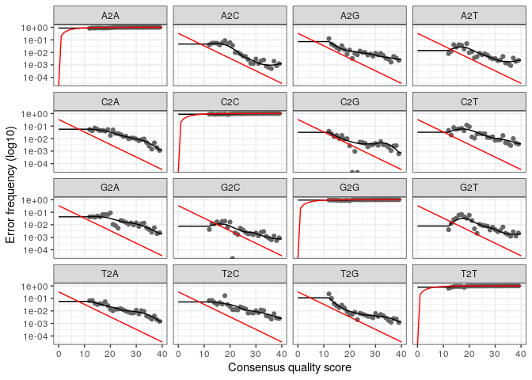
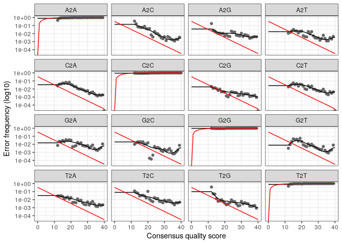
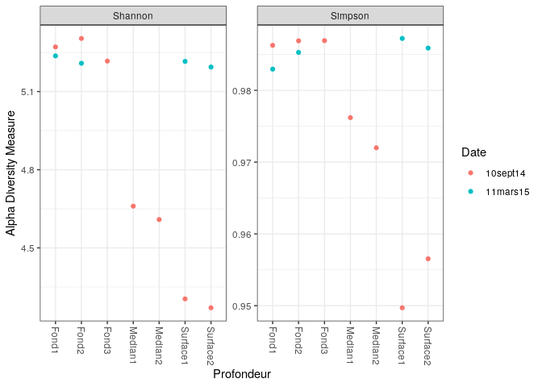
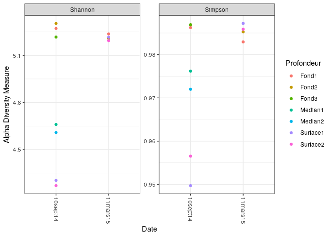
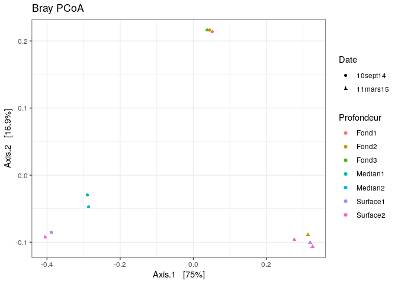
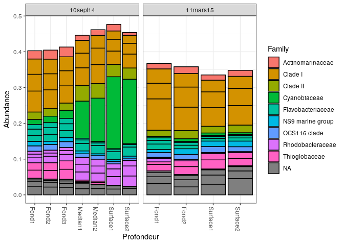

Data rade de Brest
================

  - [Les données](#les-données)
  - [Filtration des données](#filtration-des-données)
  - [Débruitage des données](#débruitage-des-données)
  - [Paires de reads](#paires-de-reads)
  - [Chimères](#chimères)
  - [Taxonomie](#taxonomie)
  - [Alpha-diversité](#alpha-diversité)
  - [Ordination](#ordination)
  - [Biomarqueurs](#biomarqueurs)
  - [Conclusion](#conclusion)

``` r
library(dada2)
```

    ## Loading required package: Rcpp

# Les données

Les données de la rade de Brest sont chargées, et les données du
10sept14 et du 11mars15 sont groupées. On indique le chemin du
répertoire.

``` r
path <- "~/St_Stratif_10sept14"
list.files(path)
```

    ##  [1] "filtered"                            "Station5_Fond1_10sept14_R1.fastq"   
    ##  [3] "Station5_Fond1_10sept14_R2.fastq"    "Station5_Fond1_11mars15_R1.fastq"   
    ##  [5] "Station5_Fond1_11mars15_R2.fastq"    "Station5_Fond2_10sept14_R1.fastq"   
    ##  [7] "Station5_Fond2_10sept14_R2.fastq"    "Station5_Fond2_11mars15_R1.fastq"   
    ##  [9] "Station5_Fond2_11mars15_R2.fastq"    "Station5_Fond3_10sept14_R1.fastq"   
    ## [11] "Station5_Fond3_10sept14_R2.fastq"    "Station5_Median1_10sept14_R1.fastq" 
    ## [13] "Station5_Median1_10sept14_R2.fastq"  "Station5_Median2_10sept14_R1.fastq" 
    ## [15] "Station5_Median2_10sept14_R2.fastq"  "Station5_Surface1_10sept14_R1.fastq"
    ## [17] "Station5_Surface1_10sept14_R2.fastq" "Station5_Surface1_11mars15_R1.fastq"
    ## [19] "Station5_Surface1_11mars15_R2.fastq" "Station5_Surface2_10sept14_R1.fastq"
    ## [21] "Station5_Surface2_10sept14_R2.fastq" "Station5_Surface2_11mars15_R1.fastq"
    ## [23] "Station5_Surface2_11mars15_R2.fastq"

Ensuite on sépare les forwards et reverses en deux variables,
respectivement ‘fnFs’ et ‘fnRs’ en fonction de leurs noms grace à la
fonction ‘sort()’. Puis on raccourcit ces noms avec la fonction
‘strsplit()’, de sorte que le nom des échantillons n’indique que la
station, la profondeur, et la date de prélèvement.

``` r
fnFs <- sort(list.files(path, pattern="_R1.fastq", full.names = TRUE))
fnRs <- sort(list.files(path, pattern="_R2.fastq", full.names = TRUE))
sample.names <- sapply(strsplit(basename(fnFs), "R"), `[`, 1)
```

# Filtration des données

On visualise la qualité des quatre premiers reads forwards.

``` r
plotQualityProfile(fnFs[1:4])
```

<!-- -->

Le score de qualité semble diminuer légèrement vers 210bp, mais ne
descend pas en dessous de 30%.

``` r
plotQualityProfile(fnRs[1:4])
```

<!-- -->

Le score de qualité diminue en dessous de 30% vers les 200bp. On note
aussi un score de qualité plus faible pour les premières paires de
bases, cela est dû aux amorces.

On va donc couper les reads pour minimiser les erreurs.

Pour cela on créer deux variables ‘filtFs’ et ‘filtRs’ auquelles vont
être assignés les données filtrées.

``` r
filtFs <- file.path(path, "filtered", paste0(sample.names, "_F_filt.fastq.gz"))
filtRs <- file.path(path, "filtered", paste0(sample.names, "_R_filt.fastq.gz"))
names(filtFs) <- sample.names
names(filtRs) <- sample.names
```

Ensuite avec la fonction ‘filterAndTrim()’ on coupe les reads. Les
forwards à 240bp et les reverses à 200bp. Et on coupe les 21bp de gauche
pour enlever les amorces.

``` r
out <- filterAndTrim(fnFs, filtFs, fnRs, filtRs, truncLen=c(240,200), trimLeft = 21,
              maxN=0, maxEE=c(2,2), truncQ=2, rm.phix=TRUE,
              compress=TRUE, multithread=TRUE)
head(out)
```

    ##                                    reads.in reads.out
    ## Station5_Fond1_10sept14_R1.fastq     159971    145448
    ## Station5_Fond1_11mars15_R1.fastq     175993    160423
    ## Station5_Fond2_10sept14_R1.fastq     197039    177018
    ## Station5_Fond2_11mars15_R1.fastq      87585     79989
    ## Station5_Fond3_10sept14_R1.fastq     117140    106150
    ## Station5_Median1_10sept14_R1.fastq   116519    106745

# Débruitage des données

On calcul d’abord le taux d’erreur des forwards et des reverses.

``` r
errF <- learnErrors(filtFs, multithread=TRUE)
```

    ## 105752691 total bases in 482889 reads from 3 samples will be used for learning the error rates.

``` r
errR <- learnErrors(filtRs, multithread=TRUE)
```

    ## 100755162 total bases in 562878 reads from 4 samples will be used for learning the error rates.

On visualise les taux d’erreur.

``` r
plotErrors(errF, nominalQ=TRUE)
```

    ## Warning: Transformation introduced infinite values in continuous y-axis
    
    ## Warning: Transformation introduced infinite values in continuous y-axis

<!-- -->

``` r
plotErrors(errR, nominalQ=TRUE)
```

    ## Warning: Transformation introduced infinite values in continuous y-axis
    
    ## Warning: Transformation introduced infinite values in continuous y-axis

<!-- -->

Puis on débruite avec la fonction ‘dada()’ qui enlève les erreurs de
séquençage en dessous des seuils calculés précédemment.

``` r
dadaFs <- dada(filtFs, err=errF, multithread=TRUE)
```

    ## Sample 1 - 145448 reads in 37907 unique sequences.
    ## Sample 2 - 160423 reads in 35863 unique sequences.
    ## Sample 3 - 177018 reads in 47212 unique sequences.
    ## Sample 4 - 79989 reads in 20356 unique sequences.
    ## Sample 5 - 106150 reads in 30255 unique sequences.
    ## Sample 6 - 106745 reads in 28836 unique sequences.
    ## Sample 7 - 98823 reads in 25824 unique sequences.
    ## Sample 8 - 107427 reads in 26733 unique sequences.
    ## Sample 9 - 71082 reads in 17976 unique sequences.
    ## Sample 10 - 78645 reads in 20422 unique sequences.
    ## Sample 11 - 91534 reads in 24487 unique sequences.

``` r
dadaRs <- dada(filtRs, err=errR, multithread=TRUE)
```

    ## Sample 1 - 145448 reads in 45486 unique sequences.
    ## Sample 2 - 160423 reads in 41638 unique sequences.
    ## Sample 3 - 177018 reads in 55554 unique sequences.
    ## Sample 4 - 79989 reads in 23239 unique sequences.
    ## Sample 5 - 106150 reads in 34625 unique sequences.
    ## Sample 6 - 106745 reads in 31673 unique sequences.
    ## Sample 7 - 98823 reads in 29093 unique sequences.
    ## Sample 8 - 107427 reads in 28947 unique sequences.
    ## Sample 9 - 71082 reads in 21426 unique sequences.
    ## Sample 10 - 78645 reads in 22051 unique sequences.
    ## Sample 11 - 91534 reads in 28266 unique sequences.

# Paires de reads

Maintenant on lie les paires de reads avec la fonction ‘mergePairs()’.

``` r
mergers <- mergePairs(dadaFs, filtFs, dadaRs, filtRs, verbose=TRUE)
```

    ## 117318 paired-reads (in 5196 unique pairings) successfully merged out of 141000 (in 21451 pairings) input.

    ## 138940 paired-reads (in 4296 unique pairings) successfully merged out of 156462 (in 15709 pairings) input.

    ## 142188 paired-reads (in 6989 unique pairings) successfully merged out of 171439 (in 27056 pairings) input.

    ## 67622 paired-reads (in 2721 unique pairings) successfully merged out of 77764 (in 9556 pairings) input.

    ## 83613 paired-reads (in 3458 unique pairings) successfully merged out of 102224 (in 16304 pairings) input.

    ## 86212 paired-reads (in 3348 unique pairings) successfully merged out of 103447 (in 14293 pairings) input.

    ## 80661 paired-reads (in 2727 unique pairings) successfully merged out of 95866 (in 12350 pairings) input.

    ## 89385 paired-reads (in 3073 unique pairings) successfully merged out of 104354 (in 12135 pairings) input.

    ## 59716 paired-reads (in 1939 unique pairings) successfully merged out of 68711 (in 7974 pairings) input.

    ## 66157 paired-reads (in 1763 unique pairings) successfully merged out of 76701 (in 8283 pairings) input.

    ## 75048 paired-reads (in 3149 unique pairings) successfully merged out of 88514 (in 12054 pairings) input.

``` r
head(mergers[[1]])
```

    ##                                                                                                                                                                                                                                                                                                                                                                                sequence
    ## 1     TACGAAGGGACCTAGCGTAGTTCGGAATTACTGGGCTTAAAGAGTTCGTAGGTGGTTGAAAAAGTTAGTGGTGAAATCCCAGAGCTTAACTCTGGAACTGCCATTAAAACTTTTCAGCTAGAGTATGATAGAGGAAAGCAGAATTTCTAGTGTAGAGGTGAAATTCGTAGATATTAGAAAGAATACCAATTGCGAAGGCAGCTTTCTGGATCATTACTGACACTGAGGAACGAAAGCATGGGTAGCGAAGAGGATTAGATACCCTCGTAGTCCATGCCGTAAACGATGTGTGTTAGACGTTGGAAATTTATTTTCAGTGTCGCAGGGAAACCGATAAACACACCGCCTGGGGAGTACGACCGCAAGGTT
    ## 2     TACGAAGGGACCTAGCGTAGTTCGGAATTACTGGGCTTAAAGAGTTCGTAGGTGGTTGAAAAAGTTGGTGGTGAAATCCCAGAGCTTAACTCTGGAACTGCCATCAAAACTTTTCAGCTAGAGTATGATAGAGGAAAGCAGAATTTCTAGTGTAGAGGTGAAATTCGTAGATATTAGAAAGAATACCAATTGCGAAGGCAGCTTTCTGGATCATTACTGACACTGAGGAACGAAAGCATGGGTAGCGAAGAGGATTAGATACCCTCGTAGTCCATGCCGTAAACGATGTGTGTTAGACGTTGGAAATTTATTTTCAGTGTCGCAGCGAAAGCGATAAACACACCGCCTGGGGAGTACGACCGCAAGGTT
    ## 3     TACGAAGGGACCTAGCGTAGTTCGGAATTACTGGGCTTAAAGAGTTCGTAGGTGGTTGAAAAAGTTGGTGGTGAAATCCCAGAGCTTAACTCTGGAACTGCCATCAAAACTTTTCAGCTAGAGTTTGATAGAGGAAAGCAGAATTTCTAGTGTAGAGGTGAAATTCGTAGATATTAGAAAGAATACCAATTGCGAAGGCAGCTTTCTGGATCATTACTGACACTGAGGAACGAAAGCATGGGTAGCGAAGAGGATTAGATACCCTCGTAGTCCATGCCGTAAACGATGTGTGTTAGACGTTGGAAATTTATTTTCAGTGTCGCAGCGAAAGCGATAAACACACCGCCTGGGGAGTACGACCGCAAGGTT
    ## 4     TACGAAGGGACCTAGCGTAGTTCGGAATTACTGGGCTTAAAGAGTTCGTAGGTGGTTGAAAAAGTTAGTGGTGAAATCCCAGAGCTTAACTCTGGAACTGCCATTAAAACTTTTCAGCTAGAGTATGATAGAGGAAAGCAGAATTTCTAGTGTAGAGGTGAAATTCGTAGATATTAGAAAGAATACCAATTGCGAAGGCAGCTTTCTGGATCATTACTGACACTGAGGAACGAAAGCATGGGTAGCGAAGAGGATTAGATACCCTCGTAGTCCATGCCGTAAACGATGTGTGTTAGACGTTGGAAATTTATTTTCAGTGTCGCAGCGAAAGCGATAAACACACCGCCTGGGGAGTACGACCGCAAGGTT
    ## 5     TACGAAGGGACCTAGCGTAGTTCGGAATTACTGGGCTTAAAGAGTTCGTAGGTGGTTGAAAAAGTTGGTGGTGAAATCCCAGAGCTTAACTCTGGAACTGCCATCAAAACTTTTCAGCTAGAGTATGATAGAGGAAAGCAGAATTTCTAGTGTAGAGGTGAAATTCGTAGATATTAGAAAGAATACCAATTGCGAAGGCAGCTTTCTGGATCATTACTGACACTGAGGAACGAAAGCATGGGTAGCGAAGAGGATTAGATACCCTCGTAGTCCATGCCGTAAACGATGTGTGTTAGACGTTGGAAATTTATTTTCAGTGTCGCAGGGAAACCGATAAACACACCGCCTGGGGAGTACGACCGCAAGGTT
    ## 6 TACGAGGGGTCCTAGCGTTGTCCGGATTTACTGGGCGTAAAGGGTACGTAGGCGTTTTAATAAGTTGTATGTTAAATATCTTAGCTTAACTAAGAAAGTGCATACAAAACTGTTAAGATAGAGTTTGAGAGAGGAACGCAGAATTCATGGTGGAGCGGTGACATGCGTAGATATCATGAGGAAAGTCAAATGCGAAGGCAGCCTTCTGGCTCAAAACTGACGCTGAGGTACGAAAGCGTGGGGAGCGAACAGGATTAGATACCCTGGTAGTCCACGCCGTAAACGATGAGTATTTGGTGCTGGGGGATTCGACCCTTTCAGTGCCGTAGCTAACGCGATAAATACTCCGCCTGGGGACTACGATCGCAAGATT
    ##   abundance forward reverse nmatch nmismatch nindel prefer accept
    ## 1      5170       1       2     29         0      0      2   TRUE
    ## 2      4129       2       1     29         0      0      2   TRUE
    ## 3      3757       3       1     29         0      0      2   TRUE
    ## 4      2481       1       1     29         0      0      2   TRUE
    ## 5      2182       2       2     29         0      0      2   TRUE
    ## 6      2132       5       9     25         0      0      1   TRUE

On forme une table d’observation des séquences fusionnées.

``` r
seqtab <- makeSequenceTable(mergers)
dim(seqtab)
```

    ## [1]    11 19426

``` r
table(nchar(getSequences(seqtab)))
```

    ## 
    ##  352  353  362  363  364  365  366  367  368  369  370  371  372  373  374  375 
    ##    1    1    1    1    4  183   27  165  184 5608 3594 2312 2613 2738  126 1770 
    ##  376  377  378  382  386 
    ##   90    4    1    1    2

La matrice contient 19 426 ASVs, d’une longueur principalement entre
365bp et 376bp.

# Chimères

On retire les chimères restantes avec la fonction ‘removeBimeraDenovo()’
qui va repérer les séquences bimériques.

``` r
seqtab.nochim <- removeBimeraDenovo(seqtab, method="consensus", multithread=TRUE, verbose=TRUE)
```

    ## Identified 17869 bimeras out of 19426 input sequences.

``` r
dim(seqtab.nochim)
```

    ## [1]   11 1557

17 869 chimères ont été identifiées et enlevées, il reste 1 557
séquences.

``` r
sum(seqtab.nochim)/sum(seqtab)
```

    ## [1] 0.7769154

La fréquence chimérique est de 0.78.

On peut vérifier la perte de séquences à chaque étapes de filtration.

``` r
getN <- function(x) sum(getUniques(x))
track <- cbind(out, sapply(dadaFs, getN), sapply(dadaRs, getN), sapply(mergers, getN), rowSums(seqtab.nochim))

colnames(track) <- c("input", "filtered", "denoisedF", "denoisedR", "merged", "nonchim")
rownames(track) <- sample.names
head(track)
```

    ##                             input filtered denoisedF denoisedR merged nonchim
    ## Station5_Fond1_10sept14_   159971   145448    142931    143292 117318   87962
    ## Station5_Fond1_11mars15_   175993   160423    158128    158473 138940  111552
    ## Station5_Fond2_10sept14_   197039   177018    173601    174591 142188  103668
    ## Station5_Fond2_11mars15_    87585    79989     78618     78926  67622   54711
    ## Station5_Fond3_10sept14_   117140   106150    103806    104338  83613   64259
    ## Station5_Median1_10sept14_ 116519   106745    104811    105173  86212   65559

Il semble que l’on perde des séquences principalement aux étapes de
fusion des paires et de filtration des chimères. Cependant il nous reste
bien assez de séquences pour faire nos analyses.

# Taxonomie

On utilise une taxonomie de la base de données Silva, que l’on assigne
aux données filtrées finales.

``` r
taxa <- assignTaxonomy(seqtab.nochim, "~/silva_nr99_v138_train_set.fa.gz", multithread = TRUE)
```

``` r
taxa.print <- taxa
rownames(taxa.print) <- NULL
taxa.print
```

    ##         Kingdom    Phylum                          Class                     
    ##    [1,] "Bacteria" "Proteobacteria"                "Alphaproteobacteria"     
    ##    [2,] "Bacteria" "Cyanobacteria"                 "Cyanobacteriia"          
    ##    [3,] "Bacteria" "Proteobacteria"                "Alphaproteobacteria"     
    ##    [4,] "Bacteria" "Proteobacteria"                "Alphaproteobacteria"     
    ##    [5,] "Bacteria" "Proteobacteria"                "Alphaproteobacteria"     
    ##    [6,] "Bacteria" "Actinobacteriota"              "Acidimicrobiia"          
    ##    [7,] "Bacteria" "Bacteroidota"                  "Bacteroidia"             
    ##    [8,] "Bacteria" "Proteobacteria"                "Gammaproteobacteria"     
    ##    [9,] "Bacteria" "Marinimicrobia (SAR406 clade)" NA                        
    ##   [10,] "Bacteria" "Proteobacteria"                "Gammaproteobacteria"     
    ##   [11,] "Bacteria" "Proteobacteria"                "Alphaproteobacteria"     
    ##   [12,] "Bacteria" "Cyanobacteria"                 "Cyanobacteriia"          
    ##   [13,] "Bacteria" "Proteobacteria"                "Alphaproteobacteria"     
    ##   [14,] "Bacteria" "Proteobacteria"                "Alphaproteobacteria"     
    ##   [15,] "Bacteria" "Bacteroidota"                  "Bacteroidia"             
    ##   [16,] "Bacteria" "Proteobacteria"                "Alphaproteobacteria"     
    ##   [17,] "Bacteria" "Proteobacteria"                "Gammaproteobacteria"     
    ##   [18,] "Bacteria" "Bacteroidota"                  "Bacteroidia"             
    ##   [19,] "Bacteria" "Bacteroidota"                  "Bacteroidia"             
    ##   [20,] "Bacteria" "Marinimicrobia (SAR406 clade)" NA                        
    ##   [21,] "Bacteria" "Proteobacteria"                "Alphaproteobacteria"     
    ##   [22,] "Bacteria" "Proteobacteria"                "Gammaproteobacteria"     
    ##   [23,] "Bacteria" "Proteobacteria"                "Alphaproteobacteria"     
    ##   [24,] "Bacteria" "Bacteroidota"                  "Bacteroidia"             
    ##   [25,] "Bacteria" "Proteobacteria"                "Gammaproteobacteria"     
    ##   [26,] "Bacteria" "Proteobacteria"                "Alphaproteobacteria"     
    ##   [27,] "Bacteria" "Verrucomicrobiota"             "Verrucomicrobiae"        
    ##   [28,] "Bacteria" "Proteobacteria"                "Alphaproteobacteria"     
    ##   [29,] "Bacteria" "Proteobacteria"                "Alphaproteobacteria"     
    ##   [30,] "Bacteria" "Proteobacteria"                "Alphaproteobacteria"     
    ##   [31,] "Bacteria" "Bacteroidota"                  "Bacteroidia"             
    ##   [32,] "Bacteria" "Cyanobacteria"                 "Cyanobacteriia"          
    ##   [33,] "Bacteria" "Proteobacteria"                "Gammaproteobacteria"     
    ##   [34,] "Bacteria" "Cyanobacteria"                 "Cyanobacteriia"          
    ##   [35,] "Bacteria" "Bacteroidota"                  "Bacteroidia"             
    ##   [36,] "Bacteria" "Bacteroidota"                  "Bacteroidia"             
    ##   [37,] "Bacteria" "Proteobacteria"                "Gammaproteobacteria"     
    ##   [38,] "Bacteria" "Proteobacteria"                "Alphaproteobacteria"     
    ##   [39,] "Bacteria" "Bacteroidota"                  "Bacteroidia"             
    ##   [40,] "Bacteria" "Marinimicrobia (SAR406 clade)" NA                        
    ##   [41,] "Bacteria" "Bacteroidota"                  "Bacteroidia"             
    ##   [42,] "Bacteria" "Bacteroidota"                  "Bacteroidia"             
    ##   [43,] "Bacteria" "Proteobacteria"                "Alphaproteobacteria"     
    ##   [44,] "Bacteria" "Proteobacteria"                "Gammaproteobacteria"     
    ##   [45,] "Bacteria" "Bacteroidota"                  "Bacteroidia"             
    ##   [46,] "Bacteria" "Bacteroidota"                  "Bacteroidia"             
    ##   [47,] "Bacteria" "Proteobacteria"                "Gammaproteobacteria"     
    ##   [48,] "Bacteria" "Proteobacteria"                "Gammaproteobacteria"     
    ##   [49,] "Bacteria" "Proteobacteria"                "Alphaproteobacteria"     
    ##   [50,] "Bacteria" "Proteobacteria"                "Gammaproteobacteria"     
    ##   [51,] "Bacteria" "Bacteroidota"                  "Bacteroidia"             
    ##   [52,] "Bacteria" "Proteobacteria"                "Gammaproteobacteria"     
    ##   [53,] "Bacteria" "Bacteroidota"                  "Bacteroidia"             
    ##   [54,] "Bacteria" "Cyanobacteria"                 "Cyanobacteriia"          
    ##   [55,] "Bacteria" "Proteobacteria"                "Gammaproteobacteria"     
    ##   [56,] "Bacteria" "Proteobacteria"                "Gammaproteobacteria"     
    ##   [57,] "Bacteria" "Bacteroidota"                  "Bacteroidia"             
    ##   [58,] "Bacteria" "Proteobacteria"                "Gammaproteobacteria"     
    ##   [59,] "Bacteria" "Proteobacteria"                "Alphaproteobacteria"     
    ##   [60,] "Bacteria" "Bacteroidota"                  "Bacteroidia"             
    ##   [61,] "Bacteria" "Verrucomicrobiota"             "Verrucomicrobiae"        
    ##   [62,] "Bacteria" "Bacteroidota"                  "Bacteroidia"             
    ##   [63,] "Bacteria" "Bacteroidota"                  "Bacteroidia"             
    ##   [64,] "Bacteria" "Bacteroidota"                  "Bacteroidia"             
    ##   [65,] "Bacteria" "Proteobacteria"                "Gammaproteobacteria"     
    ##   [66,] "Bacteria" "SAR324 clade(Marine group B)"  NA                        
    ##   [67,] "Bacteria" "Proteobacteria"                "Gammaproteobacteria"     
    ##   [68,] "Bacteria" "Proteobacteria"                "Alphaproteobacteria"     
    ##   [69,] "Bacteria" "Bacteroidota"                  "Bacteroidia"             
    ##   [70,] "Bacteria" "Proteobacteria"                "Gammaproteobacteria"     
    ##   [71,] "Bacteria" "Proteobacteria"                "Gammaproteobacteria"     
    ##   [72,] "Bacteria" "Proteobacteria"                "Alphaproteobacteria"     
    ##   [73,] "Bacteria" "Proteobacteria"                "Alphaproteobacteria"     
    ##   [74,] "Bacteria" "Proteobacteria"                "Gammaproteobacteria"     
    ##   [75,] "Bacteria" "Nitrospinota"                  "Nitrospinia"             
    ##   [76,] "Bacteria" "Marinimicrobia (SAR406 clade)" NA                        
    ##   [77,] "Bacteria" "Verrucomicrobiota"             "Verrucomicrobiae"        
    ##   [78,] "Bacteria" "Proteobacteria"                "Alphaproteobacteria"     
    ##   [79,] "Bacteria" "Proteobacteria"                "Gammaproteobacteria"     
    ##   [80,] "Bacteria" "Cyanobacteria"                 "Cyanobacteriia"          
    ##   [81,] "Bacteria" "Proteobacteria"                "Alphaproteobacteria"     
    ##   [82,] "Bacteria" "Cyanobacteria"                 "Cyanobacteriia"          
    ##   [83,] "Bacteria" "Proteobacteria"                "Gammaproteobacteria"     
    ##   [84,] "Bacteria" "Cyanobacteria"                 "Cyanobacteriia"          
    ##   [85,] "Bacteria" "Bacteroidota"                  "Rhodothermia"            
    ##   [86,] "Bacteria" "Bacteroidota"                  "Bacteroidia"             
    ##   [87,] "Bacteria" "Cyanobacteria"                 "Cyanobacteriia"          
    ##   [88,] "Bacteria" "Bacteroidota"                  "Bacteroidia"             
    ##   [89,] "Bacteria" "Proteobacteria"                "Alphaproteobacteria"     
    ##   [90,] "Bacteria" "Proteobacteria"                "Alphaproteobacteria"     
    ##   [91,] "Bacteria" "Bacteroidota"                  "Bacteroidia"             
    ##   [92,] "Bacteria" "Proteobacteria"                "Alphaproteobacteria"     
    ##   [93,] "Bacteria" "Proteobacteria"                "Gammaproteobacteria"     
    ##   [94,] "Bacteria" "Bacteroidota"                  "Bacteroidia"             
    ##   [95,] "Bacteria" "Proteobacteria"                "Alphaproteobacteria"     
    ##   [96,] "Bacteria" "Bacteroidota"                  "Bacteroidia"             
    ##   [97,] "Bacteria" "Bacteroidota"                  "Bacteroidia"             
    ##   [98,] "Bacteria" "Proteobacteria"                "Alphaproteobacteria"     
    ##   [99,] "Bacteria" "Marinimicrobia (SAR406 clade)" NA                        
    ##  [100,] "Bacteria" "Proteobacteria"                "Gammaproteobacteria"     
    ##  [101,] "Bacteria" "Proteobacteria"                "Alphaproteobacteria"     
    ##  [102,] "Bacteria" "Proteobacteria"                "Gammaproteobacteria"     
    ##  [103,] "Bacteria" "Actinobacteriota"              "Acidimicrobiia"          
    ##  [104,] "Bacteria" "SAR324 clade(Marine group B)"  NA                        
    ##  [105,] "Bacteria" "Bacteroidota"                  "Bacteroidia"             
    ##  [106,] "Bacteria" "Marinimicrobia (SAR406 clade)" NA                        
    ##  [107,] "Bacteria" "Proteobacteria"                "Alphaproteobacteria"     
    ##  [108,] "Bacteria" "Cyanobacteria"                 "Cyanobacteriia"          
    ##  [109,] "Bacteria" "Proteobacteria"                "Alphaproteobacteria"     
    ##  [110,] "Bacteria" "Bacteroidota"                  "Bacteroidia"             
    ##  [111,] "Bacteria" "Marinimicrobia (SAR406 clade)" NA                        
    ##  [112,] "Bacteria" "Proteobacteria"                "Alphaproteobacteria"     
    ##  [113,] "Bacteria" "Proteobacteria"                "Alphaproteobacteria"     
    ##  [114,] "Bacteria" "Marinimicrobia (SAR406 clade)" NA                        
    ##  [115,] "Bacteria" "Proteobacteria"                "Gammaproteobacteria"     
    ##  [116,] "Bacteria" "Bacteroidota"                  "Bacteroidia"             
    ##  [117,] "Bacteria" "Proteobacteria"                "Gammaproteobacteria"     
    ##  [118,] "Bacteria" "Bacteroidota"                  "Bacteroidia"             
    ##  [119,] "Bacteria" "Marinimicrobia (SAR406 clade)" NA                        
    ##  [120,] "Bacteria" "Verrucomicrobiota"             "Verrucomicrobiae"        
    ##  [121,] "Bacteria" "Nitrospinota"                  "Nitrospinia"             
    ##  [122,] "Bacteria" "Cyanobacteria"                 "Cyanobacteriia"          
    ##  [123,] "Bacteria" "Proteobacteria"                "Alphaproteobacteria"     
    ##  [124,] "Bacteria" "Bacteroidota"                  "Bacteroidia"             
    ##  [125,] "Bacteria" "Proteobacteria"                "Alphaproteobacteria"     
    ##  [126,] "Bacteria" "Proteobacteria"                "Alphaproteobacteria"     
    ##  [127,] "Bacteria" "Bacteroidota"                  "Bacteroidia"             
    ##  [128,] "Bacteria" "Proteobacteria"                "Gammaproteobacteria"     
    ##  [129,] "Bacteria" "Proteobacteria"                "Alphaproteobacteria"     
    ##  [130,] "Bacteria" "Proteobacteria"                "Gammaproteobacteria"     
    ##  [131,] "Bacteria" "Proteobacteria"                "Alphaproteobacteria"     
    ##  [132,] "Bacteria" "Proteobacteria"                "Alphaproteobacteria"     
    ##  [133,] "Bacteria" "Bacteroidota"                  "Bacteroidia"             
    ##  [134,] "Bacteria" "Bacteroidota"                  "Bacteroidia"             
    ##  [135,] "Bacteria" "Bacteroidota"                  "Bacteroidia"             
    ##  [136,] "Bacteria" "Proteobacteria"                "Alphaproteobacteria"     
    ##  [137,] "Bacteria" "Cyanobacteria"                 "Cyanobacteriia"          
    ##  [138,] "Bacteria" "Proteobacteria"                "Alphaproteobacteria"     
    ##  [139,] "Bacteria" "Bacteroidota"                  "Bacteroidia"             
    ##  [140,] "Bacteria" "Proteobacteria"                "Alphaproteobacteria"     
    ##  [141,] "Bacteria" "Proteobacteria"                "Gammaproteobacteria"     
    ##  [142,] "Bacteria" "Proteobacteria"                "Alphaproteobacteria"     
    ##  [143,] "Bacteria" "Proteobacteria"                "Gammaproteobacteria"     
    ##  [144,] "Bacteria" "Proteobacteria"                "Alphaproteobacteria"     
    ##  [145,] "Bacteria" "Proteobacteria"                "Gammaproteobacteria"     
    ##  [146,] "Bacteria" "Proteobacteria"                "Alphaproteobacteria"     
    ##  [147,] "Bacteria" "Bacteroidota"                  "Bacteroidia"             
    ##  [148,] "Bacteria" "Proteobacteria"                "Alphaproteobacteria"     
    ##  [149,] "Bacteria" "Proteobacteria"                "Alphaproteobacteria"     
    ##  [150,] "Bacteria" "Proteobacteria"                "Gammaproteobacteria"     
    ##  [151,] "Bacteria" "Proteobacteria"                "Gammaproteobacteria"     
    ##  [152,] "Bacteria" "Proteobacteria"                "Alphaproteobacteria"     
    ##  [153,] "Bacteria" "Proteobacteria"                "Alphaproteobacteria"     
    ##  [154,] "Bacteria" "Cyanobacteria"                 "Cyanobacteriia"          
    ##  [155,] "Bacteria" "Marinimicrobia (SAR406 clade)" NA                        
    ##  [156,] "Bacteria" "Proteobacteria"                "Gammaproteobacteria"     
    ##  [157,] "Bacteria" "Verrucomicrobiota"             "Verrucomicrobiae"        
    ##  [158,] "Bacteria" "Cyanobacteria"                 "Cyanobacteriia"          
    ##  [159,] "Bacteria" "Proteobacteria"                "Alphaproteobacteria"     
    ##  [160,] "Bacteria" "Proteobacteria"                "Alphaproteobacteria"     
    ##  [161,] "Bacteria" "Proteobacteria"                "Alphaproteobacteria"     
    ##  [162,] "Bacteria" "Marinimicrobia (SAR406 clade)" NA                        
    ##  [163,] "Bacteria" "Verrucomicrobiota"             "Verrucomicrobiae"        
    ##  [164,] "Bacteria" "Cyanobacteria"                 "Cyanobacteriia"          
    ##  [165,] "Bacteria" "Proteobacteria"                "Alphaproteobacteria"     
    ##  [166,] "Bacteria" "Verrucomicrobiota"             "Verrucomicrobiae"        
    ##  [167,] "Bacteria" "Proteobacteria"                "Gammaproteobacteria"     
    ##  [168,] "Bacteria" "Bacteroidota"                  "Bacteroidia"             
    ##  [169,] "Bacteria" "Proteobacteria"                "Alphaproteobacteria"     
    ##  [170,] "Bacteria" "Proteobacteria"                "Alphaproteobacteria"     
    ##  [171,] "Bacteria" "Bacteroidota"                  "Bacteroidia"             
    ##  [172,] "Bacteria" "Cyanobacteria"                 "Cyanobacteriia"          
    ##  [173,] "Bacteria" "Proteobacteria"                "Alphaproteobacteria"     
    ##  [174,] "Bacteria" "Proteobacteria"                "Gammaproteobacteria"     
    ##  [175,] "Bacteria" "Cyanobacteria"                 "Cyanobacteriia"          
    ##  [176,] "Archaea"  "Crenarchaeota"                 "Nitrososphaeria"         
    ##  [177,] "Bacteria" "Nitrospinota"                  "Nitrospinia"             
    ##  [178,] "Bacteria" "Proteobacteria"                "Alphaproteobacteria"     
    ##  [179,] "Bacteria" "Bacteroidota"                  "Bacteroidia"             
    ##  [180,] "Bacteria" "Bacteroidota"                  "Bacteroidia"             
    ##  [181,] "Bacteria" "Marinimicrobia (SAR406 clade)" NA                        
    ##  [182,] "Bacteria" "Bacteroidota"                  "Bacteroidia"             
    ##  [183,] "Bacteria" "Proteobacteria"                "Alphaproteobacteria"     
    ##  [184,] "Bacteria" "Actinobacteriota"              "Acidimicrobiia"          
    ##  [185,] "Bacteria" "Marinimicrobia (SAR406 clade)" NA                        
    ##  [186,] "Bacteria" "Proteobacteria"                "Gammaproteobacteria"     
    ##  [187,] "Bacteria" "Proteobacteria"                "Gammaproteobacteria"     
    ##  [188,] "Bacteria" "Verrucomicrobiota"             "Verrucomicrobiae"        
    ##  [189,] "Bacteria" "Proteobacteria"                "Alphaproteobacteria"     
    ##  [190,] "Bacteria" "Verrucomicrobiota"             "Verrucomicrobiae"        
    ##  [191,] "Bacteria" "Verrucomicrobiota"             "Verrucomicrobiae"        
    ##  [192,] "Bacteria" "Proteobacteria"                "Gammaproteobacteria"     
    ##  [193,] "Bacteria" "Proteobacteria"                "Gammaproteobacteria"     
    ##  [194,] "Bacteria" "Proteobacteria"                "Alphaproteobacteria"     
    ##  [195,] "Bacteria" "SAR324 clade(Marine group B)"  NA                        
    ##  [196,] "Bacteria" "Nitrospinota"                  "Nitrospinia"             
    ##  [197,] "Bacteria" "Proteobacteria"                "Alphaproteobacteria"     
    ##  [198,] "Bacteria" "Proteobacteria"                "Gammaproteobacteria"     
    ##  [199,] "Bacteria" "Proteobacteria"                "Gammaproteobacteria"     
    ##  [200,] "Bacteria" "Bacteroidota"                  "Bacteroidia"             
    ##  [201,] "Bacteria" "Proteobacteria"                "Alphaproteobacteria"     
    ##  [202,] "Bacteria" "Planctomycetota"               "Planctomycetes"          
    ##  [203,] "Bacteria" "SAR324 clade(Marine group B)"  NA                        
    ##  [204,] "Bacteria" "Proteobacteria"                "Alphaproteobacteria"     
    ##  [205,] "Bacteria" "Bacteroidota"                  "Bacteroidia"             
    ##  [206,] "Bacteria" "Proteobacteria"                "Alphaproteobacteria"     
    ##  [207,] "Bacteria" "Marinimicrobia (SAR406 clade)" NA                        
    ##  [208,] "Bacteria" "Chloroflexi"                   "Dehalococcoidia"         
    ##  [209,] "Bacteria" "Planctomycetota"               "Planctomycetes"          
    ##  [210,] "Bacteria" "Proteobacteria"                "Gammaproteobacteria"     
    ##  [211,] "Bacteria" "Proteobacteria"                "Alphaproteobacteria"     
    ##  [212,] "Bacteria" "Marinimicrobia (SAR406 clade)" NA                        
    ##  [213,] "Bacteria" "Bacteroidota"                  "Bacteroidia"             
    ##  [214,] "Bacteria" "Dadabacteria"                  "Dadabacteriia"           
    ##  [215,] "Bacteria" "Cyanobacteria"                 "Cyanobacteriia"          
    ##  [216,] "Bacteria" "Proteobacteria"                "Gammaproteobacteria"     
    ##  [217,] "Bacteria" "Bacteroidota"                  "Bacteroidia"             
    ##  [218,] "Bacteria" "Proteobacteria"                "Alphaproteobacteria"     
    ##  [219,] "Bacteria" "Cyanobacteria"                 "Cyanobacteriia"          
    ##  [220,] "Bacteria" "Proteobacteria"                "Alphaproteobacteria"     
    ##  [221,] "Bacteria" "Verrucomicrobiota"             "Verrucomicrobiae"        
    ##  [222,] "Bacteria" "Verrucomicrobiota"             "Verrucomicrobiae"        
    ##  [223,] "Bacteria" "Proteobacteria"                "Alphaproteobacteria"     
    ##  [224,] "Bacteria" "Nitrospinota"                  "Nitrospinia"             
    ##  [225,] "Bacteria" "Bacteroidota"                  "Bacteroidia"             
    ##  [226,] "Bacteria" "Proteobacteria"                "Alphaproteobacteria"     
    ##  [227,] "Bacteria" "Bacteroidota"                  "Bacteroidia"             
    ##  [228,] "Bacteria" "Cyanobacteria"                 "Cyanobacteriia"          
    ##  [229,] "Bacteria" "Proteobacteria"                "Alphaproteobacteria"     
    ##  [230,] "Bacteria" "Proteobacteria"                "Alphaproteobacteria"     
    ##  [231,] "Bacteria" "Marinimicrobia (SAR406 clade)" NA                        
    ##  [232,] "Bacteria" "Proteobacteria"                "Alphaproteobacteria"     
    ##  [233,] "Bacteria" "Verrucomicrobiota"             "Verrucomicrobiae"        
    ##  [234,] "Bacteria" "Proteobacteria"                "Alphaproteobacteria"     
    ##  [235,] "Bacteria" "Proteobacteria"                "Alphaproteobacteria"     
    ##  [236,] "Bacteria" "Marinimicrobia (SAR406 clade)" NA                        
    ##  [237,] "Bacteria" "Bacteroidota"                  "Bacteroidia"             
    ##  [238,] "Archaea"  "Crenarchaeota"                 "Nitrososphaeria"         
    ##  [239,] "Bacteria" "Verrucomicrobiota"             "Verrucomicrobiae"        
    ##  [240,] "Bacteria" "Proteobacteria"                "Gammaproteobacteria"     
    ##  [241,] "Bacteria" "Proteobacteria"                "Alphaproteobacteria"     
    ##  [242,] "Bacteria" "Proteobacteria"                "Alphaproteobacteria"     
    ##  [243,] "Bacteria" "Verrucomicrobiota"             "Verrucomicrobiae"        
    ##  [244,] "Bacteria" "SAR324 clade(Marine group B)"  NA                        
    ##  [245,] "Bacteria" "Proteobacteria"                "Alphaproteobacteria"     
    ##  [246,] "Bacteria" "Bacteroidota"                  "Bacteroidia"             
    ##  [247,] "Bacteria" "Proteobacteria"                "Gammaproteobacteria"     
    ##  [248,] "Bacteria" "Bacteroidota"                  "Bacteroidia"             
    ##  [249,] "Bacteria" "Proteobacteria"                "Alphaproteobacteria"     
    ##  [250,] "Bacteria" "Proteobacteria"                "Alphaproteobacteria"     
    ##  [251,] "Bacteria" "Bacteroidota"                  "Bacteroidia"             
    ##  [252,] "Bacteria" "Verrucomicrobiota"             "Verrucomicrobiae"        
    ##  [253,] "Bacteria" "Proteobacteria"                "Alphaproteobacteria"     
    ##  [254,] "Bacteria" "Proteobacteria"                "Alphaproteobacteria"     
    ##  [255,] "Bacteria" "Proteobacteria"                "Alphaproteobacteria"     
    ##  [256,] "Bacteria" "Proteobacteria"                "Alphaproteobacteria"     
    ##  [257,] "Bacteria" "Proteobacteria"                "Alphaproteobacteria"     
    ##  [258,] "Bacteria" "Proteobacteria"                "Gammaproteobacteria"     
    ##  [259,] "Bacteria" "Bacteroidota"                  "Bacteroidia"             
    ##  [260,] "Bacteria" "Bacteroidota"                  "Bacteroidia"             
    ##  [261,] "Bacteria" "Proteobacteria"                "Alphaproteobacteria"     
    ##  [262,] "Bacteria" "Proteobacteria"                "Alphaproteobacteria"     
    ##  [263,] "Bacteria" "Proteobacteria"                "Gammaproteobacteria"     
    ##  [264,] "Bacteria" "Proteobacteria"                "Alphaproteobacteria"     
    ##  [265,] "Bacteria" "Bacteroidota"                  "Bacteroidia"             
    ##  [266,] "Bacteria" "Proteobacteria"                "Alphaproteobacteria"     
    ##  [267,] "Bacteria" "Proteobacteria"                "Alphaproteobacteria"     
    ##  [268,] "Bacteria" "Proteobacteria"                "Alphaproteobacteria"     
    ##  [269,] "Bacteria" "Verrucomicrobiota"             "Verrucomicrobiae"        
    ##  [270,] "Bacteria" "Proteobacteria"                "Alphaproteobacteria"     
    ##  [271,] "Bacteria" "Nitrospinota"                  "Nitrospinia"             
    ##  [272,] "Bacteria" "Marinimicrobia (SAR406 clade)" NA                        
    ##  [273,] "Bacteria" "Proteobacteria"                "Alphaproteobacteria"     
    ##  [274,] "Bacteria" "Proteobacteria"                "Alphaproteobacteria"     
    ##  [275,] "Bacteria" "Marinimicrobia (SAR406 clade)" NA                        
    ##  [276,] "Bacteria" "Verrucomicrobiota"             "Verrucomicrobiae"        
    ##  [277,] "Bacteria" "Bacteroidota"                  "Bacteroidia"             
    ##  [278,] "Bacteria" "Proteobacteria"                "Alphaproteobacteria"     
    ##  [279,] "Bacteria" "Cyanobacteria"                 "Cyanobacteriia"          
    ##  [280,] "Bacteria" "Proteobacteria"                "Alphaproteobacteria"     
    ##  [281,] "Bacteria" "Proteobacteria"                "Alphaproteobacteria"     
    ##  [282,] "Bacteria" "Proteobacteria"                "Gammaproteobacteria"     
    ##  [283,] "Archaea"  "Thermoplasmatota"              "Thermoplasmata"          
    ##  [284,] "Bacteria" "Proteobacteria"                "Alphaproteobacteria"     
    ##  [285,] "Bacteria" "Marinimicrobia (SAR406 clade)" NA                        
    ##  [286,] "Bacteria" "Proteobacteria"                "Gammaproteobacteria"     
    ##  [287,] "Bacteria" "Proteobacteria"                "Alphaproteobacteria"     
    ##  [288,] "Bacteria" "Proteobacteria"                "Alphaproteobacteria"     
    ##  [289,] "Bacteria" "Proteobacteria"                "Alphaproteobacteria"     
    ##  [290,] "Bacteria" "Cyanobacteria"                 "Cyanobacteriia"          
    ##  [291,] "Bacteria" "Verrucomicrobiota"             "Verrucomicrobiae"        
    ##  [292,] "Bacteria" "Cyanobacteria"                 "Cyanobacteriia"          
    ##  [293,] "Bacteria" "Nitrospinota"                  "Nitrospinia"             
    ##  [294,] "Bacteria" "Proteobacteria"                "Alphaproteobacteria"     
    ##  [295,] "Bacteria" "Proteobacteria"                "Alphaproteobacteria"     
    ##  [296,] "Bacteria" "Bacteroidota"                  "Bacteroidia"             
    ##  [297,] "Bacteria" "Verrucomicrobiota"             "Verrucomicrobiae"        
    ##  [298,] "Bacteria" "Proteobacteria"                "Alphaproteobacteria"     
    ##  [299,] "Bacteria" "Nitrospinota"                  "Nitrospinia"             
    ##  [300,] "Bacteria" "Proteobacteria"                "Alphaproteobacteria"     
    ##  [301,] "Bacteria" "Proteobacteria"                "Alphaproteobacteria"     
    ##  [302,] "Bacteria" "Proteobacteria"                "Alphaproteobacteria"     
    ##  [303,] "Bacteria" "Proteobacteria"                "Alphaproteobacteria"     
    ##  [304,] "Bacteria" "Proteobacteria"                "Alphaproteobacteria"     
    ##  [305,] "Bacteria" "Proteobacteria"                "Gammaproteobacteria"     
    ##  [306,] "Archaea"  "Thermoplasmatota"              "Thermoplasmata"          
    ##  [307,] "Bacteria" "Cyanobacteria"                 "Cyanobacteriia"          
    ##  [308,] "Bacteria" "Proteobacteria"                "Alphaproteobacteria"     
    ##  [309,] "Bacteria" "Proteobacteria"                "Alphaproteobacteria"     
    ##  [310,] "Bacteria" "Marinimicrobia (SAR406 clade)" NA                        
    ##  [311,] "Bacteria" "Proteobacteria"                "Gammaproteobacteria"     
    ##  [312,] "Bacteria" "Actinobacteriota"              "Acidimicrobiia"          
    ##  [313,] "Bacteria" "Proteobacteria"                "Alphaproteobacteria"     
    ##  [314,] "Bacteria" "Proteobacteria"                "Alphaproteobacteria"     
    ##  [315,] "Bacteria" "Verrucomicrobiota"             "Verrucomicrobiae"        
    ##  [316,] "Bacteria" "Proteobacteria"                "Alphaproteobacteria"     
    ##  [317,] "Bacteria" "PAUC34f"                       NA                        
    ##  [318,] "Bacteria" "Proteobacteria"                "Alphaproteobacteria"     
    ##  [319,] "Bacteria" "Cyanobacteria"                 "Cyanobacteriia"          
    ##  [320,] "Bacteria" "SAR324 clade(Marine group B)"  NA                        
    ##  [321,] "Bacteria" "Proteobacteria"                "Alphaproteobacteria"     
    ##  [322,] "Bacteria" "Proteobacteria"                "Alphaproteobacteria"     
    ##  [323,] "Bacteria" "Proteobacteria"                "Alphaproteobacteria"     
    ##  [324,] "Bacteria" "Marinimicrobia (SAR406 clade)" NA                        
    ##  [325,] "Bacteria" "Marinimicrobia (SAR406 clade)" NA                        
    ##  [326,] "Bacteria" "Proteobacteria"                "Gammaproteobacteria"     
    ##  [327,] "Bacteria" "Bacteroidota"                  "Bacteroidia"             
    ##  [328,] "Bacteria" "Proteobacteria"                "Alphaproteobacteria"     
    ##  [329,] "Bacteria" "Cyanobacteria"                 "Cyanobacteriia"          
    ##  [330,] "Bacteria" "Proteobacteria"                "Gammaproteobacteria"     
    ##  [331,] "Bacteria" "Proteobacteria"                "Alphaproteobacteria"     
    ##  [332,] "Bacteria" "Proteobacteria"                "Alphaproteobacteria"     
    ##  [333,] "Bacteria" "Proteobacteria"                "Alphaproteobacteria"     
    ##  [334,] "Bacteria" "Cyanobacteria"                 "Cyanobacteriia"          
    ##  [335,] "Bacteria" "Proteobacteria"                "Alphaproteobacteria"     
    ##  [336,] "Bacteria" "Proteobacteria"                "Alphaproteobacteria"     
    ##  [337,] "Bacteria" "Proteobacteria"                "Alphaproteobacteria"     
    ##  [338,] "Bacteria" "Chloroflexi"                   "Dehalococcoidia"         
    ##  [339,] "Bacteria" "Proteobacteria"                "Gammaproteobacteria"     
    ##  [340,] "Bacteria" "Bacteroidota"                  "Bacteroidia"             
    ##  [341,] "Bacteria" "Proteobacteria"                "Alphaproteobacteria"     
    ##  [342,] "Bacteria" "Dadabacteria"                  "Dadabacteriia"           
    ##  [343,] "Bacteria" "Proteobacteria"                "Alphaproteobacteria"     
    ##  [344,] "Bacteria" "Marinimicrobia (SAR406 clade)" NA                        
    ##  [345,] "Bacteria" "Proteobacteria"                "Alphaproteobacteria"     
    ##  [346,] "Bacteria" "Bacteroidota"                  "Bacteroidia"             
    ##  [347,] "Bacteria" "Proteobacteria"                "Alphaproteobacteria"     
    ##  [348,] "Bacteria" "Proteobacteria"                "Gammaproteobacteria"     
    ##  [349,] "Bacteria" "Verrucomicrobiota"             "Verrucomicrobiae"        
    ##  [350,] "Archaea"  "Crenarchaeota"                 "Nitrososphaeria"         
    ##  [351,] "Bacteria" "Proteobacteria"                "Gammaproteobacteria"     
    ##  [352,] "Bacteria" "Marinimicrobia (SAR406 clade)" NA                        
    ##  [353,] "Bacteria" "Proteobacteria"                "Alphaproteobacteria"     
    ##  [354,] "Bacteria" "Proteobacteria"                "Alphaproteobacteria"     
    ##  [355,] "Bacteria" "Proteobacteria"                "Gammaproteobacteria"     
    ##  [356,] "Bacteria" "Proteobacteria"                "Alphaproteobacteria"     
    ##  [357,] "Bacteria" "Bacteroidota"                  "Bacteroidia"             
    ##  [358,] "Bacteria" "Marinimicrobia (SAR406 clade)" NA                        
    ##  [359,] "Bacteria" "Proteobacteria"                "Alphaproteobacteria"     
    ##  [360,] "Bacteria" "Proteobacteria"                "Gammaproteobacteria"     
    ##  [361,] "Bacteria" "Bacteroidota"                  "Bacteroidia"             
    ##  [362,] "Bacteria" "Proteobacteria"                "Alphaproteobacteria"     
    ##  [363,] "Bacteria" "Proteobacteria"                "Gammaproteobacteria"     
    ##  [364,] "Bacteria" "Proteobacteria"                "Alphaproteobacteria"     
    ##  [365,] "Bacteria" "Proteobacteria"                "Gammaproteobacteria"     
    ##  [366,] "Bacteria" "Proteobacteria"                "Alphaproteobacteria"     
    ##  [367,] "Bacteria" "Bacteroidota"                  "Bacteroidia"             
    ##  [368,] "Bacteria" "Bacteroidota"                  "Bacteroidia"             
    ##  [369,] "Bacteria" "Proteobacteria"                "Alphaproteobacteria"     
    ##  [370,] "Bacteria" "Proteobacteria"                "Alphaproteobacteria"     
    ##  [371,] "Bacteria" "Proteobacteria"                "Alphaproteobacteria"     
    ##  [372,] "Bacteria" "Proteobacteria"                "Alphaproteobacteria"     
    ##  [373,] "Bacteria" "Proteobacteria"                "Alphaproteobacteria"     
    ##  [374,] "Bacteria" "Bacteroidota"                  "Bacteroidia"             
    ##  [375,] "Bacteria" "Marinimicrobia (SAR406 clade)" NA                        
    ##  [376,] "Bacteria" "SAR324 clade(Marine group B)"  NA                        
    ##  [377,] "Bacteria" "Proteobacteria"                "Alphaproteobacteria"     
    ##  [378,] "Bacteria" "Proteobacteria"                "Gammaproteobacteria"     
    ##  [379,] "Bacteria" "Proteobacteria"                "Gammaproteobacteria"     
    ##  [380,] "Bacteria" "Proteobacteria"                "Alphaproteobacteria"     
    ##  [381,] "Bacteria" "Proteobacteria"                "Alphaproteobacteria"     
    ##  [382,] "Bacteria" "Proteobacteria"                "Alphaproteobacteria"     
    ##  [383,] "Bacteria" "Actinobacteriota"              "Acidimicrobiia"          
    ##  [384,] "Bacteria" "Proteobacteria"                "Alphaproteobacteria"     
    ##  [385,] "Bacteria" "Chloroflexi"                   "Dehalococcoidia"         
    ##  [386,] "Bacteria" "Cyanobacteria"                 "Cyanobacteriia"          
    ##  [387,] "Bacteria" "Proteobacteria"                "Alphaproteobacteria"     
    ##  [388,] "Bacteria" "Proteobacteria"                "Alphaproteobacteria"     
    ##  [389,] "Bacteria" "Proteobacteria"                "Alphaproteobacteria"     
    ##  [390,] "Bacteria" "Bacteroidota"                  "Bacteroidia"             
    ##  [391,] "Bacteria" "Cyanobacteria"                 "Cyanobacteriia"          
    ##  [392,] "Bacteria" "Proteobacteria"                "Alphaproteobacteria"     
    ##  [393,] "Bacteria" "Proteobacteria"                "Alphaproteobacteria"     
    ##  [394,] "Bacteria" "Chloroflexi"                   "Dehalococcoidia"         
    ##  [395,] "Bacteria" "Proteobacteria"                "Alphaproteobacteria"     
    ##  [396,] "Bacteria" "Proteobacteria"                "Alphaproteobacteria"     
    ##  [397,] "Bacteria" "Proteobacteria"                "Gammaproteobacteria"     
    ##  [398,] "Bacteria" "Bacteroidota"                  "Bacteroidia"             
    ##  [399,] "Bacteria" "Proteobacteria"                "Alphaproteobacteria"     
    ##  [400,] "Bacteria" "Proteobacteria"                "Gammaproteobacteria"     
    ##  [401,] "Bacteria" "Proteobacteria"                "Alphaproteobacteria"     
    ##  [402,] "Bacteria" "Proteobacteria"                "Alphaproteobacteria"     
    ##  [403,] "Bacteria" "Proteobacteria"                "Alphaproteobacteria"     
    ##  [404,] "Bacteria" "Proteobacteria"                "Gammaproteobacteria"     
    ##  [405,] "Bacteria" "Proteobacteria"                "Gammaproteobacteria"     
    ##  [406,] "Bacteria" "Proteobacteria"                "Alphaproteobacteria"     
    ##  [407,] "Bacteria" "Proteobacteria"                "Alphaproteobacteria"     
    ##  [408,] "Bacteria" "Proteobacteria"                "Gammaproteobacteria"     
    ##  [409,] "Bacteria" "Bacteroidota"                  "Bacteroidia"             
    ##  [410,] "Bacteria" "Actinobacteriota"              "Acidimicrobiia"          
    ##  [411,] "Bacteria" "Verrucomicrobiota"             "Verrucomicrobiae"        
    ##  [412,] "Bacteria" "Bacteroidota"                  "Bacteroidia"             
    ##  [413,] "Bacteria" "Proteobacteria"                "Alphaproteobacteria"     
    ##  [414,] "Bacteria" "Proteobacteria"                "Gammaproteobacteria"     
    ##  [415,] "Bacteria" "Proteobacteria"                "Alphaproteobacteria"     
    ##  [416,] "Bacteria" "Bacteroidota"                  "Bacteroidia"             
    ##  [417,] "Bacteria" "Proteobacteria"                "Alphaproteobacteria"     
    ##  [418,] "Bacteria" "Desulfobacterota"              "Desulfuromonadia"        
    ##  [419,] "Bacteria" "Cyanobacteria"                 "Cyanobacteriia"          
    ##  [420,] "Bacteria" "Proteobacteria"                "Alphaproteobacteria"     
    ##  [421,] "Bacteria" "Proteobacteria"                "Alphaproteobacteria"     
    ##  [422,] "Archaea"  "Thermoplasmatota"              "Thermoplasmata"          
    ##  [423,] "Bacteria" "Cyanobacteria"                 "Cyanobacteriia"          
    ##  [424,] "Bacteria" "Proteobacteria"                "Gammaproteobacteria"     
    ##  [425,] "Bacteria" "Bacteroidota"                  "Bacteroidia"             
    ##  [426,] "Bacteria" "Proteobacteria"                "Alphaproteobacteria"     
    ##  [427,] "Bacteria" "Chloroflexi"                   "Dehalococcoidia"         
    ##  [428,] "Bacteria" "Chloroflexi"                   "JG30-KF-CM66"            
    ##  [429,] "Bacteria" "Proteobacteria"                "Gammaproteobacteria"     
    ##  [430,] "Bacteria" "Proteobacteria"                "Alphaproteobacteria"     
    ##  [431,] "Bacteria" "Proteobacteria"                "Alphaproteobacteria"     
    ##  [432,] "Bacteria" "Proteobacteria"                "Alphaproteobacteria"     
    ##  [433,] "Bacteria" "SAR324 clade(Marine group B)"  NA                        
    ##  [434,] "Bacteria" "Planctomycetota"               "Planctomycetes"          
    ##  [435,] "Bacteria" "Cyanobacteria"                 "Cyanobacteriia"          
    ##  [436,] "Bacteria" "Bacteroidota"                  "Bacteroidia"             
    ##  [437,] "Bacteria" "Proteobacteria"                "Gammaproteobacteria"     
    ##  [438,] "Bacteria" "Proteobacteria"                "Alphaproteobacteria"     
    ##  [439,] "Bacteria" "Proteobacteria"                "Alphaproteobacteria"     
    ##  [440,] "Bacteria" "Cyanobacteria"                 "Cyanobacteriia"          
    ##  [441,] "Bacteria" "Chloroflexi"                   "Dehalococcoidia"         
    ##  [442,] "Bacteria" "Proteobacteria"                "Alphaproteobacteria"     
    ##  [443,] "Bacteria" "Proteobacteria"                "Alphaproteobacteria"     
    ##  [444,] "Bacteria" "Cyanobacteria"                 "Cyanobacteriia"          
    ##  [445,] "Bacteria" "Proteobacteria"                "Alphaproteobacteria"     
    ##  [446,] "Bacteria" "Bacteroidota"                  "Bacteroidia"             
    ##  [447,] "Bacteria" "Proteobacteria"                "Alphaproteobacteria"     
    ##  [448,] "Bacteria" "Proteobacteria"                "Alphaproteobacteria"     
    ##  [449,] "Bacteria" "Bacteroidota"                  "Bacteroidia"             
    ##  [450,] "Bacteria" "Proteobacteria"                "Alphaproteobacteria"     
    ##  [451,] "Bacteria" "Proteobacteria"                "Alphaproteobacteria"     
    ##  [452,] "Bacteria" "Marinimicrobia (SAR406 clade)" NA                        
    ##  [453,] "Bacteria" "Bacteroidota"                  "Bacteroidia"             
    ##  [454,] "Bacteria" "Cyanobacteria"                 "Cyanobacteriia"          
    ##  [455,] "Bacteria" "Actinobacteriota"              "Acidimicrobiia"          
    ##  [456,] "Bacteria" "Verrucomicrobiota"             "Verrucomicrobiae"        
    ##  [457,] "Bacteria" "Proteobacteria"                "Alphaproteobacteria"     
    ##  [458,] "Bacteria" "Bacteroidota"                  "Bacteroidia"             
    ##  [459,] "Bacteria" "Proteobacteria"                "Alphaproteobacteria"     
    ##  [460,] "Bacteria" "Proteobacteria"                "Alphaproteobacteria"     
    ##  [461,] "Bacteria" "Proteobacteria"                "Alphaproteobacteria"     
    ##  [462,] "Bacteria" "Verrucomicrobiota"             "Verrucomicrobiae"        
    ##  [463,] "Bacteria" "Bacteroidota"                  "Bacteroidia"             
    ##  [464,] "Bacteria" "Cyanobacteria"                 "Cyanobacteriia"          
    ##  [465,] "Bacteria" "Proteobacteria"                "Alphaproteobacteria"     
    ##  [466,] "Bacteria" "Proteobacteria"                "Alphaproteobacteria"     
    ##  [467,] "Bacteria" "Proteobacteria"                "Alphaproteobacteria"     
    ##  [468,] "Bacteria" "Proteobacteria"                "Gammaproteobacteria"     
    ##  [469,] "Bacteria" "Bacteroidota"                  "Bacteroidia"             
    ##  [470,] "Bacteria" "Marinimicrobia (SAR406 clade)" NA                        
    ##  [471,] "Bacteria" "Verrucomicrobiota"             "Verrucomicrobiae"        
    ##  [472,] "Bacteria" "Bacteroidota"                  "Bacteroidia"             
    ##  [473,] "Bacteria" "Proteobacteria"                "Gammaproteobacteria"     
    ##  [474,] "Bacteria" "Planctomycetota"               "Planctomycetes"          
    ##  [475,] "Bacteria" "Marinimicrobia (SAR406 clade)" NA                        
    ##  [476,] "Bacteria" "Proteobacteria"                "Alphaproteobacteria"     
    ##  [477,] "Bacteria" "Proteobacteria"                "Alphaproteobacteria"     
    ##  [478,] "Bacteria" "Bacteroidota"                  "Bacteroidia"             
    ##  [479,] "Bacteria" "Bacteroidota"                  "Bacteroidia"             
    ##  [480,] "Bacteria" "Cyanobacteria"                 "Cyanobacteriia"          
    ##  [481,] "Bacteria" "Marinimicrobia (SAR406 clade)" NA                        
    ##  [482,] "Bacteria" "Proteobacteria"                "Gammaproteobacteria"     
    ##  [483,] "Bacteria" "Bacteroidota"                  "Bacteroidia"             
    ##  [484,] "Bacteria" "Proteobacteria"                "Alphaproteobacteria"     
    ##  [485,] "Bacteria" "Verrucomicrobiota"             "Verrucomicrobiae"        
    ##  [486,] "Bacteria" "Proteobacteria"                "Gammaproteobacteria"     
    ##  [487,] "Bacteria" "Proteobacteria"                "Alphaproteobacteria"     
    ##  [488,] "Bacteria" "Bacteroidota"                  "Bacteroidia"             
    ##  [489,] "Bacteria" "Proteobacteria"                "Alphaproteobacteria"     
    ##  [490,] "Bacteria" "Proteobacteria"                "Alphaproteobacteria"     
    ##  [491,] "Bacteria" "Proteobacteria"                "Alphaproteobacteria"     
    ##  [492,] "Bacteria" "Planctomycetota"               "Planctomycetes"          
    ##  [493,] "Bacteria" "Chloroflexi"                   "Dehalococcoidia"         
    ##  [494,] "Bacteria" "Proteobacteria"                "Alphaproteobacteria"     
    ##  [495,] "Archaea"  "Crenarchaeota"                 "Nitrososphaeria"         
    ##  [496,] "Bacteria" "Proteobacteria"                "Alphaproteobacteria"     
    ##  [497,] "Bacteria" "Proteobacteria"                "Gammaproteobacteria"     
    ##  [498,] "Bacteria" "Proteobacteria"                "Gammaproteobacteria"     
    ##  [499,] "Bacteria" "Proteobacteria"                "Alphaproteobacteria"     
    ##  [500,] "Bacteria" "Proteobacteria"                "Alphaproteobacteria"     
    ##  [501,] "Bacteria" "Proteobacteria"                "Alphaproteobacteria"     
    ##  [502,] "Bacteria" "Proteobacteria"                "Alphaproteobacteria"     
    ##  [503,] "Bacteria" "Chloroflexi"                   "JG30-KF-CM66"            
    ##  [504,] "Bacteria" "Marinimicrobia (SAR406 clade)" NA                        
    ##  [505,] "Bacteria" "Bacteroidota"                  "Bacteroidia"             
    ##  [506,] "Bacteria" "Marinimicrobia (SAR406 clade)" NA                        
    ##  [507,] "Bacteria" "Proteobacteria"                "Alphaproteobacteria"     
    ##  [508,] "Bacteria" "Proteobacteria"                "Gammaproteobacteria"     
    ##  [509,] "Bacteria" "Proteobacteria"                "Gammaproteobacteria"     
    ##  [510,] "Bacteria" "Proteobacteria"                "Alphaproteobacteria"     
    ##  [511,] "Bacteria" "Bacteroidota"                  "Bacteroidia"             
    ##  [512,] "Bacteria" "Proteobacteria"                "Alphaproteobacteria"     
    ##  [513,] "Bacteria" "Proteobacteria"                "Gammaproteobacteria"     
    ##  [514,] "Bacteria" "Bdellovibrionota"              "Oligoflexia"             
    ##  [515,] "Bacteria" "Proteobacteria"                "Alphaproteobacteria"     
    ##  [516,] "Bacteria" "Proteobacteria"                "Alphaproteobacteria"     
    ##  [517,] "Bacteria" "Proteobacteria"                "Gammaproteobacteria"     
    ##  [518,] "Bacteria" "Proteobacteria"                "Gammaproteobacteria"     
    ##  [519,] "Bacteria" "Bacteroidota"                  "Bacteroidia"             
    ##  [520,] "Bacteria" "Bacteroidota"                  "Bacteroidia"             
    ##  [521,] "Bacteria" "Proteobacteria"                "Alphaproteobacteria"     
    ##  [522,] "Bacteria" "Bacteroidota"                  "Bacteroidia"             
    ##  [523,] "Bacteria" "SAR324 clade(Marine group B)"  NA                        
    ##  [524,] "Bacteria" "Bacteroidota"                  "Bacteroidia"             
    ##  [525,] "Bacteria" "Proteobacteria"                "Alphaproteobacteria"     
    ##  [526,] "Bacteria" "Proteobacteria"                "Gammaproteobacteria"     
    ##  [527,] "Bacteria" "Marinimicrobia (SAR406 clade)" NA                        
    ##  [528,] "Bacteria" "Proteobacteria"                "Alphaproteobacteria"     
    ##  [529,] "Bacteria" "Proteobacteria"                "Gammaproteobacteria"     
    ##  [530,] "Bacteria" "Proteobacteria"                "Alphaproteobacteria"     
    ##  [531,] "Bacteria" "Proteobacteria"                "Alphaproteobacteria"     
    ##  [532,] "Bacteria" "Planctomycetota"               "OM190"                   
    ##  [533,] "Bacteria" "SAR324 clade(Marine group B)"  NA                        
    ##  [534,] "Bacteria" "Proteobacteria"                "Alphaproteobacteria"     
    ##  [535,] "Bacteria" "Bacteroidota"                  "Bacteroidia"             
    ##  [536,] "Bacteria" "Marinimicrobia (SAR406 clade)" NA                        
    ##  [537,] "Bacteria" "Proteobacteria"                "Gammaproteobacteria"     
    ##  [538,] "Bacteria" "Actinobacteriota"              "Acidimicrobiia"          
    ##  [539,] "Bacteria" "Bacteroidota"                  "Bacteroidia"             
    ##  [540,] "Bacteria" "Marinimicrobia (SAR406 clade)" NA                        
    ##  [541,] "Bacteria" "Proteobacteria"                "Alphaproteobacteria"     
    ##  [542,] "Bacteria" "Proteobacteria"                "Gammaproteobacteria"     
    ##  [543,] "Bacteria" "Bacteroidota"                  "Bacteroidia"             
    ##  [544,] "Bacteria" "Proteobacteria"                "Alphaproteobacteria"     
    ##  [545,] "Bacteria" "Proteobacteria"                "Alphaproteobacteria"     
    ##  [546,] "Bacteria" "Proteobacteria"                "Alphaproteobacteria"     
    ##  [547,] "Bacteria" "Proteobacteria"                "Gammaproteobacteria"     
    ##  [548,] "Bacteria" "Bdellovibrionota"              "Bdellovibrionia"         
    ##  [549,] "Bacteria" "Cyanobacteria"                 "Cyanobacteriia"          
    ##  [550,] "Bacteria" "Marinimicrobia (SAR406 clade)" NA                        
    ##  [551,] "Bacteria" "Proteobacteria"                "Alphaproteobacteria"     
    ##  [552,] "Bacteria" "Proteobacteria"                "Alphaproteobacteria"     
    ##  [553,] "Bacteria" "Cyanobacteria"                 "Cyanobacteriia"          
    ##  [554,] "Bacteria" "Bdellovibrionota"              "Oligoflexia"             
    ##  [555,] "Bacteria" "Proteobacteria"                "Alphaproteobacteria"     
    ##  [556,] "Bacteria" "Cyanobacteria"                 "Cyanobacteriia"          
    ##  [557,] "Bacteria" "Marinimicrobia (SAR406 clade)" NA                        
    ##  [558,] "Bacteria" "Proteobacteria"                "Alphaproteobacteria"     
    ##  [559,] "Bacteria" "Proteobacteria"                "Alphaproteobacteria"     
    ##  [560,] "Bacteria" "Proteobacteria"                "Alphaproteobacteria"     
    ##  [561,] "Bacteria" "Proteobacteria"                "Gammaproteobacteria"     
    ##  [562,] "Bacteria" "Proteobacteria"                "Alphaproteobacteria"     
    ##  [563,] "Bacteria" "Proteobacteria"                "Gammaproteobacteria"     
    ##  [564,] "Archaea"  "Thermoplasmatota"              "Thermoplasmata"          
    ##  [565,] "Bacteria" "Bacteroidota"                  "Bacteroidia"             
    ##  [566,] "Bacteria" "Myxococcota"                   "Myxococcia"              
    ##  [567,] "Bacteria" "Proteobacteria"                "Gammaproteobacteria"     
    ##  [568,] "Bacteria" "Planctomycetota"               "OM190"                   
    ##  [569,] "Bacteria" "Proteobacteria"                "Alphaproteobacteria"     
    ##  [570,] "Bacteria" "Verrucomicrobiota"             "Verrucomicrobiae"        
    ##  [571,] "Bacteria" "Bacteroidota"                  "Bacteroidia"             
    ##  [572,] "Bacteria" "Proteobacteria"                "Gammaproteobacteria"     
    ##  [573,] "Bacteria" "Actinobacteriota"              "Acidimicrobiia"          
    ##  [574,] "Bacteria" "Proteobacteria"                "Alphaproteobacteria"     
    ##  [575,] "Bacteria" "Proteobacteria"                "Alphaproteobacteria"     
    ##  [576,] "Bacteria" "Proteobacteria"                "Gammaproteobacteria"     
    ##  [577,] "Bacteria" "Proteobacteria"                "Alphaproteobacteria"     
    ##  [578,] "Bacteria" "Proteobacteria"                "Alphaproteobacteria"     
    ##  [579,] "Bacteria" "Proteobacteria"                "Alphaproteobacteria"     
    ##  [580,] "Bacteria" "Proteobacteria"                "Alphaproteobacteria"     
    ##  [581,] "Bacteria" "Proteobacteria"                "Alphaproteobacteria"     
    ##  [582,] "Bacteria" "Proteobacteria"                "Alphaproteobacteria"     
    ##  [583,] "Bacteria" "Bacteroidota"                  "Bacteroidia"             
    ##  [584,] "Bacteria" "Bacteroidota"                  "Bacteroidia"             
    ##  [585,] "Bacteria" "Proteobacteria"                "Alphaproteobacteria"     
    ##  [586,] "Bacteria" "Proteobacteria"                "Alphaproteobacteria"     
    ##  [587,] "Bacteria" "Cyanobacteria"                 "Cyanobacteriia"          
    ##  [588,] "Bacteria" "Marinimicrobia (SAR406 clade)" NA                        
    ##  [589,] "Bacteria" "Proteobacteria"                "Alphaproteobacteria"     
    ##  [590,] "Bacteria" "Proteobacteria"                "Gammaproteobacteria"     
    ##  [591,] "Bacteria" "Marinimicrobia (SAR406 clade)" NA                        
    ##  [592,] "Bacteria" "Proteobacteria"                "Alphaproteobacteria"     
    ##  [593,] "Bacteria" "Bacteroidota"                  "Bacteroidia"             
    ##  [594,] "Bacteria" "Proteobacteria"                "Alphaproteobacteria"     
    ##  [595,] "Bacteria" "Actinobacteriota"              "Acidimicrobiia"          
    ##  [596,] "Bacteria" "Marinimicrobia (SAR406 clade)" NA                        
    ##  [597,] "Bacteria" "Nitrospinota"                  "Nitrospinia"             
    ##  [598,] "Bacteria" "Bacteroidota"                  "Bacteroidia"             
    ##  [599,] "Bacteria" "Proteobacteria"                "Alphaproteobacteria"     
    ##  [600,] "Bacteria" "Proteobacteria"                "Gammaproteobacteria"     
    ##  [601,] "Bacteria" "Proteobacteria"                "Alphaproteobacteria"     
    ##  [602,] "Bacteria" "Bacteroidota"                  "Bacteroidia"             
    ##  [603,] "Bacteria" "Cyanobacteria"                 "Cyanobacteriia"          
    ##  [604,] "Bacteria" "Proteobacteria"                "Gammaproteobacteria"     
    ##  [605,] "Bacteria" "Proteobacteria"                "Alphaproteobacteria"     
    ##  [606,] "Bacteria" "Marinimicrobia (SAR406 clade)" NA                        
    ##  [607,] "Bacteria" "Proteobacteria"                "Alphaproteobacteria"     
    ##  [608,] "Bacteria" "Cyanobacteria"                 "Cyanobacteriia"          
    ##  [609,] "Bacteria" "Nitrospinota"                  "Nitrospinia"             
    ##  [610,] "Bacteria" "Proteobacteria"                "Gammaproteobacteria"     
    ##  [611,] "Bacteria" "Cyanobacteria"                 "Cyanobacteriia"          
    ##  [612,] "Bacteria" "Bacteroidota"                  "Bacteroidia"             
    ##  [613,] "Bacteria" "Bacteroidota"                  "Bacteroidia"             
    ##  [614,] "Bacteria" "Marinimicrobia (SAR406 clade)" NA                        
    ##  [615,] "Bacteria" "Verrucomicrobiota"             "Verrucomicrobiae"        
    ##  [616,] "Bacteria" "Marinimicrobia (SAR406 clade)" NA                        
    ##  [617,] "Bacteria" "Proteobacteria"                "Alphaproteobacteria"     
    ##  [618,] "Archaea"  "Thermoplasmatota"              "Thermoplasmata"          
    ##  [619,] "Bacteria" "Proteobacteria"                "Alphaproteobacteria"     
    ##  [620,] "Bacteria" "Bacteroidota"                  "Bacteroidia"             
    ##  [621,] "Bacteria" "Cyanobacteria"                 "Cyanobacteriia"          
    ##  [622,] "Bacteria" "Proteobacteria"                "Gammaproteobacteria"     
    ##  [623,] "Bacteria" "Proteobacteria"                "Alphaproteobacteria"     
    ##  [624,] "Bacteria" "Verrucomicrobiota"             "Verrucomicrobiae"        
    ##  [625,] "Bacteria" "Bacteroidota"                  "Bacteroidia"             
    ##  [626,] "Bacteria" "Proteobacteria"                "Alphaproteobacteria"     
    ##  [627,] "Bacteria" "Bdellovibrionota"              "Oligoflexia"             
    ##  [628,] "Bacteria" "Cyanobacteria"                 "Cyanobacteriia"          
    ##  [629,] "Bacteria" "Bacteroidota"                  "Bacteroidia"             
    ##  [630,] "Bacteria" "Proteobacteria"                "Alphaproteobacteria"     
    ##  [631,] "Bacteria" "Proteobacteria"                "Alphaproteobacteria"     
    ##  [632,] "Bacteria" "Bacteroidota"                  "Bacteroidia"             
    ##  [633,] "Bacteria" "Proteobacteria"                "Gammaproteobacteria"     
    ##  [634,] "Bacteria" "Proteobacteria"                "Gammaproteobacteria"     
    ##  [635,] "Bacteria" "Proteobacteria"                "Gammaproteobacteria"     
    ##  [636,] "Bacteria" "Verrucomicrobiota"             "Lentisphaeria"           
    ##  [637,] "Bacteria" "Proteobacteria"                "Alphaproteobacteria"     
    ##  [638,] "Bacteria" "Bacteroidota"                  "Bacteroidia"             
    ##  [639,] "Bacteria" "Proteobacteria"                "Gammaproteobacteria"     
    ##  [640,] "Bacteria" "Nitrospinota"                  "Nitrospinia"             
    ##  [641,] "Bacteria" "Proteobacteria"                "Alphaproteobacteria"     
    ##  [642,] "Bacteria" "Proteobacteria"                "Alphaproteobacteria"     
    ##  [643,] "Bacteria" "Proteobacteria"                "Alphaproteobacteria"     
    ##  [644,] "Bacteria" "Cyanobacteria"                 "Cyanobacteriia"          
    ##  [645,] "Bacteria" "Verrucomicrobiota"             "Verrucomicrobiae"        
    ##  [646,] "Bacteria" "Planctomycetota"               "Phycisphaerae"           
    ##  [647,] "Bacteria" "Proteobacteria"                "Gammaproteobacteria"     
    ##  [648,] "Bacteria" "Bacteroidota"                  "Bacteroidia"             
    ##  [649,] "Bacteria" "Proteobacteria"                "Alphaproteobacteria"     
    ##  [650,] "Bacteria" "Proteobacteria"                "Gammaproteobacteria"     
    ##  [651,] "Bacteria" "Bacteroidota"                  "Bacteroidia"             
    ##  [652,] "Bacteria" "Proteobacteria"                "Gammaproteobacteria"     
    ##  [653,] "Bacteria" "Cyanobacteria"                 "Cyanobacteriia"          
    ##  [654,] "Bacteria" "Myxococcota"                   "Myxococcia"              
    ##  [655,] "Bacteria" "SAR324 clade(Marine group B)"  NA                        
    ##  [656,] "Bacteria" "Proteobacteria"                "Alphaproteobacteria"     
    ##  [657,] "Bacteria" "Proteobacteria"                "Alphaproteobacteria"     
    ##  [658,] "Bacteria" "Bacteroidota"                  "Bacteroidia"             
    ##  [659,] "Bacteria" "Cyanobacteria"                 "Cyanobacteriia"          
    ##  [660,] "Archaea"  "Thermoplasmatota"              "Thermoplasmata"          
    ##  [661,] "Bacteria" "Bacteroidota"                  "Bacteroidia"             
    ##  [662,] "Bacteria" "Proteobacteria"                "Gammaproteobacteria"     
    ##  [663,] "Bacteria" "Proteobacteria"                "Gammaproteobacteria"     
    ##  [664,] "Bacteria" "Proteobacteria"                "Alphaproteobacteria"     
    ##  [665,] "Bacteria" "Proteobacteria"                "Alphaproteobacteria"     
    ##  [666,] "Bacteria" "Proteobacteria"                "Alphaproteobacteria"     
    ##  [667,] "Bacteria" "Margulisbacteria"              NA                        
    ##  [668,] "Bacteria" "Bdellovibrionota"              "Bdellovibrionia"         
    ##  [669,] "Archaea"  "Crenarchaeota"                 "Nitrososphaeria"         
    ##  [670,] "Bacteria" "Bacteroidota"                  "Bacteroidia"             
    ##  [671,] "Bacteria" "Proteobacteria"                "Alphaproteobacteria"     
    ##  [672,] "Bacteria" "Gemmatimonadota"               "BD2-11 terrestrial group"
    ##  [673,] "Bacteria" "Proteobacteria"                "Gammaproteobacteria"     
    ##  [674,] "Bacteria" "Proteobacteria"                "Gammaproteobacteria"     
    ##  [675,] "Bacteria" "Cyanobacteria"                 "Cyanobacteriia"          
    ##  [676,] "Bacteria" "Proteobacteria"                "Alphaproteobacteria"     
    ##  [677,] "Bacteria" "SAR324 clade(Marine group B)"  NA                        
    ##  [678,] "Bacteria" "Proteobacteria"                "Gammaproteobacteria"     
    ##  [679,] "Bacteria" "Verrucomicrobiota"             "Verrucomicrobiae"        
    ##  [680,] "Bacteria" "Bacteroidota"                  "Bacteroidia"             
    ##  [681,] "Bacteria" "Bacteroidota"                  "Bacteroidia"             
    ##  [682,] "Bacteria" "Cyanobacteria"                 "Cyanobacteriia"          
    ##  [683,] "Bacteria" "Proteobacteria"                "Gammaproteobacteria"     
    ##  [684,] "Bacteria" "Bacteroidota"                  "Bacteroidia"             
    ##  [685,] "Archaea"  "Crenarchaeota"                 "Nitrososphaeria"         
    ##  [686,] "Bacteria" "Proteobacteria"                "Alphaproteobacteria"     
    ##  [687,] "Bacteria" "Proteobacteria"                "Gammaproteobacteria"     
    ##  [688,] "Bacteria" "Proteobacteria"                "Alphaproteobacteria"     
    ##  [689,] "Bacteria" "Margulisbacteria"              NA                        
    ##  [690,] "Bacteria" "Proteobacteria"                "Alphaproteobacteria"     
    ##  [691,] "Bacteria" "Proteobacteria"                "Gammaproteobacteria"     
    ##  [692,] "Bacteria" "Proteobacteria"                "Gammaproteobacteria"     
    ##  [693,] "Bacteria" "Chloroflexi"                   "Dehalococcoidia"         
    ##  [694,] "Bacteria" "Proteobacteria"                "Alphaproteobacteria"     
    ##  [695,] "Bacteria" "Cyanobacteria"                 "Cyanobacteriia"          
    ##  [696,] "Bacteria" "Cyanobacteria"                 "Cyanobacteriia"          
    ##  [697,] "Bacteria" "Proteobacteria"                "Gammaproteobacteria"     
    ##  [698,] "Bacteria" "Bacteroidota"                  "Bacteroidia"             
    ##  [699,] "Bacteria" "Planctomycetota"               "Planctomycetes"          
    ##  [700,] "Bacteria" "Gemmatimonadota"               "BD2-11 terrestrial group"
    ##  [701,] "Bacteria" "Proteobacteria"                "Gammaproteobacteria"     
    ##  [702,] "Bacteria" "Proteobacteria"                "Gammaproteobacteria"     
    ##  [703,] "Bacteria" "Bacteroidota"                  "Bacteroidia"             
    ##  [704,] "Bacteria" "Proteobacteria"                "Gammaproteobacteria"     
    ##  [705,] "Bacteria" "Proteobacteria"                "Alphaproteobacteria"     
    ##  [706,] "Bacteria" "Proteobacteria"                "Alphaproteobacteria"     
    ##  [707,] "Bacteria" "Verrucomicrobiota"             "Lentisphaeria"           
    ##  [708,] "Bacteria" "Proteobacteria"                "Gammaproteobacteria"     
    ##  [709,] "Bacteria" "Proteobacteria"                "Gammaproteobacteria"     
    ##  [710,] "Bacteria" "Proteobacteria"                "Gammaproteobacteria"     
    ##  [711,] "Bacteria" "Proteobacteria"                "Gammaproteobacteria"     
    ##  [712,] "Bacteria" "Bacteroidota"                  "Bacteroidia"             
    ##  [713,] "Bacteria" "Bacteroidota"                  "Bacteroidia"             
    ##  [714,] "Bacteria" "Cyanobacteria"                 "Cyanobacteriia"          
    ##  [715,] "Bacteria" "Proteobacteria"                "Alphaproteobacteria"     
    ##  [716,] "Bacteria" "Myxococcota"                   "Polyangia"               
    ##  [717,] "Bacteria" "Bacteroidota"                  "Bacteroidia"             
    ##  [718,] "Bacteria" "Planctomycetota"               "Planctomycetes"          
    ##  [719,] "Bacteria" "Proteobacteria"                "Gammaproteobacteria"     
    ##  [720,] "Bacteria" "Cyanobacteria"                 "Cyanobacteriia"          
    ##  [721,] "Archaea"  "Thermoplasmatota"              "Thermoplasmata"          
    ##  [722,] "Bacteria" "Proteobacteria"                "Gammaproteobacteria"     
    ##  [723,] "Archaea"  "Thermoplasmatota"              "Thermoplasmata"          
    ##  [724,] "Bacteria" "Bacteroidota"                  "Bacteroidia"             
    ##  [725,] "Bacteria" "Bacteroidota"                  "Bacteroidia"             
    ##  [726,] "Bacteria" "Proteobacteria"                "Alphaproteobacteria"     
    ##  [727,] "Bacteria" "Proteobacteria"                "Gammaproteobacteria"     
    ##  [728,] "Bacteria" "Bacteroidota"                  "Bacteroidia"             
    ##  [729,] "Bacteria" "Bacteroidota"                  "Bacteroidia"             
    ##  [730,] "Bacteria" "Proteobacteria"                "Gammaproteobacteria"     
    ##  [731,] "Bacteria" "Cyanobacteria"                 "Cyanobacteriia"          
    ##  [732,] "Bacteria" "Proteobacteria"                "Alphaproteobacteria"     
    ##  [733,] "Bacteria" "Cyanobacteria"                 "Cyanobacteriia"          
    ##  [734,] "Bacteria" "Nitrospinota"                  "Nitrospinia"             
    ##  [735,] "Bacteria" "Marinimicrobia (SAR406 clade)" NA                        
    ##  [736,] "Bacteria" "Proteobacteria"                "Gammaproteobacteria"     
    ##  [737,] "Bacteria" "Proteobacteria"                "Alphaproteobacteria"     
    ##  [738,] "Bacteria" "Bacteroidota"                  "Bacteroidia"             
    ##  [739,] "Bacteria" "Proteobacteria"                "Alphaproteobacteria"     
    ##  [740,] "Bacteria" "Bdellovibrionota"              "Oligoflexia"             
    ##  [741,] "Bacteria" "Proteobacteria"                "Alphaproteobacteria"     
    ##  [742,] "Bacteria" "Proteobacteria"                "Alphaproteobacteria"     
    ##  [743,] "Bacteria" "Bdellovibrionota"              "Oligoflexia"             
    ##  [744,] "Bacteria" "Proteobacteria"                "Alphaproteobacteria"     
    ##  [745,] "Bacteria" "Marinimicrobia (SAR406 clade)" NA                        
    ##  [746,] "Bacteria" "Proteobacteria"                "Gammaproteobacteria"     
    ##  [747,] "Bacteria" "Proteobacteria"                "Alphaproteobacteria"     
    ##  [748,] "Bacteria" "Bacteroidota"                  "Bacteroidia"             
    ##  [749,] "Bacteria" "Bacteroidota"                  "Bacteroidia"             
    ##  [750,] "Bacteria" "Actinobacteriota"              "Acidimicrobiia"          
    ##  [751,] "Bacteria" "Proteobacteria"                "Alphaproteobacteria"     
    ##  [752,] "Bacteria" "Proteobacteria"                "Alphaproteobacteria"     
    ##  [753,] "Bacteria" "Proteobacteria"                "Gammaproteobacteria"     
    ##  [754,] "Bacteria" "Proteobacteria"                "Alphaproteobacteria"     
    ##  [755,] "Bacteria" "Proteobacteria"                "Alphaproteobacteria"     
    ##  [756,] "Bacteria" "Bacteroidota"                  "Bacteroidia"             
    ##  [757,] "Bacteria" "Proteobacteria"                "Alphaproteobacteria"     
    ##  [758,] "Bacteria" "Chloroflexi"                   "Dehalococcoidia"         
    ##  [759,] "Bacteria" "Proteobacteria"                "Alphaproteobacteria"     
    ##  [760,] "Bacteria" "Proteobacteria"                "Alphaproteobacteria"     
    ##  [761,] "Bacteria" "Proteobacteria"                "Alphaproteobacteria"     
    ##  [762,] "Bacteria" "Gemmatimonadota"               "BD2-11 terrestrial group"
    ##  [763,] "Bacteria" "Proteobacteria"                "Alphaproteobacteria"     
    ##  [764,] "Bacteria" "Marinimicrobia (SAR406 clade)" NA                        
    ##  [765,] "Bacteria" "Cyanobacteria"                 "Cyanobacteriia"          
    ##  [766,] "Bacteria" "Proteobacteria"                "Gammaproteobacteria"     
    ##  [767,] "Bacteria" "Chloroflexi"                   "JG30-KF-CM66"            
    ##  [768,] "Bacteria" "Proteobacteria"                "Alphaproteobacteria"     
    ##  [769,] "Bacteria" "Cyanobacteria"                 "Cyanobacteriia"          
    ##  [770,] "Bacteria" "Bacteroidota"                  "Bacteroidia"             
    ##  [771,] "Bacteria" "Margulisbacteria"              NA                        
    ##  [772,] "Bacteria" "Proteobacteria"                "Gammaproteobacteria"     
    ##  [773,] "Bacteria" "Proteobacteria"                "Gammaproteobacteria"     
    ##  [774,] "Bacteria" "Bacteroidota"                  "Bacteroidia"             
    ##  [775,] "Bacteria" "Proteobacteria"                "Gammaproteobacteria"     
    ##  [776,] "Bacteria" "Proteobacteria"                "Alphaproteobacteria"     
    ##  [777,] "Bacteria" "Cyanobacteria"                 "Cyanobacteriia"          
    ##  [778,] "Bacteria" "Proteobacteria"                "Alphaproteobacteria"     
    ##  [779,] "Bacteria" "Bacteroidota"                  "Bacteroidia"             
    ##  [780,] "Bacteria" "Proteobacteria"                "Alphaproteobacteria"     
    ##  [781,] "Bacteria" "Cyanobacteria"                 "Cyanobacteriia"          
    ##  [782,] "Bacteria" "Proteobacteria"                "Alphaproteobacteria"     
    ##  [783,] "Bacteria" "Proteobacteria"                "Alphaproteobacteria"     
    ##  [784,] "Bacteria" "Cyanobacteria"                 "Cyanobacteriia"          
    ##  [785,] "Bacteria" "Proteobacteria"                "Alphaproteobacteria"     
    ##  [786,] "Bacteria" "Proteobacteria"                "Gammaproteobacteria"     
    ##  [787,] "Bacteria" "Dadabacteria"                  "Dadabacteriia"           
    ##  [788,] "Bacteria" "Proteobacteria"                "Gammaproteobacteria"     
    ##  [789,] "Bacteria" "Proteobacteria"                "Alphaproteobacteria"     
    ##  [790,] "Bacteria" "Actinobacteriota"              "Acidimicrobiia"          
    ##  [791,] "Bacteria" "Proteobacteria"                "Alphaproteobacteria"     
    ##  [792,] "Bacteria" "Proteobacteria"                "Gammaproteobacteria"     
    ##  [793,] "Bacteria" "Bacteroidota"                  "Bacteroidia"             
    ##  [794,] "Bacteria" "Proteobacteria"                "Gammaproteobacteria"     
    ##  [795,] "Archaea"  "Thermoplasmatota"              "Thermoplasmata"          
    ##  [796,] "Bacteria" "Cyanobacteria"                 "Cyanobacteriia"          
    ##  [797,] "Bacteria" "Cyanobacteria"                 "Cyanobacteriia"          
    ##  [798,] "Bacteria" "Marinimicrobia (SAR406 clade)" NA                        
    ##  [799,] "Bacteria" "Nitrospinota"                  "Nitrospinia"             
    ##  [800,] "Bacteria" "Bacteroidota"                  "Bacteroidia"             
    ##  [801,] "Bacteria" "Nitrospinota"                  "Nitrospinia"             
    ##  [802,] "Bacteria" "Proteobacteria"                "Alphaproteobacteria"     
    ##  [803,] "Bacteria" "Bacteroidota"                  "Bacteroidia"             
    ##  [804,] "Bacteria" "Gemmatimonadota"               "BD2-11 terrestrial group"
    ##  [805,] "Bacteria" "Bacteroidota"                  "Bacteroidia"             
    ##  [806,] "Bacteria" "Proteobacteria"                "Gammaproteobacteria"     
    ##  [807,] "Bacteria" "Proteobacteria"                "Alphaproteobacteria"     
    ##  [808,] "Bacteria" "Proteobacteria"                "Alphaproteobacteria"     
    ##  [809,] "Bacteria" "Verrucomicrobiota"             "Chlamydiae"              
    ##  [810,] "Bacteria" "Verrucomicrobiota"             "Verrucomicrobiae"        
    ##  [811,] "Bacteria" "Cyanobacteria"                 "Cyanobacteriia"          
    ##  [812,] "Bacteria" "Cyanobacteria"                 "Cyanobacteriia"          
    ##  [813,] "Bacteria" "Proteobacteria"                "Alphaproteobacteria"     
    ##  [814,] "Bacteria" "Bacteroidota"                  "Bacteroidia"             
    ##  [815,] "Bacteria" "Cyanobacteria"                 "Cyanobacteriia"          
    ##  [816,] "Bacteria" "Proteobacteria"                "Alphaproteobacteria"     
    ##  [817,] "Bacteria" "Proteobacteria"                "Alphaproteobacteria"     
    ##  [818,] "Bacteria" "Proteobacteria"                "Alphaproteobacteria"     
    ##  [819,] "Bacteria" "Proteobacteria"                "Alphaproteobacteria"     
    ##  [820,] "Bacteria" "Marinimicrobia (SAR406 clade)" NA                        
    ##  [821,] "Bacteria" "Proteobacteria"                "Alphaproteobacteria"     
    ##  [822,] "Bacteria" "Proteobacteria"                "Alphaproteobacteria"     
    ##  [823,] "Bacteria" "Cyanobacteria"                 "Cyanobacteriia"          
    ##  [824,] "Bacteria" "Proteobacteria"                "Alphaproteobacteria"     
    ##  [825,] "Bacteria" "Bacteroidota"                  "Bacteroidia"             
    ##  [826,] "Bacteria" "Proteobacteria"                "Gammaproteobacteria"     
    ##  [827,] "Bacteria" "Cyanobacteria"                 "Cyanobacteriia"          
    ##  [828,] "Bacteria" "Proteobacteria"                "Gammaproteobacteria"     
    ##  [829,] "Bacteria" "Proteobacteria"                "Gammaproteobacteria"     
    ##  [830,] "Bacteria" "Bacteroidota"                  "Bacteroidia"             
    ##  [831,] "Bacteria" "Cyanobacteria"                 "Cyanobacteriia"          
    ##  [832,] "Bacteria" "Bdellovibrionota"              "Bdellovibrionia"         
    ##  [833,] "Bacteria" "Bacteroidota"                  "Bacteroidia"             
    ##  [834,] "Bacteria" "Bacteroidota"                  "Bacteroidia"             
    ##  [835,] "Bacteria" "Cyanobacteria"                 "Cyanobacteriia"          
    ##  [836,] "Bacteria" "Marinimicrobia (SAR406 clade)" NA                        
    ##  [837,] "Bacteria" "Margulisbacteria"              NA                        
    ##  [838,] "Bacteria" "Proteobacteria"                "Alphaproteobacteria"     
    ##  [839,] "Bacteria" "Proteobacteria"                "Alphaproteobacteria"     
    ##  [840,] "Bacteria" "Proteobacteria"                "Alphaproteobacteria"     
    ##  [841,] "Bacteria" "Bacteroidota"                  "Bacteroidia"             
    ##  [842,] "Bacteria" "Marinimicrobia (SAR406 clade)" NA                        
    ##  [843,] "Bacteria" "Proteobacteria"                "Gammaproteobacteria"     
    ##  [844,] "Bacteria" "Proteobacteria"                "Alphaproteobacteria"     
    ##  [845,] "Bacteria" "Proteobacteria"                "Alphaproteobacteria"     
    ##  [846,] "Bacteria" "Bacteroidota"                  "Bacteroidia"             
    ##  [847,] "Bacteria" "Proteobacteria"                "Gammaproteobacteria"     
    ##  [848,] "Bacteria" "Proteobacteria"                "Gammaproteobacteria"     
    ##  [849,] "Bacteria" "Fibrobacterota"                "Fibrobacteria"           
    ##  [850,] "Bacteria" "Proteobacteria"                "Gammaproteobacteria"     
    ##  [851,] "Bacteria" "Cyanobacteria"                 "Cyanobacteriia"          
    ##  [852,] "Bacteria" "Planctomycetota"               "Planctomycetes"          
    ##  [853,] "Bacteria" "Proteobacteria"                "Alphaproteobacteria"     
    ##  [854,] "Bacteria" "Bacteroidota"                  "Bacteroidia"             
    ##  [855,] "Bacteria" "Proteobacteria"                "Alphaproteobacteria"     
    ##  [856,] "Bacteria" "Bdellovibrionota"              "Oligoflexia"             
    ##  [857,] "Bacteria" "Proteobacteria"                "Gammaproteobacteria"     
    ##  [858,] "Bacteria" "Marinimicrobia (SAR406 clade)" NA                        
    ##  [859,] "Bacteria" "SAR324 clade(Marine group B)"  NA                        
    ##  [860,] "Bacteria" "Proteobacteria"                "Alphaproteobacteria"     
    ##  [861,] "Bacteria" "Proteobacteria"                "Alphaproteobacteria"     
    ##  [862,] "Bacteria" "Proteobacteria"                "Gammaproteobacteria"     
    ##  [863,] "Bacteria" "Proteobacteria"                "Alphaproteobacteria"     
    ##  [864,] "Bacteria" "Proteobacteria"                "Alphaproteobacteria"     
    ##  [865,] "Bacteria" "Proteobacteria"                "Gammaproteobacteria"     
    ##  [866,] "Bacteria" "Proteobacteria"                "Gammaproteobacteria"     
    ##  [867,] "Bacteria" "Proteobacteria"                "Alphaproteobacteria"     
    ##  [868,] "Bacteria" "Marinimicrobia (SAR406 clade)" NA                        
    ##  [869,] "Bacteria" "Marinimicrobia (SAR406 clade)" NA                        
    ##  [870,] "Bacteria" "Proteobacteria"                "Gammaproteobacteria"     
    ##  [871,] "Bacteria" "Proteobacteria"                "Alphaproteobacteria"     
    ##  [872,] "Bacteria" "Proteobacteria"                "Alphaproteobacteria"     
    ##  [873,] "Bacteria" "Cyanobacteria"                 "Cyanobacteriia"          
    ##  [874,] "Bacteria" "Cyanobacteria"                 "Cyanobacteriia"          
    ##  [875,] "Bacteria" "Cyanobacteria"                 "Cyanobacteriia"          
    ##  [876,] "Bacteria" "Proteobacteria"                "Alphaproteobacteria"     
    ##  [877,] "Bacteria" "Bdellovibrionota"              "Bdellovibrionia"         
    ##  [878,] "Bacteria" "Proteobacteria"                "Alphaproteobacteria"     
    ##  [879,] "Bacteria" "Proteobacteria"                "Alphaproteobacteria"     
    ##  [880,] "Bacteria" "Proteobacteria"                "Alphaproteobacteria"     
    ##  [881,] "Bacteria" "Cyanobacteria"                 "Cyanobacteriia"          
    ##  [882,] "Bacteria" "Proteobacteria"                "Gammaproteobacteria"     
    ##  [883,] "Bacteria" "Verrucomicrobiota"             "Verrucomicrobiae"        
    ##  [884,] "Bacteria" "Bacteroidota"                  "Bacteroidia"             
    ##  [885,] "Bacteria" "Proteobacteria"                "Alphaproteobacteria"     
    ##  [886,] "Bacteria" "Bacteroidota"                  "Bacteroidia"             
    ##  [887,] "Bacteria" "Bdellovibrionota"              "Bdellovibrionia"         
    ##  [888,] "Bacteria" "Marinimicrobia (SAR406 clade)" NA                        
    ##  [889,] "Bacteria" "Proteobacteria"                "Alphaproteobacteria"     
    ##  [890,] "Bacteria" "Bacteroidota"                  "Bacteroidia"             
    ##  [891,] "Bacteria" "Bdellovibrionota"              "Bdellovibrionia"         
    ##  [892,] "Bacteria" "Planctomycetota"               "OM190"                   
    ##  [893,] "Bacteria" "Proteobacteria"                "Alphaproteobacteria"     
    ##  [894,] "Bacteria" "Proteobacteria"                "Gammaproteobacteria"     
    ##  [895,] "Bacteria" "Cyanobacteria"                 "Cyanobacteriia"          
    ##  [896,] "Bacteria" "Chloroflexi"                   "Dehalococcoidia"         
    ##  [897,] "Bacteria" "Proteobacteria"                "Gammaproteobacteria"     
    ##  [898,] "Bacteria" "Cyanobacteria"                 "Cyanobacteriia"          
    ##  [899,] "Bacteria" "Bacteroidota"                  "Bacteroidia"             
    ##  [900,] "Bacteria" "Bacteroidota"                  "Bacteroidia"             
    ##  [901,] "Bacteria" "Planctomycetota"               "Phycisphaerae"           
    ##  [902,] "Bacteria" "Proteobacteria"                "Gammaproteobacteria"     
    ##  [903,] "Bacteria" "Proteobacteria"                "Gammaproteobacteria"     
    ##  [904,] "Bacteria" "Bacteroidota"                  "Bacteroidia"             
    ##  [905,] "Bacteria" "Proteobacteria"                "Alphaproteobacteria"     
    ##  [906,] "Bacteria" "Bacteroidota"                  "Bacteroidia"             
    ##  [907,] "Bacteria" "Proteobacteria"                "Alphaproteobacteria"     
    ##  [908,] "Bacteria" "Cyanobacteria"                 "Cyanobacteriia"          
    ##  [909,] "Bacteria" "Cyanobacteria"                 "Cyanobacteriia"          
    ##  [910,] "Bacteria" "Bacteroidota"                  "Bacteroidia"             
    ##  [911,] "Bacteria" "Cyanobacteria"                 "Cyanobacteriia"          
    ##  [912,] "Bacteria" "Nitrospinota"                  "Nitrospinia"             
    ##  [913,] "Bacteria" "Chloroflexi"                   "JG30-KF-CM66"            
    ##  [914,] "Bacteria" "Proteobacteria"                "Alphaproteobacteria"     
    ##  [915,] "Bacteria" "Proteobacteria"                "Alphaproteobacteria"     
    ##  [916,] "Bacteria" "Proteobacteria"                "Alphaproteobacteria"     
    ##  [917,] "Bacteria" "Proteobacteria"                "Alphaproteobacteria"     
    ##  [918,] "Bacteria" "Proteobacteria"                "Gammaproteobacteria"     
    ##  [919,] "Bacteria" "Proteobacteria"                "Alphaproteobacteria"     
    ##  [920,] "Bacteria" "Bacteroidota"                  "Bacteroidia"             
    ##  [921,] "Bacteria" "Proteobacteria"                "Alphaproteobacteria"     
    ##  [922,] "Bacteria" "Proteobacteria"                "Alphaproteobacteria"     
    ##  [923,] "Bacteria" "Proteobacteria"                "Alphaproteobacteria"     
    ##  [924,] "Bacteria" "Proteobacteria"                "Gammaproteobacteria"     
    ##  [925,] "Bacteria" "Bacteroidota"                  "Bacteroidia"             
    ##  [926,] "Bacteria" "Proteobacteria"                "Alphaproteobacteria"     
    ##  [927,] "Bacteria" "Proteobacteria"                "Alphaproteobacteria"     
    ##  [928,] "Bacteria" "Nitrospinota"                  "Nitrospinia"             
    ##  [929,] "Bacteria" "Cyanobacteria"                 "Cyanobacteriia"          
    ##  [930,] "Bacteria" "Bacteroidota"                  "Bacteroidia"             
    ##  [931,] "Bacteria" "Marinimicrobia (SAR406 clade)" NA                        
    ##  [932,] "Bacteria" "Marinimicrobia (SAR406 clade)" NA                        
    ##  [933,] "Bacteria" "Proteobacteria"                "Alphaproteobacteria"     
    ##  [934,] "Bacteria" "Marinimicrobia (SAR406 clade)" NA                        
    ##  [935,] "Bacteria" "SAR324 clade(Marine group B)"  NA                        
    ##  [936,] "Bacteria" "Proteobacteria"                "Alphaproteobacteria"     
    ##  [937,] "Bacteria" "Bacteroidota"                  "Bacteroidia"             
    ##  [938,] "Bacteria" "Margulisbacteria"              NA                        
    ##  [939,] "Bacteria" "Cyanobacteria"                 "Cyanobacteriia"          
    ##  [940,] "Bacteria" "Proteobacteria"                "Alphaproteobacteria"     
    ##  [941,] "Bacteria" "Bacteroidota"                  "Bacteroidia"             
    ##  [942,] "Bacteria" "Cyanobacteria"                 "Cyanobacteriia"          
    ##  [943,] "Bacteria" "Proteobacteria"                "Alphaproteobacteria"     
    ##  [944,] "Bacteria" "Bacteroidota"                  "Bacteroidia"             
    ##  [945,] "Bacteria" "Proteobacteria"                "Alphaproteobacteria"     
    ##  [946,] "Bacteria" "Proteobacteria"                "Alphaproteobacteria"     
    ##  [947,] "Bacteria" "Planctomycetota"               "Phycisphaerae"           
    ##  [948,] "Bacteria" "Proteobacteria"                "Alphaproteobacteria"     
    ##  [949,] "Bacteria" "Proteobacteria"                "Alphaproteobacteria"     
    ##  [950,] "Bacteria" "Verrucomicrobiota"             "Verrucomicrobiae"        
    ##  [951,] "Bacteria" "Bacteroidota"                  "Bacteroidia"             
    ##  [952,] "Bacteria" "Proteobacteria"                "Gammaproteobacteria"     
    ##  [953,] "Bacteria" "Proteobacteria"                "Alphaproteobacteria"     
    ##  [954,] "Bacteria" "Proteobacteria"                "Alphaproteobacteria"     
    ##  [955,] "Bacteria" "Marinimicrobia (SAR406 clade)" NA                        
    ##  [956,] "Bacteria" "Bacteroidota"                  "Bacteroidia"             
    ##  [957,] "Bacteria" "Desulfobacterota"              "Desulfuromonadia"        
    ##  [958,] "Bacteria" "Proteobacteria"                "Gammaproteobacteria"     
    ##  [959,] "Bacteria" "Proteobacteria"                "Alphaproteobacteria"     
    ##  [960,] "Bacteria" "Bacteroidota"                  "Rhodothermia"            
    ##  [961,] "Bacteria" "Proteobacteria"                "Alphaproteobacteria"     
    ##  [962,] "Bacteria" "Planctomycetota"               "Planctomycetes"          
    ##  [963,] "Bacteria" "Proteobacteria"                "Alphaproteobacteria"     
    ##  [964,] "Bacteria" "Proteobacteria"                "Alphaproteobacteria"     
    ##  [965,] "Bacteria" NA                              NA                        
    ##  [966,] "Bacteria" "Proteobacteria"                "Gammaproteobacteria"     
    ##  [967,] "Bacteria" "Proteobacteria"                "Gammaproteobacteria"     
    ##  [968,] "Bacteria" "Verrucomicrobiota"             "Chlamydiae"              
    ##  [969,] "Bacteria" "Bacteroidota"                  "Bacteroidia"             
    ##  [970,] "Bacteria" "Proteobacteria"                "Gammaproteobacteria"     
    ##  [971,] "Bacteria" "Proteobacteria"                "Alphaproteobacteria"     
    ##  [972,] "Bacteria" "Proteobacteria"                "Gammaproteobacteria"     
    ##  [973,] "Bacteria" "Verrucomicrobiota"             "Verrucomicrobiae"        
    ##  [974,] "Bacteria" "Proteobacteria"                "Gammaproteobacteria"     
    ##  [975,] "Bacteria" "Planctomycetota"               "Phycisphaerae"           
    ##  [976,] "Bacteria" "Proteobacteria"                "Alphaproteobacteria"     
    ##  [977,] "Bacteria" "Proteobacteria"                "Alphaproteobacteria"     
    ##  [978,] "Bacteria" "Proteobacteria"                "Alphaproteobacteria"     
    ##  [979,] "Bacteria" "Proteobacteria"                "Gammaproteobacteria"     
    ##  [980,] "Bacteria" NA                              NA                        
    ##  [981,] "Bacteria" "Proteobacteria"                "Alphaproteobacteria"     
    ##  [982,] "Bacteria" "Bacteroidota"                  "Bacteroidia"             
    ##  [983,] "Bacteria" "Proteobacteria"                "Alphaproteobacteria"     
    ##  [984,] "Bacteria" "Cyanobacteria"                 "Cyanobacteriia"          
    ##  [985,] "Bacteria" "Bacteroidota"                  "Bacteroidia"             
    ##  [986,] "Bacteria" "Bacteroidota"                  "Bacteroidia"             
    ##  [987,] "Bacteria" "Cyanobacteria"                 "Cyanobacteriia"          
    ##  [988,] "Bacteria" "Margulisbacteria"              NA                        
    ##  [989,] "Bacteria" "Bdellovibrionota"              "Oligoflexia"             
    ##  [990,] "Bacteria" "Proteobacteria"                "Alphaproteobacteria"     
    ##  [991,] "Bacteria" "Proteobacteria"                "Alphaproteobacteria"     
    ##  [992,] "Bacteria" "Cyanobacteria"                 "Cyanobacteriia"          
    ##  [993,] "Bacteria" "Proteobacteria"                "Alphaproteobacteria"     
    ##  [994,] "Bacteria" "Proteobacteria"                "Alphaproteobacteria"     
    ##  [995,] "Bacteria" "Proteobacteria"                "Alphaproteobacteria"     
    ##  [996,] "Bacteria" "Proteobacteria"                "Alphaproteobacteria"     
    ##  [997,] "Bacteria" "Proteobacteria"                "Alphaproteobacteria"     
    ##  [998,] "Bacteria" "Verrucomicrobiota"             "Verrucomicrobiae"        
    ##  [999,] "Bacteria" "Proteobacteria"                "Alphaproteobacteria"     
    ## [1000,] "Bacteria" "Cyanobacteria"                 "Cyanobacteriia"          
    ## [1001,] "Bacteria" "Bacteroidota"                  "Bacteroidia"             
    ## [1002,] "Bacteria" "Bacteroidota"                  "Bacteroidia"             
    ## [1003,] "Bacteria" "Proteobacteria"                "Alphaproteobacteria"     
    ## [1004,] "Bacteria" "Bacteroidota"                  "Bacteroidia"             
    ## [1005,] "Bacteria" "Proteobacteria"                "Alphaproteobacteria"     
    ## [1006,] "Bacteria" "Cyanobacteria"                 "Cyanobacteriia"          
    ## [1007,] "Bacteria" "Proteobacteria"                "Gammaproteobacteria"     
    ## [1008,] "Bacteria" "Proteobacteria"                "Alphaproteobacteria"     
    ## [1009,] "Bacteria" "Proteobacteria"                "Alphaproteobacteria"     
    ## [1010,] "Bacteria" "Proteobacteria"                "Alphaproteobacteria"     
    ## [1011,] "Bacteria" "Proteobacteria"                "Alphaproteobacteria"     
    ## [1012,] "Bacteria" "Bacteroidota"                  "Bacteroidia"             
    ## [1013,] "Bacteria" "Margulisbacteria"              NA                        
    ## [1014,] "Bacteria" "Planctomycetota"               "Planctomycetes"          
    ## [1015,] "Bacteria" "Bacteroidota"                  "Bacteroidia"             
    ## [1016,] "Bacteria" "Chloroflexi"                   "Dehalococcoidia"         
    ## [1017,] "Bacteria" "Margulisbacteria"              NA                        
    ## [1018,] "Archaea"  "Thermoplasmatota"              "Thermoplasmata"          
    ## [1019,] "Bacteria" "Bacteroidota"                  "Bacteroidia"             
    ## [1020,] "Bacteria" "Bacteroidota"                  "Bacteroidia"             
    ## [1021,] "Bacteria" "Proteobacteria"                "Alphaproteobacteria"     
    ## [1022,] "Bacteria" "Proteobacteria"                "Alphaproteobacteria"     
    ## [1023,] "Bacteria" "Actinobacteriota"              "Acidimicrobiia"          
    ## [1024,] "Bacteria" "Proteobacteria"                "Alphaproteobacteria"     
    ## [1025,] "Bacteria" "Proteobacteria"                "Alphaproteobacteria"     
    ## [1026,] "Bacteria" "Bacteroidota"                  "Bacteroidia"             
    ## [1027,] "Bacteria" "Proteobacteria"                "Alphaproteobacteria"     
    ## [1028,] "Bacteria" "Planctomycetota"               "Phycisphaerae"           
    ## [1029,] "Bacteria" "Proteobacteria"                "Gammaproteobacteria"     
    ## [1030,] "Bacteria" "Proteobacteria"                "Alphaproteobacteria"     
    ## [1031,] "Bacteria" "Proteobacteria"                "Alphaproteobacteria"     
    ## [1032,] "Bacteria" "Proteobacteria"                "Alphaproteobacteria"     
    ## [1033,] "Bacteria" "Proteobacteria"                "Alphaproteobacteria"     
    ## [1034,] "Bacteria" "Cyanobacteria"                 "Cyanobacteriia"          
    ## [1035,] "Bacteria" "Proteobacteria"                "Gammaproteobacteria"     
    ## [1036,] "Bacteria" "Bdellovibrionota"              "Bdellovibrionia"         
    ## [1037,] "Bacteria" "Cyanobacteria"                 "Cyanobacteriia"          
    ## [1038,] "Bacteria" "Cyanobacteria"                 "Cyanobacteriia"          
    ## [1039,] "Bacteria" "Cyanobacteria"                 "Cyanobacteriia"          
    ## [1040,] "Bacteria" "Proteobacteria"                "Alphaproteobacteria"     
    ## [1041,] "Bacteria" "Proteobacteria"                "Alphaproteobacteria"     
    ## [1042,] "Bacteria" "Proteobacteria"                "Gammaproteobacteria"     
    ## [1043,] "Bacteria" "Bacteroidota"                  "Bacteroidia"             
    ## [1044,] "Bacteria" "Verrucomicrobiota"             "Verrucomicrobiae"        
    ## [1045,] "Bacteria" "Marinimicrobia (SAR406 clade)" NA                        
    ## [1046,] "Bacteria" "Proteobacteria"                "Gammaproteobacteria"     
    ## [1047,] "Bacteria" "Marinimicrobia (SAR406 clade)" NA                        
    ## [1048,] "Bacteria" "Actinobacteriota"              "Acidimicrobiia"          
    ## [1049,] "Bacteria" "Proteobacteria"                "Alphaproteobacteria"     
    ## [1050,] "Bacteria" "Bacteroidota"                  "Bacteroidia"             
    ## [1051,] "Bacteria" "Cyanobacteria"                 "Cyanobacteriia"          
    ## [1052,] "Bacteria" "Proteobacteria"                "Alphaproteobacteria"     
    ## [1053,] "Bacteria" "Proteobacteria"                "Gammaproteobacteria"     
    ## [1054,] "Bacteria" "Marinimicrobia (SAR406 clade)" NA                        
    ## [1055,] "Bacteria" "Proteobacteria"                "Alphaproteobacteria"     
    ## [1056,] "Bacteria" "Proteobacteria"                "Gammaproteobacteria"     
    ## [1057,] "Bacteria" "Proteobacteria"                "Alphaproteobacteria"     
    ## [1058,] "Bacteria" "Verrucomicrobiota"             "Verrucomicrobiae"        
    ## [1059,] "Bacteria" "Bacteroidota"                  "Bacteroidia"             
    ## [1060,] "Bacteria" "Cyanobacteria"                 "Cyanobacteriia"          
    ## [1061,] "Bacteria" "Bacteroidota"                  "Bacteroidia"             
    ## [1062,] "Bacteria" "Proteobacteria"                "Alphaproteobacteria"     
    ## [1063,] "Bacteria" "Proteobacteria"                "Alphaproteobacteria"     
    ## [1064,] "Bacteria" "Proteobacteria"                "Alphaproteobacteria"     
    ## [1065,] "Bacteria" "Bacteroidota"                  "Bacteroidia"             
    ## [1066,] "Bacteria" "Proteobacteria"                "Alphaproteobacteria"     
    ## [1067,] "Bacteria" "Proteobacteria"                "Alphaproteobacteria"     
    ## [1068,] "Bacteria" "Proteobacteria"                "Alphaproteobacteria"     
    ## [1069,] "Bacteria" "Bacteroidota"                  "Bacteroidia"             
    ## [1070,] "Bacteria" "Actinobacteriota"              "Acidimicrobiia"          
    ## [1071,] "Bacteria" "Proteobacteria"                "Alphaproteobacteria"     
    ## [1072,] "Bacteria" "Margulisbacteria"              NA                        
    ## [1073,] "Bacteria" "Proteobacteria"                "Gammaproteobacteria"     
    ## [1074,] "Bacteria" "Cyanobacteria"                 "Cyanobacteriia"          
    ## [1075,] "Bacteria" "Gemmatimonadota"               "BD2-11 terrestrial group"
    ## [1076,] "Bacteria" "Proteobacteria"                "Gammaproteobacteria"     
    ## [1077,] "Bacteria" "Actinobacteriota"              "Acidimicrobiia"          
    ## [1078,] "Bacteria" "Cyanobacteria"                 "Cyanobacteriia"          
    ## [1079,] "Bacteria" "Proteobacteria"                "Gammaproteobacteria"     
    ## [1080,] "Bacteria" "Proteobacteria"                "Alphaproteobacteria"     
    ## [1081,] "Bacteria" "Proteobacteria"                "Gammaproteobacteria"     
    ## [1082,] "Bacteria" "Proteobacteria"                "Alphaproteobacteria"     
    ## [1083,] "Bacteria" "Proteobacteria"                "Alphaproteobacteria"     
    ## [1084,] "Bacteria" "Margulisbacteria"              NA                        
    ## [1085,] "Bacteria" "Proteobacteria"                "Alphaproteobacteria"     
    ## [1086,] "Bacteria" "Planctomycetota"               "Planctomycetes"          
    ## [1087,] "Archaea"  "Thermoplasmatota"              "Thermoplasmata"          
    ## [1088,] "Bacteria" "Proteobacteria"                "Alphaproteobacteria"     
    ## [1089,] "Bacteria" "NB1-j"                         NA                        
    ## [1090,] "Bacteria" "Proteobacteria"                "Alphaproteobacteria"     
    ## [1091,] "Bacteria" "Proteobacteria"                "Alphaproteobacteria"     
    ## [1092,] "Bacteria" "Proteobacteria"                "Gammaproteobacteria"     
    ## [1093,] "Bacteria" "Proteobacteria"                "Alphaproteobacteria"     
    ## [1094,] "Bacteria" "Proteobacteria"                "Gammaproteobacteria"     
    ## [1095,] "Bacteria" "Proteobacteria"                "Alphaproteobacteria"     
    ## [1096,] "Bacteria" "Proteobacteria"                "Gammaproteobacteria"     
    ## [1097,] "Bacteria" "Proteobacteria"                "Alphaproteobacteria"     
    ## [1098,] "Bacteria" "Cyanobacteria"                 "Cyanobacteriia"          
    ## [1099,] "Bacteria" "Bdellovibrionota"              "Bdellovibrionia"         
    ## [1100,] "Bacteria" "Bacteroidota"                  "Bacteroidia"             
    ## [1101,] "Bacteria" "Marinimicrobia (SAR406 clade)" NA                        
    ## [1102,] "Bacteria" "Desulfobacterota"              "Desulfuromonadia"        
    ## [1103,] "Bacteria" "Proteobacteria"                "Gammaproteobacteria"     
    ## [1104,] "Bacteria" "Proteobacteria"                "Gammaproteobacteria"     
    ## [1105,] "Bacteria" "Marinimicrobia (SAR406 clade)" NA                        
    ## [1106,] "Bacteria" "Bacteroidota"                  "Bacteroidia"             
    ## [1107,] "Bacteria" "Marinimicrobia (SAR406 clade)" NA                        
    ## [1108,] "Bacteria" "Cyanobacteria"                 "Cyanobacteriia"          
    ## [1109,] "Bacteria" "Proteobacteria"                "Gammaproteobacteria"     
    ## [1110,] "Bacteria" "Proteobacteria"                "Gammaproteobacteria"     
    ## [1111,] "Bacteria" "Bacteroidota"                  "Bacteroidia"             
    ## [1112,] "Bacteria" "Proteobacteria"                "Alphaproteobacteria"     
    ## [1113,] "Bacteria" "Proteobacteria"                "Alphaproteobacteria"     
    ## [1114,] "Bacteria" "Bdellovibrionota"              "Oligoflexia"             
    ## [1115,] "Bacteria" "Desulfobacterota"              "Desulfuromonadia"        
    ## [1116,] "Bacteria" "Planctomycetota"               "Planctomycetes"          
    ## [1117,] "Bacteria" "Proteobacteria"                "Alphaproteobacteria"     
    ## [1118,] "Bacteria" "Proteobacteria"                "Alphaproteobacteria"     
    ## [1119,] "Bacteria" "Bacteroidota"                  "Bacteroidia"             
    ## [1120,] "Bacteria" "Proteobacteria"                "Gammaproteobacteria"     
    ## [1121,] "Bacteria" "Bacteroidota"                  "Bacteroidia"             
    ## [1122,] "Bacteria" "PAUC34f"                       NA                        
    ## [1123,] "Bacteria" "Planctomycetota"               "Phycisphaerae"           
    ## [1124,] "Bacteria" "Proteobacteria"                "Gammaproteobacteria"     
    ## [1125,] "Bacteria" "Verrucomicrobiota"             "Verrucomicrobiae"        
    ## [1126,] "Bacteria" "Bacteroidota"                  "Bacteroidia"             
    ## [1127,] "Bacteria" "Proteobacteria"                "Alphaproteobacteria"     
    ## [1128,] "Bacteria" "Bacteroidota"                  "Bacteroidia"             
    ## [1129,] "Bacteria" "Proteobacteria"                "Alphaproteobacteria"     
    ## [1130,] "Bacteria" "Proteobacteria"                "Alphaproteobacteria"     
    ## [1131,] "Bacteria" "Proteobacteria"                "Gammaproteobacteria"     
    ## [1132,] "Bacteria" "SAR324 clade(Marine group B)"  NA                        
    ## [1133,] "Bacteria" "Cyanobacteria"                 "Cyanobacteriia"          
    ## [1134,] "Bacteria" "Proteobacteria"                "Alphaproteobacteria"     
    ## [1135,] "Bacteria" "Proteobacteria"                "Gammaproteobacteria"     
    ## [1136,] "Bacteria" "Cyanobacteria"                 "Cyanobacteriia"          
    ## [1137,] "Bacteria" "Proteobacteria"                "Gammaproteobacteria"     
    ## [1138,] "Bacteria" "Proteobacteria"                "Alphaproteobacteria"     
    ## [1139,] "Bacteria" "Proteobacteria"                "Alphaproteobacteria"     
    ## [1140,] "Bacteria" "Proteobacteria"                "Alphaproteobacteria"     
    ## [1141,] "Bacteria" "Planctomycetota"               "OM190"                   
    ## [1142,] "Bacteria" "Proteobacteria"                "Gammaproteobacteria"     
    ## [1143,] "Bacteria" "Proteobacteria"                "Alphaproteobacteria"     
    ## [1144,] "Bacteria" "Proteobacteria"                "Gammaproteobacteria"     
    ## [1145,] "Bacteria" "Proteobacteria"                "Alphaproteobacteria"     
    ## [1146,] "Bacteria" "Cyanobacteria"                 "Cyanobacteriia"          
    ## [1147,] "Bacteria" "Proteobacteria"                "Alphaproteobacteria"     
    ## [1148,] "Bacteria" "Proteobacteria"                "Alphaproteobacteria"     
    ## [1149,] "Bacteria" "Proteobacteria"                "Alphaproteobacteria"     
    ## [1150,] "Bacteria" "Proteobacteria"                "Gammaproteobacteria"     
    ## [1151,] "Bacteria" "Cyanobacteria"                 "Cyanobacteriia"          
    ## [1152,] "Bacteria" "Proteobacteria"                "Gammaproteobacteria"     
    ## [1153,] "Bacteria" "Margulisbacteria"              NA                        
    ## [1154,] "Bacteria" "SAR324 clade(Marine group B)"  NA                        
    ## [1155,] "Bacteria" "Bacteroidota"                  "Bacteroidia"             
    ## [1156,] "Bacteria" "Bacteroidota"                  "Bacteroidia"             
    ## [1157,] "Bacteria" "Proteobacteria"                "Alphaproteobacteria"     
    ## [1158,] "Bacteria" "Bdellovibrionota"              "Bdellovibrionia"         
    ## [1159,] "Bacteria" "Proteobacteria"                "Alphaproteobacteria"     
    ## [1160,] "Bacteria" "Proteobacteria"                "Alphaproteobacteria"     
    ## [1161,] "Bacteria" "Proteobacteria"                "Gammaproteobacteria"     
    ## [1162,] "Bacteria" "Proteobacteria"                "Alphaproteobacteria"     
    ## [1163,] "Bacteria" "Proteobacteria"                "Alphaproteobacteria"     
    ## [1164,] "Bacteria" "Proteobacteria"                "Alphaproteobacteria"     
    ## [1165,] "Bacteria" "Proteobacteria"                "Alphaproteobacteria"     
    ## [1166,] "Bacteria" "Margulisbacteria"              NA                        
    ## [1167,] "Bacteria" "Actinobacteriota"              "Acidimicrobiia"          
    ## [1168,] "Bacteria" "Planctomycetota"               "OM190"                   
    ## [1169,] "Bacteria" "Cyanobacteria"                 "Cyanobacteriia"          
    ## [1170,] "Bacteria" "Nitrospinota"                  "Nitrospinia"             
    ## [1171,] "Bacteria" "Proteobacteria"                "Alphaproteobacteria"     
    ## [1172,] "Bacteria" "Proteobacteria"                "Alphaproteobacteria"     
    ## [1173,] "Bacteria" "Proteobacteria"                "Alphaproteobacteria"     
    ## [1174,] "Bacteria" "Margulisbacteria"              NA                        
    ## [1175,] "Bacteria" "Cyanobacteria"                 "Cyanobacteriia"          
    ## [1176,] "Bacteria" "Verrucomicrobiota"             "Verrucomicrobiae"        
    ## [1177,] "Bacteria" "Proteobacteria"                "Alphaproteobacteria"     
    ## [1178,] "Bacteria" "Proteobacteria"                "Alphaproteobacteria"     
    ## [1179,] "Bacteria" "Bacteroidota"                  "Bacteroidia"             
    ## [1180,] "Bacteria" "Bacteroidota"                  "Bacteroidia"             
    ## [1181,] "Bacteria" "Verrucomicrobiota"             "Lentisphaeria"           
    ## [1182,] "Bacteria" "Proteobacteria"                "Alphaproteobacteria"     
    ## [1183,] "Bacteria" "Proteobacteria"                "Alphaproteobacteria"     
    ## [1184,] "Bacteria" "Proteobacteria"                "Alphaproteobacteria"     
    ## [1185,] "Bacteria" "Proteobacteria"                "Gammaproteobacteria"     
    ## [1186,] "Bacteria" "Proteobacteria"                "Alphaproteobacteria"     
    ## [1187,] "Bacteria" "Verrucomicrobiota"             "Chlamydiae"              
    ## [1188,] "Bacteria" "Nitrospinota"                  "Nitrospinia"             
    ## [1189,] "Bacteria" "Bacteroidota"                  "Bacteroidia"             
    ## [1190,] "Bacteria" "Bacteroidota"                  "Bacteroidia"             
    ## [1191,] "Bacteria" "Margulisbacteria"              NA                        
    ## [1192,] "Bacteria" "Proteobacteria"                "Alphaproteobacteria"     
    ## [1193,] "Bacteria" "Proteobacteria"                "Alphaproteobacteria"     
    ## [1194,] "Bacteria" "Cyanobacteria"                 "Cyanobacteriia"          
    ## [1195,] "Bacteria" "Cyanobacteria"                 "Cyanobacteriia"          
    ## [1196,] "Bacteria" "Marinimicrobia (SAR406 clade)" NA                        
    ## [1197,] "Bacteria" "Proteobacteria"                "Alphaproteobacteria"     
    ## [1198,] "Bacteria" "Planctomycetota"               "Phycisphaerae"           
    ## [1199,] "Bacteria" "Campilobacterota"              "Campylobacteria"         
    ## [1200,] "Bacteria" "PAUC34f"                       NA                        
    ## [1201,] "Bacteria" "Bacteroidota"                  "Bacteroidia"             
    ## [1202,] "Bacteria" "Bacteroidota"                  "Bacteroidia"             
    ## [1203,] "Bacteria" NA                              NA                        
    ## [1204,] "Bacteria" "Proteobacteria"                "Alphaproteobacteria"     
    ## [1205,] "Bacteria" "Proteobacteria"                "Alphaproteobacteria"     
    ## [1206,] "Bacteria" "Proteobacteria"                "Alphaproteobacteria"     
    ## [1207,] "Bacteria" "Bacteroidota"                  "Bacteroidia"             
    ## [1208,] "Bacteria" "Cyanobacteria"                 "Cyanobacteriia"          
    ## [1209,] "Bacteria" "Proteobacteria"                "Alphaproteobacteria"     
    ## [1210,] "Bacteria" "Marinimicrobia (SAR406 clade)" NA                        
    ## [1211,] "Bacteria" "Actinobacteriota"              "Acidimicrobiia"          
    ## [1212,] "Bacteria" "Actinobacteriota"              "Acidimicrobiia"          
    ## [1213,] "Bacteria" "Proteobacteria"                "Alphaproteobacteria"     
    ## [1214,] "Bacteria" "Proteobacteria"                "Alphaproteobacteria"     
    ## [1215,] "Bacteria" "Margulisbacteria"              NA                        
    ## [1216,] "Bacteria" "Proteobacteria"                "Alphaproteobacteria"     
    ## [1217,] "Bacteria" "Proteobacteria"                "Gammaproteobacteria"     
    ## [1218,] "Bacteria" "Proteobacteria"                "Alphaproteobacteria"     
    ## [1219,] "Bacteria" "Cyanobacteria"                 "Cyanobacteriia"          
    ## [1220,] "Bacteria" "Planctomycetota"               "Phycisphaerae"           
    ## [1221,] "Bacteria" "Proteobacteria"                "Alphaproteobacteria"     
    ## [1222,] "Bacteria" "Bacteroidota"                  "Bacteroidia"             
    ## [1223,] "Bacteria" "Proteobacteria"                "Alphaproteobacteria"     
    ## [1224,] "Bacteria" "Proteobacteria"                "Alphaproteobacteria"     
    ## [1225,] "Bacteria" "Proteobacteria"                "Gammaproteobacteria"     
    ## [1226,] "Bacteria" "Proteobacteria"                "Gammaproteobacteria"     
    ## [1227,] "Bacteria" "Proteobacteria"                "Alphaproteobacteria"     
    ## [1228,] "Bacteria" "Proteobacteria"                "Alphaproteobacteria"     
    ## [1229,] "Bacteria" "Verrucomicrobiota"             "Verrucomicrobiae"        
    ## [1230,] "Archaea"  "Thermoplasmatota"              "Thermoplasmata"          
    ## [1231,] "Bacteria" "Bdellovibrionota"              "Bdellovibrionia"         
    ## [1232,] "Bacteria" NA                              NA                        
    ## [1233,] "Bacteria" "Bacteroidota"                  "Bacteroidia"             
    ## [1234,] "Bacteria" "Proteobacteria"                "Gammaproteobacteria"     
    ## [1235,] "Bacteria" "Proteobacteria"                "Gammaproteobacteria"     
    ## [1236,] "Bacteria" "Proteobacteria"                "Gammaproteobacteria"     
    ## [1237,] "Bacteria" "Marinimicrobia (SAR406 clade)" NA                        
    ## [1238,] "Bacteria" "Actinobacteriota"              "Actinobacteria"          
    ## [1239,] "Bacteria" "Bdellovibrionota"              "Bdellovibrionia"         
    ## [1240,] "Bacteria" "Proteobacteria"                "Gammaproteobacteria"     
    ## [1241,] "Bacteria" "Bacteroidota"                  "Bacteroidia"             
    ## [1242,] "Bacteria" "Proteobacteria"                "Alphaproteobacteria"     
    ## [1243,] "Bacteria" "Proteobacteria"                "Alphaproteobacteria"     
    ## [1244,] "Bacteria" "Bacteroidota"                  "Bacteroidia"             
    ## [1245,] "Bacteria" "Proteobacteria"                "Gammaproteobacteria"     
    ## [1246,] "Bacteria" "Proteobacteria"                "Gammaproteobacteria"     
    ## [1247,] "Bacteria" "Bacteroidota"                  "Bacteroidia"             
    ## [1248,] "Bacteria" "Bdellovibrionota"              "Bdellovibrionia"         
    ## [1249,] "Bacteria" "Proteobacteria"                "Alphaproteobacteria"     
    ## [1250,] "Bacteria" "Proteobacteria"                "Alphaproteobacteria"     
    ## [1251,] "Bacteria" "Cyanobacteria"                 "Cyanobacteriia"          
    ## [1252,] "Bacteria" "Gemmatimonadota"               "BD2-11 terrestrial group"
    ## [1253,] "Bacteria" "Proteobacteria"                "Alphaproteobacteria"     
    ## [1254,] "Bacteria" "Proteobacteria"                "Alphaproteobacteria"     
    ## [1255,] "Bacteria" "Bacteroidota"                  "Bacteroidia"             
    ## [1256,] "Bacteria" "Cyanobacteria"                 "Cyanobacteriia"          
    ## [1257,] "Bacteria" "Proteobacteria"                "Gammaproteobacteria"     
    ## [1258,] "Bacteria" "Marinimicrobia (SAR406 clade)" NA                        
    ## [1259,] "Bacteria" "Proteobacteria"                "Alphaproteobacteria"     
    ## [1260,] "Bacteria" "Proteobacteria"                "Gammaproteobacteria"     
    ## [1261,] "Bacteria" "Proteobacteria"                "Gammaproteobacteria"     
    ## [1262,] "Bacteria" "Margulisbacteria"              NA                        
    ## [1263,] "Bacteria" "Marinimicrobia (SAR406 clade)" NA                        
    ## [1264,] "Bacteria" "Proteobacteria"                "Gammaproteobacteria"     
    ## [1265,] "Bacteria" "Proteobacteria"                "Gammaproteobacteria"     
    ## [1266,] "Bacteria" "Proteobacteria"                "Alphaproteobacteria"     
    ## [1267,] "Bacteria" "Cyanobacteria"                 "Cyanobacteriia"          
    ## [1268,] "Bacteria" "Margulisbacteria"              NA                        
    ## [1269,] "Bacteria" "Nitrospinota"                  "Nitrospinia"             
    ## [1270,] "Bacteria" "Proteobacteria"                "Gammaproteobacteria"     
    ## [1271,] "Bacteria" "Chloroflexi"                   "Dehalococcoidia"         
    ## [1272,] "Bacteria" "Proteobacteria"                "Gammaproteobacteria"     
    ## [1273,] "Bacteria" "Cyanobacteria"                 "Cyanobacteriia"          
    ## [1274,] "Bacteria" "Cyanobacteria"                 "Cyanobacteriia"          
    ## [1275,] "Bacteria" "Proteobacteria"                "Alphaproteobacteria"     
    ## [1276,] "Bacteria" "Margulisbacteria"              NA                        
    ## [1277,] "Bacteria" "Cyanobacteria"                 "Cyanobacteriia"          
    ## [1278,] "Bacteria" "Bacteroidota"                  "Bacteroidia"             
    ## [1279,] "Bacteria" "Proteobacteria"                "Gammaproteobacteria"     
    ## [1280,] "Archaea"  "Thermoplasmatota"              "Thermoplasmata"          
    ## [1281,] "Bacteria" "Marinimicrobia (SAR406 clade)" NA                        
    ## [1282,] "Bacteria" "Margulisbacteria"              NA                        
    ## [1283,] "Bacteria" "Cyanobacteria"                 "Cyanobacteriia"          
    ## [1284,] "Bacteria" "Bacteroidota"                  "Bacteroidia"             
    ## [1285,] "Bacteria" "Cyanobacteria"                 "Cyanobacteriia"          
    ## [1286,] "Bacteria" "Proteobacteria"                "Alphaproteobacteria"     
    ## [1287,] "Bacteria" "Cyanobacteria"                 "Cyanobacteriia"          
    ## [1288,] "Bacteria" "Proteobacteria"                "Gammaproteobacteria"     
    ## [1289,] "Bacteria" "Proteobacteria"                "Gammaproteobacteria"     
    ## [1290,] "Bacteria" "Proteobacteria"                "Alphaproteobacteria"     
    ## [1291,] "Bacteria" "Myxococcota"                   "Polyangia"               
    ## [1292,] "Bacteria" "Proteobacteria"                "Alphaproteobacteria"     
    ## [1293,] "Bacteria" "Proteobacteria"                "Gammaproteobacteria"     
    ## [1294,] "Bacteria" "Nitrospinota"                  "Nitrospinia"             
    ## [1295,] "Bacteria" "Proteobacteria"                "Alphaproteobacteria"     
    ## [1296,] "Bacteria" "Proteobacteria"                "Gammaproteobacteria"     
    ## [1297,] "Bacteria" "Proteobacteria"                "Alphaproteobacteria"     
    ## [1298,] "Bacteria" "Bacteroidota"                  "Bacteroidia"             
    ## [1299,] "Bacteria" "Bdellovibrionota"              "Bdellovibrionia"         
    ## [1300,] "Bacteria" "Marinimicrobia (SAR406 clade)" NA                        
    ## [1301,] "Bacteria" "Cyanobacteria"                 "Cyanobacteriia"          
    ## [1302,] "Bacteria" "Planctomycetota"               "Phycisphaerae"           
    ## [1303,] "Bacteria" "Marinimicrobia (SAR406 clade)" NA                        
    ## [1304,] "Bacteria" "Proteobacteria"                "Alphaproteobacteria"     
    ## [1305,] "Bacteria" "Bacteroidota"                  "Bacteroidia"             
    ## [1306,] "Bacteria" "Bacteroidota"                  "Bacteroidia"             
    ## [1307,] "Bacteria" "Proteobacteria"                "Alphaproteobacteria"     
    ## [1308,] "Bacteria" "Marinimicrobia (SAR406 clade)" NA                        
    ## [1309,] "Bacteria" "Proteobacteria"                "Gammaproteobacteria"     
    ## [1310,] "Bacteria" "Proteobacteria"                "Gammaproteobacteria"     
    ## [1311,] "Bacteria" "Marinimicrobia (SAR406 clade)" NA                        
    ## [1312,] "Bacteria" "Cyanobacteria"                 "Cyanobacteriia"          
    ## [1313,] "Bacteria" "Proteobacteria"                "Alphaproteobacteria"     
    ## [1314,] "Bacteria" "Gemmatimonadota"               "BD2-11 terrestrial group"
    ## [1315,] "Bacteria" "Proteobacteria"                "Alphaproteobacteria"     
    ## [1316,] "Bacteria" "Proteobacteria"                "Alphaproteobacteria"     
    ## [1317,] "Bacteria" "Bacteroidota"                  "Bacteroidia"             
    ## [1318,] "Archaea"  "Thermoplasmatota"              "Thermoplasmata"          
    ## [1319,] "Bacteria" "Marinimicrobia (SAR406 clade)" NA                        
    ## [1320,] "Bacteria" "Verrucomicrobiota"             "Verrucomicrobiae"        
    ## [1321,] "Bacteria" "Proteobacteria"                "Gammaproteobacteria"     
    ## [1322,] "Bacteria" "Proteobacteria"                "Alphaproteobacteria"     
    ## [1323,] "Bacteria" "Proteobacteria"                "Gammaproteobacteria"     
    ## [1324,] "Bacteria" "Proteobacteria"                "Gammaproteobacteria"     
    ## [1325,] "Bacteria" "Bdellovibrionota"              "Bdellovibrionia"         
    ## [1326,] "Bacteria" "Verrucomicrobiota"             "Chlamydiae"              
    ## [1327,] "Bacteria" "Hydrogenedentes"               "Hydrogenedentia"         
    ## [1328,] "Bacteria" "Proteobacteria"                "Gammaproteobacteria"     
    ## [1329,] "Bacteria" "Marinimicrobia (SAR406 clade)" NA                        
    ## [1330,] "Bacteria" "Proteobacteria"                "Alphaproteobacteria"     
    ## [1331,] "Bacteria" "Proteobacteria"                "Alphaproteobacteria"     
    ## [1332,] "Bacteria" "Proteobacteria"                "Alphaproteobacteria"     
    ## [1333,] "Bacteria" "Proteobacteria"                "Gammaproteobacteria"     
    ## [1334,] "Bacteria" "Bdellovibrionota"              "Bdellovibrionia"         
    ## [1335,] "Bacteria" "Proteobacteria"                "Gammaproteobacteria"     
    ## [1336,] "Bacteria" "Verrucomicrobiota"             "Chlamydiae"              
    ## [1337,] "Bacteria" "Bacteroidota"                  "Bacteroidia"             
    ## [1338,] "Bacteria" "Proteobacteria"                "Alphaproteobacteria"     
    ## [1339,] "Bacteria" "Proteobacteria"                "Gammaproteobacteria"     
    ## [1340,] "Bacteria" "Bdellovibrionota"              "Oligoflexia"             
    ## [1341,] "Bacteria" "Myxococcota"                   "Polyangia"               
    ## [1342,] "Bacteria" "Proteobacteria"                "Alphaproteobacteria"     
    ## [1343,] "Archaea"  "Thermoplasmatota"              "Thermoplasmata"          
    ## [1344,] "Bacteria" "Margulisbacteria"              NA                        
    ## [1345,] "Bacteria" "Bacteroidota"                  "Bacteroidia"             
    ## [1346,] "Bacteria" "Proteobacteria"                "Alphaproteobacteria"     
    ## [1347,] "Bacteria" "Bacteroidota"                  "Bacteroidia"             
    ## [1348,] "Bacteria" "Proteobacteria"                "Alphaproteobacteria"     
    ## [1349,] "Bacteria" "Proteobacteria"                "Alphaproteobacteria"     
    ## [1350,] "Bacteria" "Cyanobacteria"                 "Cyanobacteriia"          
    ## [1351,] "Bacteria" "Cyanobacteria"                 "Cyanobacteriia"          
    ## [1352,] "Bacteria" "Cyanobacteria"                 "Cyanobacteriia"          
    ## [1353,] "Bacteria" "Verrucomicrobiota"             "Chlamydiae"              
    ## [1354,] "Bacteria" "Cyanobacteria"                 "Cyanobacteriia"          
    ## [1355,] "Bacteria" "Proteobacteria"                "Alphaproteobacteria"     
    ## [1356,] "Bacteria" "Bacteroidota"                  "Bacteroidia"             
    ## [1357,] "Bacteria" "Planctomycetota"               "Phycisphaerae"           
    ## [1358,] "Archaea"  "Thermoplasmatota"              "Thermoplasmata"          
    ## [1359,] "Bacteria" "Desulfobacterota"              "Desulfuromonadia"        
    ## [1360,] "Bacteria" "Bdellovibrionota"              "Bdellovibrionia"         
    ## [1361,] "Bacteria" "Proteobacteria"                "Gammaproteobacteria"     
    ## [1362,] "Bacteria" "Verrucomicrobiota"             "Chlamydiae"              
    ## [1363,] "Bacteria" "Verrucomicrobiota"             "Verrucomicrobiae"        
    ## [1364,] "Bacteria" "Bacteroidota"                  "Bacteroidia"             
    ## [1365,] "Bacteria" "Bacteroidota"                  "Bacteroidia"             
    ## [1366,] "Bacteria" "Verrucomicrobiota"             "Verrucomicrobiae"        
    ## [1367,] "Bacteria" "Chloroflexi"                   "Dehalococcoidia"         
    ## [1368,] "Bacteria" "Bacteroidota"                  "Bacteroidia"             
    ## [1369,] "Bacteria" "Proteobacteria"                "Alphaproteobacteria"     
    ## [1370,] "Bacteria" "Verrucomicrobiota"             "Verrucomicrobiae"        
    ## [1371,] "Bacteria" "Actinobacteriota"              "Actinobacteria"          
    ## [1372,] "Bacteria" "Proteobacteria"                "Gammaproteobacteria"     
    ## [1373,] "Bacteria" "Bacteroidota"                  "Bacteroidia"             
    ## [1374,] "Bacteria" "Bdellovibrionota"              "Bdellovibrionia"         
    ## [1375,] "Bacteria" "Bdellovibrionota"              "Bdellovibrionia"         
    ## [1376,] "Bacteria" "Proteobacteria"                "Gammaproteobacteria"     
    ## [1377,] "Bacteria" "Bacteroidota"                  "Bacteroidia"             
    ## [1378,] "Bacteria" "Proteobacteria"                "Alphaproteobacteria"     
    ## [1379,] "Bacteria" "Proteobacteria"                "Alphaproteobacteria"     
    ## [1380,] "Bacteria" NA                              NA                        
    ## [1381,] "Bacteria" "Cyanobacteria"                 "Cyanobacteriia"          
    ## [1382,] "Bacteria" "Cyanobacteria"                 "Cyanobacteriia"          
    ## [1383,] "Bacteria" "Cyanobacteria"                 "Cyanobacteriia"          
    ## [1384,] "Bacteria" "Cyanobacteria"                 "Cyanobacteriia"          
    ## [1385,] "Bacteria" "Bacteroidota"                  "Bacteroidia"             
    ## [1386,] "Bacteria" "Proteobacteria"                "Alphaproteobacteria"     
    ## [1387,] "Bacteria" "Verrucomicrobiota"             "Verrucomicrobiae"        
    ## [1388,] "Bacteria" "Desulfobacterota"              "Desulfuromonadia"        
    ## [1389,] "Bacteria" "Cyanobacteria"                 "Cyanobacteriia"          
    ## [1390,] "Bacteria" "Margulisbacteria"              NA                        
    ## [1391,] "Bacteria" "Proteobacteria"                "Gammaproteobacteria"     
    ## [1392,] "Bacteria" "Planctomycetota"               "Phycisphaerae"           
    ## [1393,] "Bacteria" "Actinobacteriota"              "Acidimicrobiia"          
    ## [1394,] "Bacteria" "Proteobacteria"                "Gammaproteobacteria"     
    ## [1395,] "Bacteria" "Bdellovibrionota"              "Oligoflexia"             
    ## [1396,] "Bacteria" "Bdellovibrionota"              "Bdellovibrionia"         
    ## [1397,] "Bacteria" "Bdellovibrionota"              "Bdellovibrionia"         
    ## [1398,] "Bacteria" "Proteobacteria"                "Alphaproteobacteria"     
    ## [1399,] "Bacteria" "Proteobacteria"                "Alphaproteobacteria"     
    ## [1400,] "Bacteria" "Proteobacteria"                "Alphaproteobacteria"     
    ## [1401,] "Bacteria" "Proteobacteria"                "Alphaproteobacteria"     
    ## [1402,] "Bacteria" "Proteobacteria"                "Alphaproteobacteria"     
    ## [1403,] "Bacteria" "Verrucomicrobiota"             "Verrucomicrobiae"        
    ## [1404,] "Bacteria" NA                              NA                        
    ## [1405,] "Bacteria" "Chloroflexi"                   "Dehalococcoidia"         
    ## [1406,] "Bacteria" "Proteobacteria"                "Gammaproteobacteria"     
    ## [1407,] "Bacteria" "Proteobacteria"                "Alphaproteobacteria"     
    ## [1408,] "Bacteria" "Proteobacteria"                "Alphaproteobacteria"     
    ## [1409,] "Bacteria" "Proteobacteria"                "Alphaproteobacteria"     
    ## [1410,] "Bacteria" "Proteobacteria"                "Gammaproteobacteria"     
    ## [1411,] "Archaea"  "Thermoplasmatota"              "Thermoplasmata"          
    ## [1412,] "Bacteria" "Proteobacteria"                "Alphaproteobacteria"     
    ## [1413,] "Bacteria" "Desulfobacterota"              "Desulfuromonadia"        
    ## [1414,] "Bacteria" "Proteobacteria"                "Gammaproteobacteria"     
    ## [1415,] "Bacteria" "Proteobacteria"                "Gammaproteobacteria"     
    ## [1416,] "Bacteria" "Marinimicrobia (SAR406 clade)" NA                        
    ## [1417,] "Bacteria" "Proteobacteria"                "Gammaproteobacteria"     
    ## [1418,] "Bacteria" "Bacteroidota"                  "Bacteroidia"             
    ## [1419,] "Bacteria" "Planctomycetota"               "Planctomycetes"          
    ## [1420,] "Bacteria" "Proteobacteria"                "Alphaproteobacteria"     
    ## [1421,] "Bacteria" "Cyanobacteria"                 "Cyanobacteriia"          
    ## [1422,] "Bacteria" "Bacteroidota"                  "Bacteroidia"             
    ## [1423,] "Bacteria" "Proteobacteria"                "Gammaproteobacteria"     
    ## [1424,] "Bacteria" "Proteobacteria"                "Alphaproteobacteria"     
    ## [1425,] "Bacteria" "Margulisbacteria"              NA                        
    ## [1426,] "Bacteria" "Bacteroidota"                  "Bacteroidia"             
    ## [1427,] "Bacteria" "Proteobacteria"                "Alphaproteobacteria"     
    ## [1428,] "Bacteria" "Cyanobacteria"                 "Cyanobacteriia"          
    ## [1429,] "Bacteria" "Proteobacteria"                "Alphaproteobacteria"     
    ## [1430,] "Bacteria" "Proteobacteria"                "Alphaproteobacteria"     
    ## [1431,] "Bacteria" "Proteobacteria"                "Alphaproteobacteria"     
    ## [1432,] "Bacteria" "Cyanobacteria"                 "Cyanobacteriia"          
    ## [1433,] "Bacteria" "Proteobacteria"                "Alphaproteobacteria"     
    ## [1434,] "Bacteria" "Proteobacteria"                "Gammaproteobacteria"     
    ## [1435,] "Bacteria" "Verrucomicrobiota"             "Chlamydiae"              
    ## [1436,] "Bacteria" NA                              NA                        
    ## [1437,] "Bacteria" "Verrucomicrobiota"             "Chlamydiae"              
    ## [1438,] "Bacteria" "Proteobacteria"                "Gammaproteobacteria"     
    ## [1439,] "Bacteria" "Proteobacteria"                "Alphaproteobacteria"     
    ## [1440,] "Bacteria" "Proteobacteria"                "Gammaproteobacteria"     
    ## [1441,] "Bacteria" "Bacteroidota"                  "Bacteroidia"             
    ## [1442,] "Bacteria" "Cyanobacteria"                 "Cyanobacteriia"          
    ## [1443,] "Bacteria" "Proteobacteria"                "Alphaproteobacteria"     
    ## [1444,] "Bacteria" "Cyanobacteria"                 "Cyanobacteriia"          
    ## [1445,] "Bacteria" "Verrucomicrobiota"             "Chlamydiae"              
    ## [1446,] "Bacteria" "Margulisbacteria"              NA                        
    ## [1447,] "Bacteria" "Bacteroidota"                  "Bacteroidia"             
    ## [1448,] "Bacteria" "Dependentiae"                  "Babeliae"                
    ## [1449,] "Bacteria" "Bacteroidota"                  "Bacteroidia"             
    ## [1450,] "Bacteria" "Proteobacteria"                "Alphaproteobacteria"     
    ## [1451,] "Bacteria" "Proteobacteria"                "Alphaproteobacteria"     
    ## [1452,] "Bacteria" "Proteobacteria"                "Gammaproteobacteria"     
    ## [1453,] "Bacteria" "Proteobacteria"                "Gammaproteobacteria"     
    ## [1454,] "Bacteria" "Proteobacteria"                "Gammaproteobacteria"     
    ## [1455,] "Bacteria" "Planctomycetota"               "Pla3 lineage"            
    ## [1456,] "Bacteria" "Proteobacteria"                "Gammaproteobacteria"     
    ## [1457,] "Bacteria" "Marinimicrobia (SAR406 clade)" NA                        
    ## [1458,] "Bacteria" "Proteobacteria"                "Alphaproteobacteria"     
    ## [1459,] "Bacteria" "Bacteroidota"                  "Bacteroidia"             
    ## [1460,] "Bacteria" "Proteobacteria"                "Gammaproteobacteria"     
    ## [1461,] "Bacteria" "Proteobacteria"                "Gammaproteobacteria"     
    ## [1462,] "Bacteria" "Proteobacteria"                "Alphaproteobacteria"     
    ## [1463,] "Bacteria" "Proteobacteria"                "Gammaproteobacteria"     
    ## [1464,] "Bacteria" "Verrucomicrobiota"             "Verrucomicrobiae"        
    ## [1465,] "Bacteria" "Bacteroidota"                  "Bacteroidia"             
    ## [1466,] "Bacteria" "Proteobacteria"                "Gammaproteobacteria"     
    ## [1467,] "Bacteria" "Proteobacteria"                "Alphaproteobacteria"     
    ## [1468,] "Bacteria" "Proteobacteria"                "Gammaproteobacteria"     
    ## [1469,] "Bacteria" "Proteobacteria"                "Alphaproteobacteria"     
    ## [1470,] "Bacteria" "Cyanobacteria"                 "Cyanobacteriia"          
    ## [1471,] "Bacteria" "Bdellovibrionota"              "Bdellovibrionia"         
    ## [1472,] "Bacteria" "Proteobacteria"                "Alphaproteobacteria"     
    ## [1473,] "Bacteria" "Proteobacteria"                "Alphaproteobacteria"     
    ## [1474,] "Bacteria" NA                              NA                        
    ## [1475,] "Bacteria" "Marinimicrobia (SAR406 clade)" NA                        
    ## [1476,] "Bacteria" NA                              NA                        
    ## [1477,] "Bacteria" "Proteobacteria"                "Alphaproteobacteria"     
    ## [1478,] "Bacteria" NA                              NA                        
    ## [1479,] "Bacteria" "Proteobacteria"                "Gammaproteobacteria"     
    ## [1480,] "Bacteria" "Verrucomicrobiota"             "Verrucomicrobiae"        
    ## [1481,] "Bacteria" "Proteobacteria"                "Alphaproteobacteria"     
    ## [1482,] "Bacteria" "Cyanobacteria"                 "Cyanobacteriia"          
    ## [1483,] "Bacteria" "Proteobacteria"                "Alphaproteobacteria"     
    ## [1484,] "Bacteria" "Proteobacteria"                "Alphaproteobacteria"     
    ## [1485,] "Bacteria" "Verrucomicrobiota"             "Chlamydiae"              
    ## [1486,] "Bacteria" "Proteobacteria"                "Alphaproteobacteria"     
    ## [1487,] "Bacteria" "Proteobacteria"                "Gammaproteobacteria"     
    ## [1488,] "Bacteria" "Bacteroidota"                  "Bacteroidia"             
    ## [1489,] "Bacteria" "Verrucomicrobiota"             "Omnitrophia"             
    ## [1490,] "Bacteria" "Bacteroidota"                  "Bacteroidia"             
    ## [1491,] "Bacteria" "Proteobacteria"                NA                        
    ## [1492,] "Bacteria" "Verrucomicrobiota"             "Chlamydiae"              
    ## [1493,] "Bacteria" "Proteobacteria"                "Gammaproteobacteria"     
    ## [1494,] "Bacteria" "Proteobacteria"                "Alphaproteobacteria"     
    ## [1495,] "Bacteria" "Fibrobacterota"                "Fibrobacteria"           
    ## [1496,] "Bacteria" "Elusimicrobiota"               "Elusimicrobia"           
    ## [1497,] "Bacteria" "Proteobacteria"                "Gammaproteobacteria"     
    ## [1498,] "Bacteria" "Proteobacteria"                "Gammaproteobacteria"     
    ## [1499,] "Bacteria" "Proteobacteria"                "Alphaproteobacteria"     
    ## [1500,] "Bacteria" "Chloroflexi"                   "Dehalococcoidia"         
    ## [1501,] "Bacteria" "Proteobacteria"                "Gammaproteobacteria"     
    ## [1502,] "Bacteria" "Bdellovibrionota"              "Bdellovibrionia"         
    ## [1503,] "Bacteria" "Proteobacteria"                "Alphaproteobacteria"     
    ## [1504,] "Bacteria" "Chloroflexi"                   "JG30-KF-CM66"            
    ## [1505,] "Bacteria" "Bacteroidota"                  "Bacteroidia"             
    ## [1506,] "Bacteria" "Bdellovibrionota"              "Oligoflexia"             
    ## [1507,] "Bacteria" "Proteobacteria"                "Alphaproteobacteria"     
    ## [1508,] "Bacteria" "Proteobacteria"                "Alphaproteobacteria"     
    ## [1509,] "Bacteria" "Bdellovibrionota"              "Oligoflexia"             
    ## [1510,] "Bacteria" "Proteobacteria"                "Alphaproteobacteria"     
    ## [1511,] "Bacteria" "Verrucomicrobiota"             "Lentisphaeria"           
    ## [1512,] "Bacteria" "Proteobacteria"                "Alphaproteobacteria"     
    ## [1513,] "Bacteria" "Cyanobacteria"                 "Cyanobacteriia"          
    ## [1514,] "Bacteria" NA                              NA                        
    ## [1515,] "Bacteria" "Cyanobacteria"                 "Cyanobacteriia"          
    ## [1516,] "Bacteria" "Verrucomicrobiota"             "Omnitrophia"             
    ## [1517,] "Bacteria" "Planctomycetota"               "OM190"                   
    ## [1518,] "Bacteria" "NB1-j"                         NA                        
    ## [1519,] "Bacteria" "Proteobacteria"                "Alphaproteobacteria"     
    ## [1520,] "Bacteria" "Bacteroidota"                  "Bacteroidia"             
    ## [1521,] "Bacteria" "Proteobacteria"                "Alphaproteobacteria"     
    ## [1522,] "Bacteria" NA                              NA                        
    ## [1523,] "Bacteria" "Proteobacteria"                "Alphaproteobacteria"     
    ## [1524,] "Bacteria" "Bdellovibrionota"              "Bdellovibrionia"         
    ## [1525,] "Bacteria" "Verrucomicrobiota"             "Chlamydiae"              
    ## [1526,] "Bacteria" "Verrucomicrobiota"             "Omnitrophia"             
    ## [1527,] "Bacteria" "Bacteroidota"                  "Bacteroidia"             
    ## [1528,] "Bacteria" "Chloroflexi"                   "Dehalococcoidia"         
    ## [1529,] "Bacteria" "Verrucomicrobiota"             "Omnitrophia"             
    ## [1530,] "Bacteria" "Proteobacteria"                "Gammaproteobacteria"     
    ## [1531,] "Bacteria" "Planctomycetota"               "Planctomycetes"          
    ## [1532,] "Bacteria" "Proteobacteria"                "Alphaproteobacteria"     
    ## [1533,] "Bacteria" "Bacteroidota"                  "Bacteroidia"             
    ## [1534,] "Bacteria" "Proteobacteria"                "Gammaproteobacteria"     
    ## [1535,] "Bacteria" "Bacteroidota"                  "Bacteroidia"             
    ## [1536,] "Bacteria" NA                              NA                        
    ## [1537,] "Bacteria" "Bacteroidota"                  "Bacteroidia"             
    ## [1538,] "Bacteria" "Desulfobacterota"              "Desulfuromonadia"        
    ## [1539,] "Bacteria" "Bacteroidota"                  "Bacteroidia"             
    ## [1540,] "Bacteria" "Proteobacteria"                "Alphaproteobacteria"     
    ## [1541,] "Bacteria" "Proteobacteria"                "Gammaproteobacteria"     
    ## [1542,] "Bacteria" "Proteobacteria"                "Gammaproteobacteria"     
    ## [1543,] "Bacteria" "Proteobacteria"                "Gammaproteobacteria"     
    ## [1544,] "Bacteria" "Cyanobacteria"                 "Cyanobacteriia"          
    ## [1545,] "Bacteria" "Marinimicrobia (SAR406 clade)" NA                        
    ## [1546,] "Bacteria" "Bacteroidota"                  "Bacteroidia"             
    ## [1547,] "Bacteria" "Bacteroidota"                  "Bacteroidia"             
    ## [1548,] "Archaea"  "Thermoplasmatota"              "Thermoplasmata"          
    ## [1549,] "Bacteria" "Proteobacteria"                "Alphaproteobacteria"     
    ## [1550,] "Bacteria" "Cyanobacteria"                 "Cyanobacteriia"          
    ## [1551,] "Bacteria" "Cyanobacteria"                 "Cyanobacteriia"          
    ## [1552,] "Bacteria" "Proteobacteria"                "Gammaproteobacteria"     
    ## [1553,] "Bacteria" "Proteobacteria"                "Alphaproteobacteria"     
    ## [1554,] "Bacteria" "Proteobacteria"                "Alphaproteobacteria"     
    ## [1555,] "Bacteria" "Cyanobacteria"                 "Cyanobacteriia"          
    ## [1556,] "Bacteria" "Bacteroidota"                  "Bacteroidia"             
    ## [1557,] "Bacteria" "Bacteroidota"                  "Bacteroidia"             
    ##         Order                                Family                   
    ##    [1,] "SAR11 clade"                        "Clade I"                
    ##    [2,] "Synechococcales"                    "Cyanobiaceae"           
    ##    [3,] "SAR11 clade"                        "Clade I"                
    ##    [4,] "SAR11 clade"                        "Clade I"                
    ##    [5,] "SAR11 clade"                        "Clade II"               
    ##    [6,] "Actinomarinales"                    "Actinomarinaceae"       
    ##    [7,] "Flavobacteriales"                   "Flavobacteriaceae"      
    ##    [8,] "Thiomicrospirales"                  "Thioglobaceae"          
    ##    [9,] NA                                   NA                       
    ##   [10,] "Thiomicrospirales"                  "Thioglobaceae"          
    ##   [11,] "Parvibaculales"                     "OCS116 clade"           
    ##   [12,] "Chloroplast"                        NA                       
    ##   [13,] "Rhodobacterales"                    "Rhodobacteraceae"       
    ##   [14,] "Rhodobacterales"                    "Rhodobacteraceae"       
    ##   [15,] "Flavobacteriales"                   "Flavobacteriaceae"      
    ##   [16,] "Rhodobacterales"                    "Rhodobacteraceae"       
    ##   [17,] "SAR86 clade"                        NA                       
    ##   [18,] "Flavobacteriales"                   "Flavobacteriaceae"      
    ##   [19,] "Flavobacteriales"                   "NS9 marine group"       
    ##   [20,] NA                                   NA                       
    ##   [21,] "Rhodobacterales"                    "Rhodobacteraceae"       
    ##   [22,] "SAR86 clade"                        NA                       
    ##   [23,] "SAR11 clade"                        "Clade II"               
    ##   [24,] "Flavobacteriales"                   "Flavobacteriaceae"      
    ##   [25,] "HOC36"                              NA                       
    ##   [26,] "Rhodobacterales"                    "Rhodobacteraceae"       
    ##   [27,] "Opitutales"                         "Puniceicoccaceae"       
    ##   [28,] "Rhodobacterales"                    "Rhodobacteraceae"       
    ##   [29,] "Parvibaculales"                     "OCS116 clade"           
    ##   [30,] "Puniceispirillales"                 "SAR116 clade"           
    ##   [31,] "Flavobacteriales"                   "Flavobacteriaceae"      
    ##   [32,] "Chloroplast"                        NA                       
    ##   [33,] "Burkholderiales"                    "Methylophilaceae"       
    ##   [34,] "Chloroplast"                        NA                       
    ##   [35,] "Flavobacteriales"                   "Flavobacteriaceae"      
    ##   [36,] "Flavobacteriales"                   "Flavobacteriaceae"      
    ##   [37,] "SAR86 clade"                        NA                       
    ##   [38,] "SAR11 clade"                        "Clade I"                
    ##   [39,] "Flavobacteriales"                   "Crocinitomicaceae"      
    ##   [40,] NA                                   NA                       
    ##   [41,] "Flavobacteriales"                   "Flavobacteriaceae"      
    ##   [42,] "Flavobacteriales"                   "Flavobacteriaceae"      
    ##   [43,] "SAR11 clade"                        "Clade I"                
    ##   [44,] "Oceanospirillales"                  "Pseudohongiellaceae"    
    ##   [45,] "Flavobacteriales"                   "Flavobacteriaceae"      
    ##   [46,] "Flavobacteriales"                   "NS9 marine group"       
    ##   [47,] "SAR86 clade"                        NA                       
    ##   [48,] "SAR86 clade"                        NA                       
    ##   [49,] "Thalassobaculales"                  "Nisaeaceae"             
    ##   [50,] "Burkholderiales"                    "Methylophilaceae"       
    ##   [51,] "Flavobacteriales"                   "Flavobacteriaceae"      
    ##   [52,] "Cellvibrionales"                    "Porticoccaceae"         
    ##   [53,] "Flavobacteriales"                   "Flavobacteriaceae"      
    ##   [54,] "Synechococcales"                    "Cyanobiaceae"           
    ##   [55,] "SAR86 clade"                        NA                       
    ##   [56,] "SAR86 clade"                        NA                       
    ##   [57,] "Cytophagales"                       "Cyclobacteriaceae"      
    ##   [58,] "SAR86 clade"                        NA                       
    ##   [59,] "SAR11 clade"                        "Clade I"                
    ##   [60,] "Flavobacteriales"                   "Crocinitomicaceae"      
    ##   [61,] "Verrucomicrobiales"                 "Rubritaleaceae"         
    ##   [62,] "Chitinophagales"                    NA                       
    ##   [63,] "Flavobacteriales"                   "NS9 marine group"       
    ##   [64,] "Flavobacteriales"                   "NS9 marine group"       
    ##   [65,] "Thiomicrospirales"                  "Thioglobaceae"          
    ##   [66,] NA                                   NA                       
    ##   [67,] "Cellvibrionales"                    "Halieaceae"             
    ##   [68,] "Thalassobaculales"                  "Nisaeaceae"             
    ##   [69,] "Flavobacteriales"                   "Cryomorphaceae"         
    ##   [70,] "SAR86 clade"                        NA                       
    ##   [71,] "SAR86 clade"                        NA                       
    ##   [72,] "Puniceispirillales"                 "SAR116 clade"           
    ##   [73,] "SAR11 clade"                        "Clade II"               
    ##   [74,] "Burkholderiales"                    "Nitrosomonadaceae"      
    ##   [75,] "Nitrospinales"                      "Nitrospinaceae"         
    ##   [76,] NA                                   NA                       
    ##   [77,] "Opitutales"                         "Puniceicoccaceae"       
    ##   [78,] "SAR11 clade"                        "Clade I"                
    ##   [79,] "Ga0077536"                          NA                       
    ##   [80,] "Synechococcales"                    "Cyanobiaceae"           
    ##   [81,] "SAR11 clade"                        "Clade I"                
    ##   [82,] "Chloroplast"                        NA                       
    ##   [83,] "Thiotrichales"                      "Thiotrichaceae"         
    ##   [84,] "Synechococcales"                    "Cyanobiaceae"           
    ##   [85,] "Balneolales"                        "Balneolaceae"           
    ##   [86,] "Flavobacteriales"                   "Flavobacteriaceae"      
    ##   [87,] "Chloroplast"                        NA                       
    ##   [88,] "Flavobacteriales"                   "NS7 marine group"       
    ##   [89,] "SAR11 clade"                        "Clade I"                
    ##   [90,] "Puniceispirillales"                 "SAR116 clade"           
    ##   [91,] "Flavobacteriales"                   "Flavobacteriaceae"      
    ##   [92,] "Defluviicoccales"                   NA                       
    ##   [93,] "SAR86 clade"                        NA                       
    ##   [94,] "Flavobacteriales"                   "Flavobacteriaceae"      
    ##   [95,] "SAR11 clade"                        "Clade I"                
    ##   [96,] "Flavobacteriales"                   "Flavobacteriaceae"      
    ##   [97,] "Flavobacteriales"                   "NS9 marine group"       
    ##   [98,] "SAR11 clade"                        "Clade I"                
    ##   [99,] NA                                   NA                       
    ##  [100,] "Oceanospirillales"                  "Pseudohongiellaceae"    
    ##  [101,] "Rhodobacterales"                    "Rhodobacteraceae"       
    ##  [102,] "HOC36"                              NA                       
    ##  [103,] "Microtrichales"                     "Microtrichaceae"        
    ##  [104,] NA                                   NA                       
    ##  [105,] "Flavobacteriales"                   "Crocinitomicaceae"      
    ##  [106,] NA                                   NA                       
    ##  [107,] "SAR11 clade"                        "Clade I"                
    ##  [108,] "Chloroplast"                        NA                       
    ##  [109,] "Rhodobacterales"                    "Rhodobacteraceae"       
    ##  [110,] "Flavobacteriales"                   "Flavobacteriaceae"      
    ##  [111,] NA                                   NA                       
    ##  [112,] "SAR11 clade"                        "Clade I"                
    ##  [113,] "Rhodobacterales"                    "Rhodobacteraceae"       
    ##  [114,] NA                                   NA                       
    ##  [115,] "Cellvibrionales"                    "Halieaceae"             
    ##  [116,] "Flavobacteriales"                   "Flavobacteriaceae"      
    ##  [117,] "Steroidobacterales"                 "Woeseiaceae"            
    ##  [118,] "Flavobacteriales"                   "Flavobacteriaceae"      
    ##  [119,] NA                                   NA                       
    ##  [120,] "Pedosphaerales"                     "Pedosphaeraceae"        
    ##  [121,] "Nitrospinales"                      "Nitrospinaceae"         
    ##  [122,] "Synechococcales"                    "Cyanobiaceae"           
    ##  [123,] "SAR11 clade"                        "Clade I"                
    ##  [124,] "Flavobacteriales"                   "Flavobacteriaceae"      
    ##  [125,] "SAR11 clade"                        "Clade I"                
    ##  [126,] "Rhodobacterales"                    "Rhodobacteraceae"       
    ##  [127,] "Flavobacteriales"                   "NS9 marine group"       
    ##  [128,] "UBA10353 marine group"              NA                       
    ##  [129,] "SAR11 clade"                        "Clade IV"               
    ##  [130,] "SAR86 clade"                        NA                       
    ##  [131,] "SAR11 clade"                        "Clade I"                
    ##  [132,] "Rickettsiales"                      "S25-593"                
    ##  [133,] "Flavobacteriales"                   "Flavobacteriaceae"      
    ##  [134,] "Flavobacteriales"                   "NS9 marine group"       
    ##  [135,] "Flavobacteriales"                   "Cryomorphaceae"         
    ##  [136,] "SAR11 clade"                        "Clade II"               
    ##  [137,] "Chloroplast"                        NA                       
    ##  [138,] "Rhodobacterales"                    "Rhodobacteraceae"       
    ##  [139,] "Flavobacteriales"                   "NS9 marine group"       
    ##  [140,] "SAR11 clade"                        "Clade II"               
    ##  [141,] "HOC36"                              NA                       
    ##  [142,] "SAR11 clade"                        "Clade I"                
    ##  [143,] "Steroidobacterales"                 "Woeseiaceae"            
    ##  [144,] "SAR11 clade"                        "Clade II"               
    ##  [145,] "HOC36"                              NA                       
    ##  [146,] "Rhizobiales"                        "Stappiaceae"            
    ##  [147,] "Flavobacteriales"                   "Flavobacteriaceae"      
    ##  [148,] "Rhodospirillales"                   "Magnetospiraceae"       
    ##  [149,] "SAR11 clade"                        "Clade IV"               
    ##  [150,] "Oceanospirillales"                  "Pseudohongiellaceae"    
    ##  [151,] "Oceanospirillales"                  "Pseudohongiellaceae"    
    ##  [152,] "Defluviicoccales"                   NA                       
    ##  [153,] "Rhodobacterales"                    "Rhodobacteraceae"       
    ##  [154,] "Chloroplast"                        NA                       
    ##  [155,] NA                                   NA                       
    ##  [156,] "KI89A clade"                        NA                       
    ##  [157,] "Opitutales"                         "Puniceicoccaceae"       
    ##  [158,] "Chloroplast"                        NA                       
    ##  [159,] "Defluviicoccales"                   NA                       
    ##  [160,] "SAR11 clade"                        "Clade I"                
    ##  [161,] "SAR11 clade"                        "Clade II"               
    ##  [162,] NA                                   NA                       
    ##  [163,] "Arctic97B-4 marine group"           NA                       
    ##  [164,] "Chloroplast"                        NA                       
    ##  [165,] "SAR11 clade"                        NA                       
    ##  [166,] "Opitutales"                         "Puniceicoccaceae"       
    ##  [167,] "Cellvibrionales"                    "Porticoccaceae"         
    ##  [168,] "Flavobacteriales"                   "NS9 marine group"       
    ##  [169,] "Parvibaculales"                     "Parvibaculaceae"        
    ##  [170,] NA                                   NA                       
    ##  [171,] "Flavobacteriales"                   "Flavobacteriaceae"      
    ##  [172,] "Chloroplast"                        NA                       
    ##  [173,] "SAR11 clade"                        "Clade II"               
    ##  [174,] "Cellvibrionales"                    "Porticoccaceae"         
    ##  [175,] "Chloroplast"                        NA                       
    ##  [176,] "Nitrosopumilales"                   "Nitrosopumilaceae"      
    ##  [177,] "Nitrospinales"                      "Nitrospinaceae"         
    ##  [178,] "SAR11 clade"                        "Clade III"              
    ##  [179,] "Flavobacteriales"                   "NS7 marine group"       
    ##  [180,] "Flavobacteriales"                   "NS9 marine group"       
    ##  [181,] NA                                   NA                       
    ##  [182,] "Flavobacteriales"                   "Flavobacteriaceae"      
    ##  [183,] "SAR11 clade"                        "Clade II"               
    ##  [184,] "Microtrichales"                     "Microtrichaceae"        
    ##  [185,] NA                                   NA                       
    ##  [186,] "UBA10353 marine group"              NA                       
    ##  [187,] "Steroidobacterales"                 "Woeseiaceae"            
    ##  [188,] "Opitutales"                         "Puniceicoccaceae"       
    ##  [189,] "SAR11 clade"                        "Clade II"               
    ##  [190,] "Opitutales"                         "Puniceicoccaceae"       
    ##  [191,] "Opitutales"                         "Puniceicoccaceae"       
    ##  [192,] "SAR86 clade"                        NA                       
    ##  [193,] "SAR86 clade"                        NA                       
    ##  [194,] NA                                   NA                       
    ##  [195,] NA                                   NA                       
    ##  [196,] "Nitrospinales"                      "Nitrospinaceae"         
    ##  [197,] "SAR11 clade"                        NA                       
    ##  [198,] "OM182 clade"                        NA                       
    ##  [199,] "UBA10353 marine group"              NA                       
    ##  [200,] "Sphingobacteriales"                 "NS11-12 marine group"   
    ##  [201,] "SAR11 clade"                        "Clade I"                
    ##  [202,] "Pirellulales"                       "Pirellulaceae"          
    ##  [203,] NA                                   NA                       
    ##  [204,] "SAR11 clade"                        "Clade I"                
    ##  [205,] "Flavobacteriales"                   "NS9 marine group"       
    ##  [206,] "Parvibaculales"                     "PS1 clade"              
    ##  [207,] NA                                   NA                       
    ##  [208,] "SAR202 clade"                       NA                       
    ##  [209,] "Pirellulales"                       "Pirellulaceae"          
    ##  [210,] "SAR86 clade"                        NA                       
    ##  [211,] "SAR11 clade"                        "Clade I"                
    ##  [212,] NA                                   NA                       
    ##  [213,] "Flavobacteriales"                   "Flavobacteriaceae"      
    ##  [214,] "Dadabacteriales"                    NA                       
    ##  [215,] "Chloroplast"                        NA                       
    ##  [216,] "SAR86 clade"                        NA                       
    ##  [217,] "Flavobacteriales"                   "Flavobacteriaceae"      
    ##  [218,] "SAR11 clade"                        NA                       
    ##  [219,] "Chloroplast"                        NA                       
    ##  [220,] "SAR11 clade"                        "Clade I"                
    ##  [221,] "Opitutales"                         "Puniceicoccaceae"       
    ##  [222,] "Verrucomicrobiales"                 "Rubritaleaceae"         
    ##  [223,] "SAR11 clade"                        "Clade I"                
    ##  [224,] "Nitrospinales"                      "Nitrospinaceae"         
    ##  [225,] "Cytophagales"                       "Cyclobacteriaceae"      
    ##  [226,] "Rhodobacterales"                    "Rhodobacteraceae"       
    ##  [227,] "Flavobacteriales"                   "Flavobacteriaceae"      
    ##  [228,] "Chloroplast"                        NA                       
    ##  [229,] "SAR11 clade"                        NA                       
    ##  [230,] "SAR11 clade"                        "Clade II"               
    ##  [231,] NA                                   NA                       
    ##  [232,] "Puniceispirillales"                 "SAR116 clade"           
    ##  [233,] "Opitutales"                         "Puniceicoccaceae"       
    ##  [234,] "SAR11 clade"                        "Clade II"               
    ##  [235,] "Defluviicoccales"                   NA                       
    ##  [236,] NA                                   NA                       
    ##  [237,] "Flavobacteriales"                   "Cryomorphaceae"         
    ##  [238,] "Nitrosopumilales"                   "Nitrosopumilaceae"      
    ##  [239,] "Opitutales"                         "Puniceicoccaceae"       
    ##  [240,] "Thiotrichales"                      "Thiotrichaceae"         
    ##  [241,] "SAR11 clade"                        "Clade II"               
    ##  [242,] "SAR11 clade"                        "Clade II"               
    ##  [243,] "Opitutales"                         "Puniceicoccaceae"       
    ##  [244,] NA                                   NA                       
    ##  [245,] "SAR11 clade"                        "Clade I"                
    ##  [246,] "Flavobacteriales"                   "Flavobacteriaceae"      
    ##  [247,] "Thiotrichales"                      "Thiotrichaceae"         
    ##  [248,] "Flavobacteriales"                   "Flavobacteriaceae"      
    ##  [249,] "Puniceispirillales"                 "SAR116 clade"           
    ##  [250,] "Rhodobacterales"                    "Rhodobacteraceae"       
    ##  [251,] "Flavobacteriales"                   "Crocinitomicaceae"      
    ##  [252,] "Opitutales"                         "Puniceicoccaceae"       
    ##  [253,] "Thalassobaculales"                  "Nisaeaceae"             
    ##  [254,] "SAR11 clade"                        "Clade II"               
    ##  [255,] "Rhodospirillales"                   "Magnetospiraceae"       
    ##  [256,] "SAR11 clade"                        "Clade II"               
    ##  [257,] "SAR11 clade"                        "Clade II"               
    ##  [258,] "UBA10353 marine group"              NA                       
    ##  [259,] "Flavobacteriales"                   "Flavobacteriaceae"      
    ##  [260,] "Flavobacteriales"                   "Flavobacteriaceae"      
    ##  [261,] "SAR11 clade"                        "Clade II"               
    ##  [262,] "SAR11 clade"                        "Clade II"               
    ##  [263,] "SAR86 clade"                        NA                       
    ##  [264,] "SAR11 clade"                        "Clade II"               
    ##  [265,] "Flavobacteriales"                   "Flavobacteriaceae"      
    ##  [266,] "SAR11 clade"                        "Clade II"               
    ##  [267,] "SAR11 clade"                        "Clade I"                
    ##  [268,] "Rhodospirillales"                   "Magnetospiraceae"       
    ##  [269,] "Opitutales"                         "Puniceicoccaceae"       
    ##  [270,] "SAR11 clade"                        "Clade I"                
    ##  [271,] "Nitrospinales"                      "Nitrospinaceae"         
    ##  [272,] NA                                   NA                       
    ##  [273,] "Puniceispirillales"                 "SAR116 clade"           
    ##  [274,] "Defluviicoccales"                   NA                       
    ##  [275,] NA                                   NA                       
    ##  [276,] "Verrucomicrobiales"                 "Rubritaleaceae"         
    ##  [277,] "Flavobacteriales"                   "Flavobacteriaceae"      
    ##  [278,] "SAR11 clade"                        "Clade II"               
    ##  [279,] "Chloroplast"                        NA                       
    ##  [280,] "SAR11 clade"                        "Clade II"               
    ##  [281,] "SAR11 clade"                        "Clade I"                
    ##  [282,] "Cellvibrionales"                    "Halieaceae"             
    ##  [283,] "Marine Group II"                    NA                       
    ##  [284,] "SAR11 clade"                        "Clade IV"               
    ##  [285,] NA                                   NA                       
    ##  [286,] "Cellvibrionales"                    "Porticoccaceae"         
    ##  [287,] "SAR11 clade"                        "Clade II"               
    ##  [288,] "SAR11 clade"                        "Clade II"               
    ##  [289,] "SAR11 clade"                        "Clade II"               
    ##  [290,] "Chloroplast"                        NA                       
    ##  [291,] "Opitutales"                         "Puniceicoccaceae"       
    ##  [292,] "Chloroplast"                        NA                       
    ##  [293,] "Nitrospinales"                      "Nitrospinaceae"         
    ##  [294,] "SAR11 clade"                        "Clade II"               
    ##  [295,] "Thalassobaculales"                  "Nisaeaceae"             
    ##  [296,] "Cytophagales"                       "Cyclobacteriaceae"      
    ##  [297,] "Verrucomicrobiales"                 "DEV007"                 
    ##  [298,] "Defluviicoccales"                   NA                       
    ##  [299,] "Nitrospinales"                      "Nitrospinaceae"         
    ##  [300,] "Rhodobacterales"                    "Rhodobacteraceae"       
    ##  [301,] "SAR11 clade"                        "Clade II"               
    ##  [302,] "SAR11 clade"                        NA                       
    ##  [303,] "SAR11 clade"                        "Clade II"               
    ##  [304,] "Rhodospirillales"                   "Magnetospiraceae"       
    ##  [305,] "UBA10353 marine group"              NA                       
    ##  [306,] "Marine Group II"                    NA                       
    ##  [307,] "Chloroplast"                        NA                       
    ##  [308,] "SAR11 clade"                        "Clade I"                
    ##  [309,] "Puniceispirillales"                 "SAR116 clade"           
    ##  [310,] NA                                   NA                       
    ##  [311,] "OM182 clade"                        NA                       
    ##  [312,] "Actinomarinales"                    "Actinomarinaceae"       
    ##  [313,] "Puniceispirillales"                 "SAR116 clade"           
    ##  [314,] "SAR11 clade"                        "Clade I"                
    ##  [315,] "Opitutales"                         "Puniceicoccaceae"       
    ##  [316,] "AT-s3-44"                           NA                       
    ##  [317,] NA                                   NA                       
    ##  [318,] "SAR11 clade"                        "Clade I"                
    ##  [319,] "Synechococcales"                    "Cyanobiaceae"           
    ##  [320,] NA                                   NA                       
    ##  [321,] "SAR11 clade"                        "Clade I"                
    ##  [322,] "SAR11 clade"                        NA                       
    ##  [323,] "SAR11 clade"                        "Clade II"               
    ##  [324,] NA                                   NA                       
    ##  [325,] NA                                   NA                       
    ##  [326,] "Coxiellales"                        "Coxiellaceae"           
    ##  [327,] "Flavobacteriales"                   "NS9 marine group"       
    ##  [328,] "Kiloniellales"                      "Kiloniellaceae"         
    ##  [329,] "Chloroplast"                        NA                       
    ##  [330,] "OM182 clade"                        NA                       
    ##  [331,] "SAR11 clade"                        "Clade II"               
    ##  [332,] "Rhodobacterales"                    "Rhodobacteraceae"       
    ##  [333,] "SAR11 clade"                        "Clade I"                
    ##  [334,] "Chloroplast"                        NA                       
    ##  [335,] "Rhodospirillales"                   "Magnetospiraceae"       
    ##  [336,] "SAR11 clade"                        "Clade I"                
    ##  [337,] "SAR11 clade"                        NA                       
    ##  [338,] "SAR202 clade"                       NA                       
    ##  [339,] "KI89A clade"                        NA                       
    ##  [340,] "Flavobacteriales"                   "Flavobacteriaceae"      
    ##  [341,] "SAR11 clade"                        "Clade III"              
    ##  [342,] "Dadabacteriales"                    NA                       
    ##  [343,] "SAR11 clade"                        "Clade II"               
    ##  [344,] NA                                   NA                       
    ##  [345,] "SAR11 clade"                        "Clade I"                
    ##  [346,] "Flavobacteriales"                   "NS9 marine group"       
    ##  [347,] "Rickettsiales"                      "S25-593"                
    ##  [348,] "Burkholderiales"                    "Methylophilaceae"       
    ##  [349,] "Verrucomicrobiales"                 "DEV007"                 
    ##  [350,] "Nitrosopumilales"                   "Nitrosopumilaceae"      
    ##  [351,] "Burkholderiales"                    "MWH-UniP1 aquatic group"
    ##  [352,] NA                                   NA                       
    ##  [353,] "SAR11 clade"                        "Clade II"               
    ##  [354,] "SAR11 clade"                        "Clade II"               
    ##  [355,] "SAR86 clade"                        NA                       
    ##  [356,] "Puniceispirillales"                 "SAR116 clade"           
    ##  [357,] "Flavobacteriales"                   "NS9 marine group"       
    ##  [358,] NA                                   NA                       
    ##  [359,] "SAR11 clade"                        "Clade II"               
    ##  [360,] "Burkholderiales"                    "Methylophilaceae"       
    ##  [361,] "Flavobacteriales"                   "Flavobacteriaceae"      
    ##  [362,] "Rhodospirillales"                   "Magnetospiraceae"       
    ##  [363,] "Ga0077536"                          NA                       
    ##  [364,] "SAR11 clade"                        "Clade I"                
    ##  [365,] "Cellvibrionales"                    "Halieaceae"             
    ##  [366,] "SAR11 clade"                        "Clade II"               
    ##  [367,] "Flavobacteriales"                   "NS7 marine group"       
    ##  [368,] "Flavobacteriales"                   "NS9 marine group"       
    ##  [369,] "SAR11 clade"                        "Clade II"               
    ##  [370,] "SAR11 clade"                        "Clade II"               
    ##  [371,] "SAR11 clade"                        "Clade II"               
    ##  [372,] "SAR11 clade"                        "Clade II"               
    ##  [373,] "Thalassobaculales"                  NA                       
    ##  [374,] "Flavobacteriales"                   "NS9 marine group"       
    ##  [375,] NA                                   NA                       
    ##  [376,] NA                                   NA                       
    ##  [377,] "SAR11 clade"                        "Clade II"               
    ##  [378,] "OM182 clade"                        NA                       
    ##  [379,] "SAR86 clade"                        NA                       
    ##  [380,] "SAR11 clade"                        "Clade I"                
    ##  [381,] "SAR11 clade"                        "Clade I"                
    ##  [382,] "SAR11 clade"                        "Clade II"               
    ##  [383,] "Actinomarinales"                    "Actinomarinaceae"       
    ##  [384,] "SAR11 clade"                        "Clade I"                
    ##  [385,] "SAR202 clade"                       NA                       
    ##  [386,] "Chloroplast"                        NA                       
    ##  [387,] "Rhodobacterales"                    "Rhodobacteraceae"       
    ##  [388,] "Parvibaculales"                     "PS1 clade"              
    ##  [389,] "SAR11 clade"                        "Clade I"                
    ##  [390,] "Flavobacteriales"                   "Cryomorphaceae"         
    ##  [391,] "Chloroplast"                        NA                       
    ##  [392,] "SAR11 clade"                        NA                       
    ##  [393,] "SAR11 clade"                        "Clade II"               
    ##  [394,] "SAR202 clade"                       NA                       
    ##  [395,] "SAR11 clade"                        "Clade II"               
    ##  [396,] "SAR11 clade"                        "Clade I"                
    ##  [397,] "Vibrionales"                        "Vibrionaceae"           
    ##  [398,] "Flavobacteriales"                   "Flavobacteriaceae"      
    ##  [399,] "Puniceispirillales"                 "SAR116 clade"           
    ##  [400,] "Thiotrichales"                      "Thiotrichaceae"         
    ##  [401,] "SAR11 clade"                        "Clade I"                
    ##  [402,] "SAR11 clade"                        "Clade II"               
    ##  [403,] "SAR11 clade"                        NA                       
    ##  [404,] "Thiotrichales"                      "Thiotrichaceae"         
    ##  [405,] "SAR86 clade"                        NA                       
    ##  [406,] "SAR11 clade"                        "Clade II"               
    ##  [407,] "SAR11 clade"                        "Clade II"               
    ##  [408,] "SAR86 clade"                        NA                       
    ##  [409,] "Flavobacteriales"                   "Flavobacteriaceae"      
    ##  [410,] "Microtrichales"                     "Microtrichaceae"        
    ##  [411,] "Arctic97B-4 marine group"           NA                       
    ##  [412,] "Flavobacteriales"                   "NS7 marine group"       
    ##  [413,] "Puniceispirillales"                 "SAR116 clade"           
    ##  [414,] "Coxiellales"                        "Coxiellaceae"           
    ##  [415,] "Puniceispirillales"                 "SAR116 clade"           
    ##  [416,] "Flavobacteriales"                   "NS9 marine group"       
    ##  [417,] "Puniceispirillales"                 "SAR116 clade"           
    ##  [418,] "PB19"                               NA                       
    ##  [419,] "Chloroplast"                        NA                       
    ##  [420,] "SAR11 clade"                        "Clade II"               
    ##  [421,] "SAR11 clade"                        "Clade II"               
    ##  [422,] "Marine Group II"                    NA                       
    ##  [423,] "Chloroplast"                        NA                       
    ##  [424,] "OM182 clade"                        NA                       
    ##  [425,] "Flavobacteriales"                   "NS7 marine group"       
    ##  [426,] "SAR11 clade"                        "Clade I"                
    ##  [427,] "SAR202 clade"                       NA                       
    ##  [428,] NA                                   NA                       
    ##  [429,] "Cellvibrionales"                    "Halieaceae"             
    ##  [430,] "Rhodospirillales"                   "Magnetospiraceae"       
    ##  [431,] "SAR11 clade"                        "Clade II"               
    ##  [432,] "SAR11 clade"                        "Clade I"                
    ##  [433,] NA                                   NA                       
    ##  [434,] "Pirellulales"                       "Pirellulaceae"          
    ##  [435,] "Cyanobacteriales"                   "Microcystaceae"         
    ##  [436,] "Flavobacteriales"                   "NS9 marine group"       
    ##  [437,] "Burkholderiales"                    "Methylophilaceae"       
    ##  [438,] "SAR11 clade"                        "Clade II"               
    ##  [439,] "SAR11 clade"                        "Clade II"               
    ##  [440,] "Chloroplast"                        NA                       
    ##  [441,] "SAR202 clade"                       NA                       
    ##  [442,] "Defluviicoccales"                   NA                       
    ##  [443,] "SAR11 clade"                        "Clade I"                
    ##  [444,] "Chloroplast"                        NA                       
    ##  [445,] "Rickettsiales"                      "Mitochondria"           
    ##  [446,] "Flavobacteriales"                   "NS9 marine group"       
    ##  [447,] "SAR11 clade"                        "Clade II"               
    ##  [448,] "SAR11 clade"                        "Clade I"                
    ##  [449,] "Flavobacteriales"                   "NS9 marine group"       
    ##  [450,] "SAR11 clade"                        "Clade II"               
    ##  [451,] "SAR11 clade"                        "Clade II"               
    ##  [452,] NA                                   NA                       
    ##  [453,] "Flavobacteriales"                   "NS9 marine group"       
    ##  [454,] "Chloroplast"                        NA                       
    ##  [455,] "Actinomarinales"                    "Actinomarinaceae"       
    ##  [456,] "Verrucomicrobiales"                 "DEV007"                 
    ##  [457,] "SAR11 clade"                        "Clade I"                
    ##  [458,] "Flavobacteriales"                   "NS9 marine group"       
    ##  [459,] NA                                   NA                       
    ##  [460,] "SAR11 clade"                        "Clade II"               
    ##  [461,] "SAR11 clade"                        "Clade II"               
    ##  [462,] "Opitutales"                         "Puniceicoccaceae"       
    ##  [463,] "Flavobacteriales"                   "Flavobacteriaceae"      
    ##  [464,] "Chloroplast"                        NA                       
    ##  [465,] "Puniceispirillales"                 "SAR116 clade"           
    ##  [466,] "Rhodospirillales"                   "Magnetospiraceae"       
    ##  [467,] "SAR11 clade"                        "Clade II"               
    ##  [468,] "Oceanospirillales"                  "Pseudohongiellaceae"    
    ##  [469,] "Flavobacteriales"                   "NS9 marine group"       
    ##  [470,] NA                                   NA                       
    ##  [471,] "Arctic97B-4 marine group"           NA                       
    ##  [472,] "Flavobacteriales"                   "Flavobacteriaceae"      
    ##  [473,] "SAR86 clade"                        NA                       
    ##  [474,] "Pirellulales"                       "Pirellulaceae"          
    ##  [475,] NA                                   NA                       
    ##  [476,] "SAR11 clade"                        "Clade I"                
    ##  [477,] "SAR11 clade"                        "Clade II"               
    ##  [478,] "Flavobacteriales"                   "NS7 marine group"       
    ##  [479,] "Flavobacteriales"                   "NS9 marine group"       
    ##  [480,] "Chloroplast"                        NA                       
    ##  [481,] NA                                   NA                       
    ##  [482,] "Steroidobacterales"                 "Woeseiaceae"            
    ##  [483,] "Flavobacteriales"                   "Flavobacteriaceae"      
    ##  [484,] "SAR11 clade"                        NA                       
    ##  [485,] "Opitutales"                         "Puniceicoccaceae"       
    ##  [486,] "OM182 clade"                        NA                       
    ##  [487,] "SAR11 clade"                        "Clade II"               
    ##  [488,] "Flavobacteriales"                   "NS9 marine group"       
    ##  [489,] "Puniceispirillales"                 "SAR116 clade"           
    ##  [490,] "SAR11 clade"                        "Clade I"                
    ##  [491,] "SAR11 clade"                        NA                       
    ##  [492,] "Planctomycetales"                   "Rubinisphaeraceae"      
    ##  [493,] "SAR202 clade"                       NA                       
    ##  [494,] "SAR11 clade"                        NA                       
    ##  [495,] "Nitrosopumilales"                   "Nitrosopumilaceae"      
    ##  [496,] "SAR11 clade"                        "Clade I"                
    ##  [497,] "HgCo23"                             NA                       
    ##  [498,] "Vibrionales"                        "Vibrionaceae"           
    ##  [499,] "SAR11 clade"                        NA                       
    ##  [500,] "SAR11 clade"                        "Clade II"               
    ##  [501,] "SAR11 clade"                        "Clade I"                
    ##  [502,] "SAR11 clade"                        "Clade II"               
    ##  [503,] NA                                   NA                       
    ##  [504,] NA                                   NA                       
    ##  [505,] "Flavobacteriales"                   "Cryomorphaceae"         
    ##  [506,] NA                                   NA                       
    ##  [507,] "SAR11 clade"                        "Clade II"               
    ##  [508,] "KI89A clade"                        NA                       
    ##  [509,] "Oceanospirillales"                  "Pseudohongiellaceae"    
    ##  [510,] "Rhodospirillales"                   "Magnetospiraceae"       
    ##  [511,] "Cytophagales"                       "Cyclobacteriaceae"      
    ##  [512,] "SAR11 clade"                        "Clade I"                
    ##  [513,] "Cellvibrionales"                    "Spongiibacteraceae"     
    ##  [514,] "Oligoflexales"                      NA                       
    ##  [515,] "Rickettsiales"                      "Mitochondria"           
    ##  [516,] "Rhodobacterales"                    "Rhodobacteraceae"       
    ##  [517,] "EPR3968-O8a-Bc78"                   NA                       
    ##  [518,] "SAR86 clade"                        NA                       
    ##  [519,] "Flavobacteriales"                   "Flavobacteriaceae"      
    ##  [520,] "Flavobacteriales"                   "NS9 marine group"       
    ##  [521,] "SAR11 clade"                        "Clade I"                
    ##  [522,] "Flavobacteriales"                   "NS9 marine group"       
    ##  [523,] NA                                   NA                       
    ##  [524,] "Flavobacteriales"                   "NS9 marine group"       
    ##  [525,] "SAR11 clade"                        "Clade II"               
    ##  [526,] NA                                   NA                       
    ##  [527,] NA                                   NA                       
    ##  [528,] "SAR11 clade"                        NA                       
    ##  [529,] "Oceanospirillales"                  "Litoricolaceae"         
    ##  [530,] "Thalassobaculales"                  "Nisaeaceae"             
    ##  [531,] "SAR11 clade"                        "Clade I"                
    ##  [532,] NA                                   NA                       
    ##  [533,] NA                                   NA                       
    ##  [534,] "SAR11 clade"                        "Clade IV"               
    ##  [535,] "Flavobacteriales"                   "NS9 marine group"       
    ##  [536,] NA                                   NA                       
    ##  [537,] "HgCo23"                             NA                       
    ##  [538,] "Microtrichales"                     "Microtrichaceae"        
    ##  [539,] "Flavobacteriales"                   "Cryomorphaceae"         
    ##  [540,] NA                                   NA                       
    ##  [541,] "SAR11 clade"                        "Clade II"               
    ##  [542,] "Cellvibrionales"                    "Halieaceae"             
    ##  [543,] "Chitinophagales"                    "Saprospiraceae"         
    ##  [544,] "SAR11 clade"                        "Clade I"                
    ##  [545,] "SAR11 clade"                        "Clade I"                
    ##  [546,] "SAR11 clade"                        "Clade II"               
    ##  [547,] "Thiotrichales"                      "Thiotrichaceae"         
    ##  [548,] "Bdellovibrionales"                  "Bdellovibrionaceae"     
    ##  [549,] "Chloroplast"                        NA                       
    ##  [550,] NA                                   NA                       
    ##  [551,] "Thalassobaculales"                  "Nisaeaceae"             
    ##  [552,] "SAR11 clade"                        "Clade I"                
    ##  [553,] "Chloroplast"                        NA                       
    ##  [554,] "Oligoflexales"                      NA                       
    ##  [555,] "SAR11 clade"                        "Clade II"               
    ##  [556,] "Chloroplast"                        NA                       
    ##  [557,] NA                                   NA                       
    ##  [558,] "SAR11 clade"                        "Clade II"               
    ##  [559,] "SAR11 clade"                        NA                       
    ##  [560,] "SAR11 clade"                        "Clade II"               
    ##  [561,] "SAR86 clade"                        NA                       
    ##  [562,] "SAR11 clade"                        "Clade IV"               
    ##  [563,] "Cellvibrionales"                    "Halieaceae"             
    ##  [564,] "Marine Group II"                    NA                       
    ##  [565,] "Flavobacteriales"                   "NS9 marine group"       
    ##  [566,] "Myxococcales"                       "Myxococcaceae"          
    ##  [567,] "SAR86 clade"                        NA                       
    ##  [568,] NA                                   NA                       
    ##  [569,] "SAR11 clade"                        "Clade II"               
    ##  [570,] "Opitutales"                         "Puniceicoccaceae"       
    ##  [571,] "Flavobacteriales"                   "NS9 marine group"       
    ##  [572,] "Thiomicrospirales"                  "Thioglobaceae"          
    ##  [573,] "Microtrichales"                     "Microtrichaceae"        
    ##  [574,] "Rickettsiales"                      "S25-593"                
    ##  [575,] "SAR11 clade"                        "Clade I"                
    ##  [576,] "SAR86 clade"                        NA                       
    ##  [577,] "SAR11 clade"                        NA                       
    ##  [578,] "SAR11 clade"                        "Clade I"                
    ##  [579,] "SAR11 clade"                        "Clade I"                
    ##  [580,] "SAR11 clade"                        "Clade I"                
    ##  [581,] "Rickettsiales"                      "S25-593"                
    ##  [582,] "SAR11 clade"                        "Clade II"               
    ##  [583,] "Flavobacteriales"                   "NS9 marine group"       
    ##  [584,] "Flavobacteriales"                   "Cryomorphaceae"         
    ##  [585,] "SAR11 clade"                        "Clade I"                
    ##  [586,] "SAR11 clade"                        "Clade I"                
    ##  [587,] "Chloroplast"                        NA                       
    ##  [588,] NA                                   NA                       
    ##  [589,] "Rhodospirillales"                   "Magnetospiraceae"       
    ##  [590,] "Francisellales"                     "Francisellaceae"        
    ##  [591,] NA                                   NA                       
    ##  [592,] "Rhodospirillales"                   "Magnetospiraceae"       
    ##  [593,] "Flavobacteriales"                   "NS9 marine group"       
    ##  [594,] "Defluviicoccales"                   NA                       
    ##  [595,] "Microtrichales"                     "Microtrichaceae"        
    ##  [596,] NA                                   NA                       
    ##  [597,] "Nitrospinales"                      "Nitrospinaceae"         
    ##  [598,] "Flavobacteriales"                   "NS7 marine group"       
    ##  [599,] "SAR11 clade"                        "Clade II"               
    ##  [600,] "Alteromonadales"                    "Pseudoalteromonadaceae" 
    ##  [601,] "SAR11 clade"                        "Clade I"                
    ##  [602,] "Chitinophagales"                    "Saprospiraceae"         
    ##  [603,] "Chloroplast"                        NA                       
    ##  [604,] "UBA10353 marine group"              NA                       
    ##  [605,] "SAR11 clade"                        NA                       
    ##  [606,] NA                                   NA                       
    ##  [607,] "SAR11 clade"                        "Clade II"               
    ##  [608,] "Chloroplast"                        NA                       
    ##  [609,] "Nitrospinales"                      "Nitrospinaceae"         
    ##  [610,] "HOC36"                              NA                       
    ##  [611,] "Chloroplast"                        NA                       
    ##  [612,] "Flavobacteriales"                   "NS9 marine group"       
    ##  [613,] "Flavobacteriales"                   "Flavobacteriaceae"      
    ##  [614,] NA                                   NA                       
    ##  [615,] "Verrucomicrobiales"                 "Rubritaleaceae"         
    ##  [616,] NA                                   NA                       
    ##  [617,] "SAR11 clade"                        NA                       
    ##  [618,] "Marine Group II"                    NA                       
    ##  [619,] "SAR11 clade"                        "Clade II"               
    ##  [620,] "Flavobacteriales"                   "Crocinitomicaceae"      
    ##  [621,] "Chloroplast"                        NA                       
    ##  [622,] "Coxiellales"                        "Coxiellaceae"           
    ##  [623,] "Rhodobacterales"                    "Rhodobacteraceae"       
    ##  [624,] "Opitutales"                         "Puniceicoccaceae"       
    ##  [625,] "Flavobacteriales"                   "Cryomorphaceae"         
    ##  [626,] "SAR11 clade"                        "Clade I"                
    ##  [627,] "Oligoflexales"                      NA                       
    ##  [628,] "Chloroplast"                        NA                       
    ##  [629,] "Flavobacteriales"                   "Flavobacteriaceae"      
    ##  [630,] "SAR11 clade"                        "Clade IV"               
    ##  [631,] "SAR11 clade"                        "Clade II"               
    ##  [632,] "Flavobacteriales"                   "Flavobacteriaceae"      
    ##  [633,] "Nitrosococcales"                    "Nitrosococcaceae"       
    ##  [634,] "SS1-B-07-19"                        NA                       
    ##  [635,] "SS1-B-07-19"                        NA                       
    ##  [636,] "Lentisphaerales"                    "Lentisphaeraceae"       
    ##  [637,] "SAR11 clade"                        "Clade II"               
    ##  [638,] "Flavobacteriales"                   "NS9 marine group"       
    ##  [639,] "KI89A clade"                        NA                       
    ##  [640,] "Nitrospinales"                      "Nitrospinaceae"         
    ##  [641,] "Rhodospirillales"                   "Magnetospiraceae"       
    ##  [642,] "Rickettsiales"                      "Mitochondria"           
    ##  [643,] "SAR11 clade"                        "Clade II"               
    ##  [644,] "Chloroplast"                        NA                       
    ##  [645,] "Pedosphaerales"                     "Pedosphaeraceae"        
    ##  [646,] "Phycisphaerales"                    "Phycisphaeraceae"       
    ##  [647,] "Coxiellales"                        "Coxiellaceae"           
    ##  [648,] "Flavobacteriales"                   "Flavobacteriaceae"      
    ##  [649,] "SAR11 clade"                        "Clade I"                
    ##  [650,] "Coxiellales"                        "Coxiellaceae"           
    ##  [651,] "Chitinophagales"                    "Saprospiraceae"         
    ##  [652,] "SAR86 clade"                        NA                       
    ##  [653,] "Chloroplast"                        NA                       
    ##  [654,] "Myxococcales"                       "Myxococcaceae"          
    ##  [655,] NA                                   NA                       
    ##  [656,] "SAR11 clade"                        "Clade II"               
    ##  [657,] "Rickettsiales"                      "Mitochondria"           
    ##  [658,] "Flavobacteriales"                   "Flavobacteriaceae"      
    ##  [659,] "Chloroplast"                        NA                       
    ##  [660,] "Marine Group III"                   NA                       
    ##  [661,] "Flavobacteriales"                   "Flavobacteriaceae"      
    ##  [662,] "Oceanospirillales"                  "Nitrincolaceae"         
    ##  [663,] "Burkholderiales"                    "Methylophilaceae"       
    ##  [664,] "SAR11 clade"                        "Clade II"               
    ##  [665,] "SAR11 clade"                        NA                       
    ##  [666,] "SAR11 clade"                        "Clade I"                
    ##  [667,] NA                                   NA                       
    ##  [668,] "Bdellovibrionales"                  "Bdellovibrionaceae"     
    ##  [669,] "Nitrosopumilales"                   "Nitrosopumilaceae"      
    ##  [670,] "Flavobacteriales"                   "Cryomorphaceae"         
    ##  [671,] "SAR11 clade"                        "Clade I"                
    ##  [672,] NA                                   NA                       
    ##  [673,] "Oceanospirillales"                  "Pseudohongiellaceae"    
    ##  [674,] "Burkholderiales"                    "Methylophilaceae"       
    ##  [675,] "Chloroplast"                        NA                       
    ##  [676,] "SAR11 clade"                        "Clade I"                
    ##  [677,] NA                                   NA                       
    ##  [678,] "Burkholderiales"                    "Methylophilaceae"       
    ##  [679,] "Arctic97B-4 marine group"           NA                       
    ##  [680,] "Flavobacteriales"                   "Flavobacteriaceae"      
    ##  [681,] "Flavobacteriales"                   "NS9 marine group"       
    ##  [682,] "Chloroplast"                        NA                       
    ##  [683,] "HOC36"                              NA                       
    ##  [684,] "Flavobacteriales"                   "NS9 marine group"       
    ##  [685,] "Nitrosopumilales"                   "Nitrosopumilaceae"      
    ##  [686,] "SAR11 clade"                        "Clade II"               
    ##  [687,] "Coxiellales"                        "Coxiellaceae"           
    ##  [688,] "SAR11 clade"                        "Clade II"               
    ##  [689,] NA                                   NA                       
    ##  [690,] NA                                   NA                       
    ##  [691,] "Thiotrichales"                      "Thiotrichaceae"         
    ##  [692,] "HOC36"                              NA                       
    ##  [693,] "SAR202 clade"                       NA                       
    ##  [694,] "SAR11 clade"                        "Clade II"               
    ##  [695,] "Chloroplast"                        NA                       
    ##  [696,] "Chloroplast"                        NA                       
    ##  [697,] "Piscirickettsiales"                 "Piscirickettsiaceae"    
    ##  [698,] "Sphingobacteriales"                 "Lentimicrobiaceae"      
    ##  [699,] "Pirellulales"                       "Pirellulaceae"          
    ##  [700,] NA                                   NA                       
    ##  [701,] "SAR86 clade"                        NA                       
    ##  [702,] "SAR86 clade"                        NA                       
    ##  [703,] "Flavobacteriales"                   "Flavobacteriaceae"      
    ##  [704,] "SAR86 clade"                        NA                       
    ##  [705,] "Rhodospirillales"                   "Magnetospiraceae"       
    ##  [706,] NA                                   NA                       
    ##  [707,] "Lentisphaerales"                    "Lentisphaeraceae"       
    ##  [708,] "Cellvibrionales"                    "Halieaceae"             
    ##  [709,] "OM182 clade"                        NA                       
    ##  [710,] "Coxiellales"                        "Coxiellaceae"           
    ##  [711,] "SAR86 clade"                        NA                       
    ##  [712,] "Flavobacteriales"                   "NS7 marine group"       
    ##  [713,] "Flavobacteriales"                   "Flavobacteriaceae"      
    ##  [714,] "Chloroplast"                        NA                       
    ##  [715,] "Puniceispirillales"                 "SAR116 clade"           
    ##  [716,] "Blfdi19"                            NA                       
    ##  [717,] "Flavobacteriales"                   "NS9 marine group"       
    ##  [718,] "Planctomycetales"                   "Rubinisphaeraceae"      
    ##  [719,] "HgCo23"                             NA                       
    ##  [720,] "Chloroplast"                        NA                       
    ##  [721,] "Marine Group II"                    NA                       
    ##  [722,] "Burkholderiales"                    "Methylophilaceae"       
    ##  [723,] "Marine Group II"                    NA                       
    ##  [724,] "Flavobacteriales"                   "Flavobacteriaceae"      
    ##  [725,] "Flavobacteriales"                   "Flavobacteriaceae"      
    ##  [726,] "SAR11 clade"                        "Clade II"               
    ##  [727,] "Burkholderiales"                    "Methylophilaceae"       
    ##  [728,] "Flavobacteriales"                   "Flavobacteriaceae"      
    ##  [729,] "Flavobacteriales"                   "Flavobacteriaceae"      
    ##  [730,] "Burkholderiales"                    "Nitrosomonadaceae"      
    ##  [731,] "Chloroplast"                        NA                       
    ##  [732,] "SAR11 clade"                        "Clade II"               
    ##  [733,] "Chloroplast"                        NA                       
    ##  [734,] "Nitrospinales"                      "Nitrospinaceae"         
    ##  [735,] NA                                   NA                       
    ##  [736,] "Cellvibrionales"                    "Halieaceae"             
    ##  [737,] "Rickettsiales"                      "Mitochondria"           
    ##  [738,] "Flavobacteriales"                   "Cryomorphaceae"         
    ##  [739,] "SAR11 clade"                        "Clade II"               
    ##  [740,] "Oligoflexales"                      NA                       
    ##  [741,] "SAR11 clade"                        "Clade II"               
    ##  [742,] "Rhizobiales"                        "Stappiaceae"            
    ##  [743,] "Oligoflexales"                      NA                       
    ##  [744,] "Defluviicoccales"                   NA                       
    ##  [745,] NA                                   NA                       
    ##  [746,] "Ga0077536"                          NA                       
    ##  [747,] "Rickettsiales"                      "S25-593"                
    ##  [748,] "Flavobacteriales"                   "NS9 marine group"       
    ##  [749,] "Flavobacteriales"                   "Cryomorphaceae"         
    ##  [750,] "Microtrichales"                     "Microtrichaceae"        
    ##  [751,] "SAR11 clade"                        "Clade IV"               
    ##  [752,] "SAR11 clade"                        "Clade I"                
    ##  [753,] "Ga0077536"                          NA                       
    ##  [754,] "SAR11 clade"                        NA                       
    ##  [755,] "Rhodospirillales"                   "Magnetospiraceae"       
    ##  [756,] "Flavobacteriales"                   "Flavobacteriaceae"      
    ##  [757,] "SAR11 clade"                        NA                       
    ##  [758,] "SAR202 clade"                       NA                       
    ##  [759,] "Puniceispirillales"                 "SAR116 clade"           
    ##  [760,] "SAR11 clade"                        NA                       
    ##  [761,] "SAR11 clade"                        "Clade IV"               
    ##  [762,] NA                                   NA                       
    ##  [763,] "SAR11 clade"                        "Clade II"               
    ##  [764,] NA                                   NA                       
    ##  [765,] "Chloroplast"                        NA                       
    ##  [766,] "KI89A clade"                        NA                       
    ##  [767,] NA                                   NA                       
    ##  [768,] "SAR11 clade"                        "Clade I"                
    ##  [769,] "Chloroplast"                        NA                       
    ##  [770,] "Flavobacteriales"                   "NS7 marine group"       
    ##  [771,] NA                                   NA                       
    ##  [772,] "Ectothiorhodospirales"              "Ectothiorhodospiraceae" 
    ##  [773,] "Coxiellales"                        "Coxiellaceae"           
    ##  [774,] "Flavobacteriales"                   "Cryomorphaceae"         
    ##  [775,] "Cellvibrionales"                    "Halieaceae"             
    ##  [776,] "SAR11 clade"                        "Clade I"                
    ##  [777,] "Chloroplast"                        NA                       
    ##  [778,] "SAR11 clade"                        "Clade I"                
    ##  [779,] "Flavobacteriales"                   "Cryomorphaceae"         
    ##  [780,] "Puniceispirillales"                 NA                       
    ##  [781,] "Chloroplast"                        NA                       
    ##  [782,] "SAR11 clade"                        NA                       
    ##  [783,] "Thalassobaculales"                  "Nisaeaceae"             
    ##  [784,] "Chloroplast"                        NA                       
    ##  [785,] "Puniceispirillales"                 "SAR116 clade"           
    ##  [786,] "Oceanospirillales"                  "Pseudohongiellaceae"    
    ##  [787,] "Dadabacteriales"                    NA                       
    ##  [788,] "Coxiellales"                        "Coxiellaceae"           
    ##  [789,] "SAR11 clade"                        "Clade I"                
    ##  [790,] "Microtrichales"                     "Microtrichaceae"        
    ##  [791,] "Puniceispirillales"                 NA                       
    ##  [792,] "SAR86 clade"                        NA                       
    ##  [793,] "Flavobacteriales"                   "Flavobacteriaceae"      
    ##  [794,] "Oceanospirillales"                  "Pseudohongiellaceae"    
    ##  [795,] "Marine Group II"                    NA                       
    ##  [796,] "Chloroplast"                        NA                       
    ##  [797,] "Chloroplast"                        NA                       
    ##  [798,] NA                                   NA                       
    ##  [799,] "Nitrospinales"                      "Nitrospinaceae"         
    ##  [800,] "Flavobacteriales"                   "Cryomorphaceae"         
    ##  [801,] "Nitrospinales"                      "Nitrospinaceae"         
    ##  [802,] "Puniceispirillales"                 "SAR116 clade"           
    ##  [803,] "Flavobacteriales"                   "NS9 marine group"       
    ##  [804,] NA                                   NA                       
    ##  [805,] "Flavobacteriales"                   "NS9 marine group"       
    ##  [806,] "HOC36"                              NA                       
    ##  [807,] "Puniceispirillales"                 "SAR116 clade"           
    ##  [808,] "SAR11 clade"                        "Clade I"                
    ##  [809,] "Chlamydiales"                       "Chlamydiaceae"          
    ##  [810,] "Opitutales"                         "Puniceicoccaceae"       
    ##  [811,] "Chloroplast"                        NA                       
    ##  [812,] "Chloroplast"                        NA                       
    ##  [813,] "Thalassobaculales"                  "Nisaeaceae"             
    ##  [814,] "Flavobacteriales"                   "Flavobacteriaceae"      
    ##  [815,] "Chloroplast"                        NA                       
    ##  [816,] "Rhodobacterales"                    "Rhodobacteraceae"       
    ##  [817,] "Rhodospirillales"                   "Magnetospiraceae"       
    ##  [818,] "Rhodospirillales"                   "Magnetospiraceae"       
    ##  [819,] "SAR11 clade"                        "Clade II"               
    ##  [820,] NA                                   NA                       
    ##  [821,] "Rhodospirillales"                   "Magnetospiraceae"       
    ##  [822,] "Defluviicoccales"                   NA                       
    ##  [823,] "Chloroplast"                        NA                       
    ##  [824,] "Rhodospirillales"                   "Magnetospiraceae"       
    ##  [825,] "Flavobacteriales"                   "Flavobacteriaceae"      
    ##  [826,] "Vibrionales"                        "Vibrionaceae"           
    ##  [827,] "Chloroplast"                        NA                       
    ##  [828,] "Thiotrichales"                      "Thiotrichaceae"         
    ##  [829,] "EPR3968-O8a-Bc78"                   NA                       
    ##  [830,] "Flavobacteriales"                   "Flavobacteriaceae"      
    ##  [831,] "Cyanobacteriales"                   "Microcystaceae"         
    ##  [832,] "Bdellovibrionales"                  "Bdellovibrionaceae"     
    ##  [833,] "Flavobacteriales"                   "Flavobacteriaceae"      
    ##  [834,] "Flavobacteriales"                   "NS9 marine group"       
    ##  [835,] "Chloroplast"                        NA                       
    ##  [836,] NA                                   NA                       
    ##  [837,] NA                                   NA                       
    ##  [838,] "SAR11 clade"                        "Clade IV"               
    ##  [839,] "Rhodospirillales"                   "Magnetospiraceae"       
    ##  [840,] "SAR11 clade"                        NA                       
    ##  [841,] "Flavobacteriales"                   "Flavobacteriaceae"      
    ##  [842,] NA                                   NA                       
    ##  [843,] "Oceanospirillales"                  "Pseudohongiellaceae"    
    ##  [844,] "Rhodobacterales"                    "Rhodobacteraceae"       
    ##  [845,] "SAR11 clade"                        "Clade I"                
    ##  [846,] "Cytophagales"                       "Cyclobacteriaceae"      
    ##  [847,] "SAR86 clade"                        NA                       
    ##  [848,] "HgCo23"                             NA                       
    ##  [849,] "Fibrobacterales"                    "Fibrobacteraceae"       
    ##  [850,] "Piscirickettsiales"                 "Piscirickettsiaceae"    
    ##  [851,] "Chloroplast"                        NA                       
    ##  [852,] "Planctomycetales"                   "Gimesiaceae"            
    ##  [853,] "Rhodospirillales"                   "Magnetospiraceae"       
    ##  [854,] "Flavobacteriales"                   "Cryomorphaceae"         
    ##  [855,] "Rickettsiales"                      "Mitochondria"           
    ##  [856,] "Oligoflexales"                      NA                       
    ##  [857,] "Thiotrichales"                      "Thiotrichaceae"         
    ##  [858,] NA                                   NA                       
    ##  [859,] NA                                   NA                       
    ##  [860,] "SAR11 clade"                        "Clade I"                
    ##  [861,] "Rhodospirillales"                   "Magnetospiraceae"       
    ##  [862,] "SAR86 clade"                        NA                       
    ##  [863,] "Rickettsiales"                      "Mitochondria"           
    ##  [864,] "Rickettsiales"                      "Mitochondria"           
    ##  [865,] "SAR86 clade"                        NA                       
    ##  [866,] "KI89A clade"                        NA                       
    ##  [867,] "Rickettsiales"                      "Mitochondria"           
    ##  [868,] NA                                   NA                       
    ##  [869,] NA                                   NA                       
    ##  [870,] "Burkholderiales"                    "MWH-UniP1 aquatic group"
    ##  [871,] "SAR11 clade"                        "Clade II"               
    ##  [872,] "SAR11 clade"                        "Clade I"                
    ##  [873,] "Chloroplast"                        NA                       
    ##  [874,] "Chloroplast"                        NA                       
    ##  [875,] "Chloroplast"                        NA                       
    ##  [876,] "SAR11 clade"                        "Clade I"                
    ##  [877,] "Bacteriovoracales"                  "Bacteriovoracaceae"     
    ##  [878,] "SAR11 clade"                        "Clade II"               
    ##  [879,] "Rhodospirillales"                   "Magnetospiraceae"       
    ##  [880,] "SAR11 clade"                        NA                       
    ##  [881,] "Chloroplast"                        NA                       
    ##  [882,] "Burkholderiales"                    "MWH-UniP1 aquatic group"
    ##  [883,] "Opitutales"                         "Puniceicoccaceae"       
    ##  [884,] "Flavobacteriales"                   "NS9 marine group"       
    ##  [885,] "Rhodospirillales"                   "Magnetospiraceae"       
    ##  [886,] "Flavobacteriales"                   "Cryomorphaceae"         
    ##  [887,] "Bdellovibrionales"                  "Bdellovibrionaceae"     
    ##  [888,] NA                                   NA                       
    ##  [889,] "Defluviicoccales"                   NA                       
    ##  [890,] "Flavobacteriales"                   "NS9 marine group"       
    ##  [891,] "Bdellovibrionales"                  "Bdellovibrionaceae"     
    ##  [892,] NA                                   NA                       
    ##  [893,] "SAR11 clade"                        "Clade II"               
    ##  [894,] "OM182 clade"                        NA                       
    ##  [895,] "Chloroplast"                        NA                       
    ##  [896,] "SAR202 clade"                       NA                       
    ##  [897,] "HgCo23"                             NA                       
    ##  [898,] "Chloroplast"                        NA                       
    ##  [899,] "Flavobacteriales"                   "Cryomorphaceae"         
    ##  [900,] "Flavobacteriales"                   "NS9 marine group"       
    ##  [901,] "Phycisphaerales"                    "Phycisphaeraceae"       
    ##  [902,] "SAR86 clade"                        NA                       
    ##  [903,] "Coxiellales"                        "Coxiellaceae"           
    ##  [904,] "Flavobacteriales"                   "Flavobacteriaceae"      
    ##  [905,] "Puniceispirillales"                 "SAR116 clade"           
    ##  [906,] "Flavobacteriales"                   "Cryomorphaceae"         
    ##  [907,] "Rhodospirillales"                   "Magnetospiraceae"       
    ##  [908,] "Chloroplast"                        NA                       
    ##  [909,] "Chloroplast"                        NA                       
    ##  [910,] "Flavobacteriales"                   "Cryomorphaceae"         
    ##  [911,] "Chloroplast"                        NA                       
    ##  [912,] "Nitrospinales"                      "Nitrospinaceae"         
    ##  [913,] NA                                   NA                       
    ##  [914,] "SAR11 clade"                        NA                       
    ##  [915,] "Rickettsiales"                      "Mitochondria"           
    ##  [916,] "Puniceispirillales"                 "SAR116 clade"           
    ##  [917,] "SAR11 clade"                        "Clade I"                
    ##  [918,] "OM182 clade"                        NA                       
    ##  [919,] "Defluviicoccales"                   NA                       
    ##  [920,] "Flavobacteriales"                   "Crocinitomicaceae"      
    ##  [921,] "Rhodospirillales"                   "AEGEAN-169 marine group"
    ##  [922,] "SAR11 clade"                        "Clade II"               
    ##  [923,] "SAR11 clade"                        "Clade II"               
    ##  [924,] "Coxiellales"                        "Coxiellaceae"           
    ##  [925,] "Flavobacteriales"                   "Flavobacteriaceae"      
    ##  [926,] "SAR11 clade"                        "Clade II"               
    ##  [927,] "Puniceispirillales"                 "SAR116 clade"           
    ##  [928,] "Nitrospinales"                      "Nitrospinaceae"         
    ##  [929,] "Chloroplast"                        NA                       
    ##  [930,] "Flavobacteriales"                   "NS7 marine group"       
    ##  [931,] NA                                   NA                       
    ##  [932,] NA                                   NA                       
    ##  [933,] "Rhodospirillales"                   NA                       
    ##  [934,] NA                                   NA                       
    ##  [935,] NA                                   NA                       
    ##  [936,] "Rhodobacterales"                    "Rhodobacteraceae"       
    ##  [937,] "Flavobacteriales"                   "Flavobacteriaceae"      
    ##  [938,] NA                                   NA                       
    ##  [939,] "Chloroplast"                        NA                       
    ##  [940,] "SAR11 clade"                        "Clade I"                
    ##  [941,] "Cytophagales"                       "Cyclobacteriaceae"      
    ##  [942,] "Cyanobacteriales"                   "Phormidiaceae"          
    ##  [943,] "Rhodospirillales"                   "Magnetospiraceae"       
    ##  [944,] "Flavobacteriales"                   "NS9 marine group"       
    ##  [945,] "SAR11 clade"                        "Clade II"               
    ##  [946,] "SAR11 clade"                        "Clade II"               
    ##  [947,] "Phycisphaerales"                    "Phycisphaeraceae"       
    ##  [948,] "Rickettsiales"                      "Mitochondria"           
    ##  [949,] "SAR11 clade"                        "Clade II"               
    ##  [950,] "Opitutales"                         "Puniceicoccaceae"       
    ##  [951,] "Flavobacteriales"                   "Flavobacteriaceae"      
    ##  [952,] "HgCo23"                             NA                       
    ##  [953,] "SAR11 clade"                        "Clade IV"               
    ##  [954,] NA                                   NA                       
    ##  [955,] NA                                   NA                       
    ##  [956,] "Flavobacteriales"                   "Crocinitomicaceae"      
    ##  [957,] "PB19"                               NA                       
    ##  [958,] "Burkholderiales"                    "Methylophilaceae"       
    ##  [959,] "Rhodospirillales"                   "Magnetospiraceae"       
    ##  [960,] "Rhodothermales"                     "Rhodothermaceae"        
    ##  [961,] "Caulobacterales"                    "Hyphomonadaceae"        
    ##  [962,] "Pirellulales"                       "Pirellulaceae"          
    ##  [963,] "SAR11 clade"                        "Clade II"               
    ##  [964,] "Rhodospirillales"                   "Magnetospiraceae"       
    ##  [965,] NA                                   NA                       
    ##  [966,] NA                                   NA                       
    ##  [967,] "Alteromonadales"                    "Colwelliaceae"          
    ##  [968,] "Chlamydiales"                       "Simkaniaceae"           
    ##  [969,] "Flavobacteriales"                   "Flavobacteriaceae"      
    ##  [970,] "Cellvibrionales"                    "Halieaceae"             
    ##  [971,] "Puniceispirillales"                 "EF100-94H03"            
    ##  [972,] "Coxiellales"                        "Coxiellaceae"           
    ##  [973,] "Opitutales"                         "Puniceicoccaceae"       
    ##  [974,] "Coxiellales"                        "Coxiellaceae"           
    ##  [975,] "Phycisphaerales"                    "Phycisphaeraceae"       
    ##  [976,] "SAR11 clade"                        NA                       
    ##  [977,] "SAR11 clade"                        "Clade II"               
    ##  [978,] "SAR11 clade"                        "Clade II"               
    ##  [979,] "Oceanospirillales"                  "Pseudohongiellaceae"    
    ##  [980,] NA                                   NA                       
    ##  [981,] "Rickettsiales"                      "Mitochondria"           
    ##  [982,] "Flavobacteriales"                   "Cryomorphaceae"         
    ##  [983,] "Rickettsiales"                      "Rickettsiaceae"         
    ##  [984,] "Chloroplast"                        NA                       
    ##  [985,] "Flavobacteriales"                   "Crocinitomicaceae"      
    ##  [986,] "Flavobacteriales"                   "Flavobacteriaceae"      
    ##  [987,] "Chloroplast"                        NA                       
    ##  [988,] NA                                   NA                       
    ##  [989,] "Oligoflexales"                      NA                       
    ##  [990,] "Rickettsiales"                      "Rickettsiaceae"         
    ##  [991,] "SAR11 clade"                        "Clade I"                
    ##  [992,] "Chloroplast"                        NA                       
    ##  [993,] "SAR11 clade"                        "Clade II"               
    ##  [994,] "Defluviicoccales"                   NA                       
    ##  [995,] "Rhodospirillales"                   "Magnetospiraceae"       
    ##  [996,] "SAR11 clade"                        "Clade II"               
    ##  [997,] "Rhodospirillales"                   "Magnetospiraceae"       
    ##  [998,] "Opitutales"                         "Puniceicoccaceae"       
    ##  [999,] "Rhodobacterales"                    "Rhodobacteraceae"       
    ## [1000,] "Chloroplast"                        NA                       
    ## [1001,] "Chitinophagales"                    "Saprospiraceae"         
    ## [1002,] "Chitinophagales"                    NA                       
    ## [1003,] "SAR11 clade"                        "Clade I"                
    ## [1004,] "Flavobacteriales"                   "Flavobacteriaceae"      
    ## [1005,] "Rickettsiales"                      "Mitochondria"           
    ## [1006,] "Chloroplast"                        NA                       
    ## [1007,] "Alteromonadales"                    "Colwelliaceae"          
    ## [1008,] "SAR11 clade"                        "Clade II"               
    ## [1009,] "SAR11 clade"                        "Clade I"                
    ## [1010,] "SAR11 clade"                        "Clade II"               
    ## [1011,] "SAR11 clade"                        "Clade I"                
    ## [1012,] "Flavobacteriales"                   "Flavobacteriaceae"      
    ## [1013,] NA                                   NA                       
    ## [1014,] "Pirellulales"                       "Pirellulaceae"          
    ## [1015,] "Flavobacteriales"                   "NS7 marine group"       
    ## [1016,] "SAR202 clade"                       NA                       
    ## [1017,] NA                                   NA                       
    ## [1018,] "Marine Group II"                    NA                       
    ## [1019,] "Flavobacteriales"                   "Flavobacteriaceae"      
    ## [1020,] "Flavobacteriales"                   "Flavobacteriaceae"      
    ## [1021,] "Defluviicoccales"                   NA                       
    ## [1022,] "Puniceispirillales"                 "SAR116 clade"           
    ## [1023,] "Microtrichales"                     "Microtrichaceae"        
    ## [1024,] "SAR11 clade"                        "Clade II"               
    ## [1025,] "Rickettsiales"                      "S25-593"                
    ## [1026,] "Flavobacteriales"                   "NS9 marine group"       
    ## [1027,] "Rickettsiales"                      "S25-593"                
    ## [1028,] "Phycisphaerales"                    "Phycisphaeraceae"       
    ## [1029,] "SAR86 clade"                        NA                       
    ## [1030,] "Puniceispirillales"                 "SAR116 clade"           
    ## [1031,] "SAR11 clade"                        "Clade II"               
    ## [1032,] "SAR11 clade"                        "Clade II"               
    ## [1033,] "Rhodobacterales"                    "Rhodobacteraceae"       
    ## [1034,] "Chloroplast"                        NA                       
    ## [1035,] "OM182 clade"                        NA                       
    ## [1036,] "Bacteriovoracales"                  "Bacteriovoracaceae"     
    ## [1037,] "Chloroplast"                        NA                       
    ## [1038,] "Chloroplast"                        NA                       
    ## [1039,] "Chloroplast"                        NA                       
    ## [1040,] "Puniceispirillales"                 "SAR116 clade"           
    ## [1041,] "Puniceispirillales"                 "SAR116 clade"           
    ## [1042,] "Burkholderiales"                    "Methylophilaceae"       
    ## [1043,] "Flavobacteriales"                   "NS9 marine group"       
    ## [1044,] "Opitutales"                         "Puniceicoccaceae"       
    ## [1045,] NA                                   NA                       
    ## [1046,] "Coxiellales"                        "Coxiellaceae"           
    ## [1047,] NA                                   NA                       
    ## [1048,] "Microtrichales"                     "Microtrichaceae"        
    ## [1049,] "Rhodospirillales"                   "Magnetospiraceae"       
    ## [1050,] "Flavobacteriales"                   "NS7 marine group"       
    ## [1051,] "Chloroplast"                        NA                       
    ## [1052,] "Rickettsiales"                      "Mitochondria"           
    ## [1053,] "Alteromonadales"                    "Colwelliaceae"          
    ## [1054,] NA                                   NA                       
    ## [1055,] "SAR11 clade"                        "Clade II"               
    ## [1056,] "Coxiellales"                        "Coxiellaceae"           
    ## [1057,] "Rickettsiales"                      "Mitochondria"           
    ## [1058,] "Opitutales"                         "Puniceicoccaceae"       
    ## [1059,] "Flavobacteriales"                   "NS9 marine group"       
    ## [1060,] "Chloroplast"                        NA                       
    ## [1061,] "Flavobacteriales"                   "NS7 marine group"       
    ## [1062,] "SAR11 clade"                        "Clade I"                
    ## [1063,] "Rickettsiales"                      "Mitochondria"           
    ## [1064,] "SAR11 clade"                        NA                       
    ## [1065,] "Flavobacteriales"                   "Flavobacteriaceae"      
    ## [1066,] "SAR11 clade"                        "Clade I"                
    ## [1067,] "Rickettsiales"                      "Mitochondria"           
    ## [1068,] "SAR11 clade"                        "Clade II"               
    ## [1069,] "Flavobacteriales"                   "Flavobacteriaceae"      
    ## [1070,] "Microtrichales"                     "Microtrichaceae"        
    ## [1071,] "SAR11 clade"                        "Clade II"               
    ## [1072,] NA                                   NA                       
    ## [1073,] "Cellvibrionales"                    "Halieaceae"             
    ## [1074,] "Chloroplast"                        NA                       
    ## [1075,] NA                                   NA                       
    ## [1076,] "Alteromonadales"                    "Pseudoalteromonadaceae" 
    ## [1077,] "Microtrichales"                     "Microtrichaceae"        
    ## [1078,] "Chloroplast"                        NA                       
    ## [1079,] "SAR86 clade"                        NA                       
    ## [1080,] "SAR11 clade"                        "Clade I"                
    ## [1081,] "Alteromonadales"                    "Colwelliaceae"          
    ## [1082,] "Parvibaculales"                     "Parvibaculaceae"        
    ## [1083,] "Defluviicoccales"                   NA                       
    ## [1084,] NA                                   NA                       
    ## [1085,] "Rhodobacterales"                    "Rhodobacteraceae"       
    ## [1086,] "Pirellulales"                       "Pirellulaceae"          
    ## [1087,] "Marine Group II"                    NA                       
    ## [1088,] "SAR11 clade"                        "Clade I"                
    ## [1089,] NA                                   NA                       
    ## [1090,] "SAR11 clade"                        "Clade I"                
    ## [1091,] "SAR11 clade"                        "Clade I"                
    ## [1092,] "Coxiellales"                        "Coxiellaceae"           
    ## [1093,] "Parvibaculales"                     "OCS116 clade"           
    ## [1094,] "Coxiellales"                        "Coxiellaceae"           
    ## [1095,] "SAR11 clade"                        "Clade I"                
    ## [1096,] "Gammaproteobacteria Incertae Sedis" "Unknown Family"         
    ## [1097,] "SAR11 clade"                        "Clade I"                
    ## [1098,] "Chloroplast"                        NA                       
    ## [1099,] "Bdellovibrionales"                  "Bdellovibrionaceae"     
    ## [1100,] "Flavobacteriales"                   "Flavobacteriaceae"      
    ## [1101,] NA                                   NA                       
    ## [1102,] "PB19"                               NA                       
    ## [1103,] "Cellvibrionales"                    "Spongiibacteraceae"     
    ## [1104,] "Coxiellales"                        "Coxiellaceae"           
    ## [1105,] NA                                   NA                       
    ## [1106,] "Flavobacteriales"                   "NS7 marine group"       
    ## [1107,] NA                                   NA                       
    ## [1108,] "Chloroplast"                        NA                       
    ## [1109,] "Cellvibrionales"                    "Halieaceae"             
    ## [1110,] "SAR86 clade"                        NA                       
    ## [1111,] "Flavobacteriales"                   "Crocinitomicaceae"      
    ## [1112,] "Rhodospirillales"                   "Magnetospiraceae"       
    ## [1113,] "SAR11 clade"                        "Clade I"                
    ## [1114,] "Oligoflexales"                      NA                       
    ## [1115,] "PB19"                               NA                       
    ## [1116,] "Pirellulales"                       "Pirellulaceae"          
    ## [1117,] "Rhodospirillales"                   "Magnetospiraceae"       
    ## [1118,] NA                                   NA                       
    ## [1119,] "Flavobacteriales"                   "Cryomorphaceae"         
    ## [1120,] "Steroidobacterales"                 "Woeseiaceae"            
    ## [1121,] "Flavobacteriales"                   "NS9 marine group"       
    ## [1122,] NA                                   NA                       
    ## [1123,] "Phycisphaerales"                    "Phycisphaeraceae"       
    ## [1124,] "Ga0077536"                          NA                       
    ## [1125,] "Arctic97B-4 marine group"           NA                       
    ## [1126,] "Flavobacteriales"                   "Crocinitomicaceae"      
    ## [1127,] "Rhodospirillales"                   "Magnetospiraceae"       
    ## [1128,] "Cytophagales"                       "Cyclobacteriaceae"      
    ## [1129,] "Rickettsiales"                      "Mitochondria"           
    ## [1130,] "Rhodobacterales"                    "Rhodobacteraceae"       
    ## [1131,] "Coxiellales"                        "Coxiellaceae"           
    ## [1132,] NA                                   NA                       
    ## [1133,] "Chloroplast"                        NA                       
    ## [1134,] "Rhodobacterales"                    "Rhodobacteraceae"       
    ## [1135,] "Cellvibrionales"                    "Halieaceae"             
    ## [1136,] "Chloroplast"                        NA                       
    ## [1137,] "KI89A clade"                        NA                       
    ## [1138,] "Rickettsiales"                      "Mitochondria"           
    ## [1139,] "SAR11 clade"                        "Clade I"                
    ## [1140,] "Rhodospirillales"                   "Magnetospiraceae"       
    ## [1141,] NA                                   NA                       
    ## [1142,] "HgCo23"                             NA                       
    ## [1143,] "Rhodospirillales"                   "Magnetospiraceae"       
    ## [1144,] "Alteromonadales"                    "Pseudoalteromonadaceae" 
    ## [1145,] "SAR11 clade"                        NA                       
    ## [1146,] "Chloroplast"                        NA                       
    ## [1147,] "Rickettsiales"                      "Mitochondria"           
    ## [1148,] NA                                   NA                       
    ## [1149,] "Rickettsiales"                      "Mitochondria"           
    ## [1150,] "Alteromonadales"                    "Colwelliaceae"          
    ## [1151,] "Chloroplast"                        NA                       
    ## [1152,] "Alteromonadales"                    "Alteromonadaceae"       
    ## [1153,] NA                                   NA                       
    ## [1154,] NA                                   NA                       
    ## [1155,] "Cytophagales"                       NA                       
    ## [1156,] "Flavobacteriales"                   "Cryomorphaceae"         
    ## [1157,] "Rickettsiales"                      "S25-593"                
    ## [1158,] "Bdellovibrionales"                  "Bdellovibrionaceae"     
    ## [1159,] "SAR11 clade"                        "Clade I"                
    ## [1160,] "SAR11 clade"                        "Clade I"                
    ## [1161,] NA                                   NA                       
    ## [1162,] "SAR11 clade"                        "Clade I"                
    ## [1163,] "Puniceispirillales"                 "EF100-94H03"            
    ## [1164,] "SAR11 clade"                        "Clade II"               
    ## [1165,] "Rhodospirillales"                   "Rhodospirillaceae"      
    ## [1166,] NA                                   NA                       
    ## [1167,] "Microtrichales"                     "Microtrichaceae"        
    ## [1168,] NA                                   NA                       
    ## [1169,] "Chloroplast"                        NA                       
    ## [1170,] "Nitrospinales"                      "Nitrospinaceae"         
    ## [1171,] "Rhodospirillales"                   "Magnetospiraceae"       
    ## [1172,] "Rickettsiales"                      "Mitochondria"           
    ## [1173,] "SAR11 clade"                        "Clade II"               
    ## [1174,] NA                                   NA                       
    ## [1175,] "Chloroplast"                        NA                       
    ## [1176,] "Arctic97B-4 marine group"           NA                       
    ## [1177,] "Rickettsiales"                      "S25-593"                
    ## [1178,] "SAR11 clade"                        "Clade II"               
    ## [1179,] "Flavobacteriales"                   "NS7 marine group"       
    ## [1180,] "Flavobacteriales"                   "Crocinitomicaceae"      
    ## [1181,] "Lentisphaerales"                    "Lentisphaeraceae"       
    ## [1182,] "SAR11 clade"                        "Clade I"                
    ## [1183,] "SAR11 clade"                        "Clade I"                
    ## [1184,] "SAR11 clade"                        "Clade I"                
    ## [1185,] "NKB5"                               NA                       
    ## [1186,] "SAR11 clade"                        "Clade IV"               
    ## [1187,] "Chlamydiales"                       "Chlamydiaceae"          
    ## [1188,] "Nitrospinales"                      "Nitrospinaceae"         
    ## [1189,] "Flavobacteriales"                   "Cryomorphaceae"         
    ## [1190,] "Flavobacteriales"                   "Crocinitomicaceae"      
    ## [1191,] NA                                   NA                       
    ## [1192,] "SAR11 clade"                        "Clade II"               
    ## [1193,] "Rickettsiales"                      "Mitochondria"           
    ## [1194,] "Chloroplast"                        NA                       
    ## [1195,] "Chloroplast"                        NA                       
    ## [1196,] NA                                   NA                       
    ## [1197,] "Rhodobacterales"                    "Rhodobacteraceae"       
    ## [1198,] "Phycisphaerales"                    "Phycisphaeraceae"       
    ## [1199,] "Campylobacterales"                  "Arcobacteraceae"        
    ## [1200,] NA                                   NA                       
    ## [1201,] "Cytophagales"                       "Cyclobacteriaceae"      
    ## [1202,] "Flavobacteriales"                   "Flavobacteriaceae"      
    ## [1203,] NA                                   NA                       
    ## [1204,] NA                                   NA                       
    ## [1205,] "Rickettsiales"                      "Mitochondria"           
    ## [1206,] "Rickettsiales"                      "Mitochondria"           
    ## [1207,] "Flavobacteriales"                   "Cryomorphaceae"         
    ## [1208,] "Chloroplast"                        NA                       
    ## [1209,] "Rickettsiales"                      "Mitochondria"           
    ## [1210,] NA                                   NA                       
    ## [1211,] "Microtrichales"                     "Microtrichaceae"        
    ## [1212,] "Microtrichales"                     "Microtrichaceae"        
    ## [1213,] "Rickettsiales"                      "Rickettsiaceae"         
    ## [1214,] "Rickettsiales"                      "Mitochondria"           
    ## [1215,] NA                                   NA                       
    ## [1216,] "Rickettsiales"                      "Mitochondria"           
    ## [1217,] "Arenicellales"                      "Arenicellaceae"         
    ## [1218,] "Rickettsiales"                      "Mitochondria"           
    ## [1219,] "Chloroplast"                        NA                       
    ## [1220,] "Phycisphaerales"                    "Phycisphaeraceae"       
    ## [1221,] "Rhodospirillales"                   "Magnetospiraceae"       
    ## [1222,] "Flavobacteriales"                   "NS9 marine group"       
    ## [1223,] "SAR11 clade"                        "Clade I"                
    ## [1224,] "Rickettsiales"                      "Fokiniaceae"            
    ## [1225,] NA                                   NA                       
    ## [1226,] "Steroidobacterales"                 "Woeseiaceae"            
    ## [1227,] "Rickettsiales"                      "Mitochondria"           
    ## [1228,] "Puniceispirillales"                 "SAR116 clade"           
    ## [1229,] "Opitutales"                         "Puniceicoccaceae"       
    ## [1230,] "Marine Group III"                   NA                       
    ## [1231,] "Bacteriovoracales"                  "Bacteriovoracaceae"     
    ## [1232,] NA                                   NA                       
    ## [1233,] "Flavobacteriales"                   "Flavobacteriaceae"      
    ## [1234,] "SAR86 clade"                        NA                       
    ## [1235,] "JTB23"                              NA                       
    ## [1236,] "Oceanospirillales"                  "Pseudohongiellaceae"    
    ## [1237,] NA                                   NA                       
    ## [1238,] "PeM15"                              NA                       
    ## [1239,] "Bdellovibrionales"                  "Bdellovibrionaceae"     
    ## [1240,] "Francisellales"                     "Francisellaceae"        
    ## [1241,] "Flavobacteriales"                   "Flavobacteriaceae"      
    ## [1242,] "Rhodospirillales"                   "AEGEAN-169 marine group"
    ## [1243,] "SAR11 clade"                        NA                       
    ## [1244,] "Flavobacteriales"                   "Flavobacteriaceae"      
    ## [1245,] "OM182 clade"                        NA                       
    ## [1246,] "Vibrionales"                        "Vibrionaceae"           
    ## [1247,] "Flavobacteriales"                   "Cryomorphaceae"         
    ## [1248,] "Bdellovibrionales"                  "Bdellovibrionaceae"     
    ## [1249,] "Rickettsiales"                      "Mitochondria"           
    ## [1250,] "Rickettsiales"                      NA                       
    ## [1251,] "Chloroplast"                        NA                       
    ## [1252,] NA                                   NA                       
    ## [1253,] "Rhodospirillales"                   "Magnetospiraceae"       
    ## [1254,] "Sphingomonadales"                   "Sphingomonadaceae"      
    ## [1255,] "Flavobacteriales"                   "Crocinitomicaceae"      
    ## [1256,] "Chloroplast"                        NA                       
    ## [1257,] "Oceanospirillales"                  "Pseudohongiellaceae"    
    ## [1258,] NA                                   NA                       
    ## [1259,] "Rhodospirillales"                   "Magnetospiraceae"       
    ## [1260,] "Burkholderiales"                    "Methylophilaceae"       
    ## [1261,] "Oceanospirillales"                  "Litoricolaceae"         
    ## [1262,] NA                                   NA                       
    ## [1263,] NA                                   NA                       
    ## [1264,] "SAR86 clade"                        NA                       
    ## [1265,] "Oceanospirillales"                  "Pseudohongiellaceae"    
    ## [1266,] "Rhodospirillales"                   "Magnetospiraceae"       
    ## [1267,] "Chloroplast"                        NA                       
    ## [1268,] NA                                   NA                       
    ## [1269,] "Nitrospinales"                      "Nitrospinaceae"         
    ## [1270,] "Oceanospirillales"                  "Litoricolaceae"         
    ## [1271,] "SAR202 clade"                       NA                       
    ## [1272,] "Cellvibrionales"                    "Halieaceae"             
    ## [1273,] "Chloroplast"                        NA                       
    ## [1274,] "Chloroplast"                        NA                       
    ## [1275,] "Rickettsiales"                      "Mitochondria"           
    ## [1276,] NA                                   NA                       
    ## [1277,] "Chloroplast"                        NA                       
    ## [1278,] "Flavobacteriales"                   "Crocinitomicaceae"      
    ## [1279,] "SAR86 clade"                        NA                       
    ## [1280,] "Marine Group II"                    NA                       
    ## [1281,] NA                                   NA                       
    ## [1282,] NA                                   NA                       
    ## [1283,] "Chloroplast"                        NA                       
    ## [1284,] "Flavobacteriales"                   "NS7 marine group"       
    ## [1285,] "Chloroplast"                        NA                       
    ## [1286,] "Rhodospirillales"                   "Magnetospiraceae"       
    ## [1287,] "Chloroplast"                        NA                       
    ## [1288,] "Coxiellales"                        "Coxiellaceae"           
    ## [1289,] "Oceanospirillales"                  "Pseudohongiellaceae"    
    ## [1290,] "Defluviicoccales"                   NA                       
    ## [1291,] "Nannocystales"                      "Nannocystaceae"         
    ## [1292,] "Rickettsiales"                      "Rickettsiaceae"         
    ## [1293,] "Coxiellales"                        "Coxiellaceae"           
    ## [1294,] "Nitrospinales"                      "Nitrospinaceae"         
    ## [1295,] "Rickettsiales"                      "Mitochondria"           
    ## [1296,] "Coxiellales"                        "Coxiellaceae"           
    ## [1297,] "Rickettsiales"                      "Mitochondria"           
    ## [1298,] "Flavobacteriales"                   "NS9 marine group"       
    ## [1299,] "Bdellovibrionales"                  "Bdellovibrionaceae"     
    ## [1300,] NA                                   NA                       
    ## [1301,] "Chloroplast"                        NA                       
    ## [1302,] "Phycisphaerales"                    "Phycisphaeraceae"       
    ## [1303,] NA                                   NA                       
    ## [1304,] "Rickettsiales"                      "Mitochondria"           
    ## [1305,] "Flavobacteriales"                   "NS7 marine group"       
    ## [1306,] "Cytophagales"                       "Cyclobacteriaceae"      
    ## [1307,] "Rhodospirillales"                   "Magnetospiraceae"       
    ## [1308,] NA                                   NA                       
    ## [1309,] NA                                   NA                       
    ## [1310,] "Steroidobacterales"                 "Woeseiaceae"            
    ## [1311,] NA                                   NA                       
    ## [1312,] "Chloroplast"                        NA                       
    ## [1313,] "Rhodospirillales"                   "Magnetospiraceae"       
    ## [1314,] NA                                   NA                       
    ## [1315,] "Rickettsiales"                      "Mitochondria"           
    ## [1316,] "Rickettsiales"                      "Mitochondria"           
    ## [1317,] "Flavobacteriales"                   "Flavobacteriaceae"      
    ## [1318,] "Marine Group II"                    NA                       
    ## [1319,] NA                                   NA                       
    ## [1320,] "Opitutales"                         "Puniceicoccaceae"       
    ## [1321,] "Burkholderiales"                    "Methylophilaceae"       
    ## [1322,] "Rhodospirillales"                   "AEGEAN-169 marine group"
    ## [1323,] "Alteromonadales"                    NA                       
    ## [1324,] "Piscirickettsiales"                 "Piscirickettsiaceae"    
    ## [1325,] "Bdellovibrionales"                  "Bdellovibrionaceae"     
    ## [1326,] "Chlamydiales"                       "Simkaniaceae"           
    ## [1327,] "Hydrogenedentiales"                 "Hydrogenedensaceae"     
    ## [1328,] "Piscirickettsiales"                 "Piscirickettsiaceae"    
    ## [1329,] NA                                   NA                       
    ## [1330,] "Rhodospirillales"                   "Rhodospirillaceae"      
    ## [1331,] "Rhodospirillales"                   "Magnetospiraceae"       
    ## [1332,] "Rhodospirillales"                   "Magnetospiraceae"       
    ## [1333,] "Nitrosococcales"                    "Nitrosococcaceae"       
    ## [1334,] "Bacteriovoracales"                  "Bacteriovoracaceae"     
    ## [1335,] "Alteromonadales"                    "Colwelliaceae"          
    ## [1336,] "Chlamydiales"                       NA                       
    ## [1337,] "Flavobacteriales"                   "Crocinitomicaceae"      
    ## [1338,] "Rickettsiales"                      "Rickettsiaceae"         
    ## [1339,] "Gammaproteobacteria Incertae Sedis" "Unknown Family"         
    ## [1340,] "Oligoflexales"                      NA                       
    ## [1341,] NA                                   NA                       
    ## [1342,] "Rickettsiales"                      "Mitochondria"           
    ## [1343,] "Marine Group II"                    NA                       
    ## [1344,] NA                                   NA                       
    ## [1345,] "Flavobacteriales"                   "NS9 marine group"       
    ## [1346,] "Rhodospirillales"                   "Magnetospiraceae"       
    ## [1347,] "Flavobacteriales"                   "NS9 marine group"       
    ## [1348,] "Rickettsiales"                      "Mitochondria"           
    ## [1349,] "Defluviicoccales"                   NA                       
    ## [1350,] "Chloroplast"                        NA                       
    ## [1351,] "Chloroplast"                        NA                       
    ## [1352,] "Chloroplast"                        NA                       
    ## [1353,] "Chlamydiales"                       NA                       
    ## [1354,] "Chloroplast"                        NA                       
    ## [1355,] "Rickettsiales"                      "AB1"                    
    ## [1356,] "Flavobacteriales"                   "Crocinitomicaceae"      
    ## [1357,] "Phycisphaerales"                    "Phycisphaeraceae"       
    ## [1358,] "Marine Group II"                    NA                       
    ## [1359,] "PB19"                               NA                       
    ## [1360,] "Bdellovibrionales"                  "Bdellovibrionaceae"     
    ## [1361,] "Coxiellales"                        "Coxiellaceae"           
    ## [1362,] "Chlamydiales"                       "Chlamydiaceae"          
    ## [1363,] "Verrucomicrobiales"                 "Rubritaleaceae"         
    ## [1364,] "Flavobacteriales"                   "Crocinitomicaceae"      
    ## [1365,] "Sphingobacteriales"                 "NS11-12 marine group"   
    ## [1366,] "Verrucomicrobiales"                 "Rubritaleaceae"         
    ## [1367,] "SAR202 clade"                       NA                       
    ## [1368,] "Flavobacteriales"                   "Cryomorphaceae"         
    ## [1369,] "Rickettsiales"                      "Fokiniaceae"            
    ## [1370,] "Opitutales"                         "Puniceicoccaceae"       
    ## [1371,] NA                                   NA                       
    ## [1372,] "Tenderiales"                        "Tenderiaceae"           
    ## [1373,] "Flavobacteriales"                   "Flavobacteriaceae"      
    ## [1374,] "Bacteriovoracales"                  "Bacteriovoracaceae"     
    ## [1375,] "Bdellovibrionales"                  "Bdellovibrionaceae"     
    ## [1376,] "Gammaproteobacteria Incertae Sedis" "Unknown Family"         
    ## [1377,] "Flavobacteriales"                   "Crocinitomicaceae"      
    ## [1378,] "Rickettsiales"                      "Mitochondria"           
    ## [1379,] "SAR11 clade"                        NA                       
    ## [1380,] NA                                   NA                       
    ## [1381,] "Chloroplast"                        NA                       
    ## [1382,] "Chloroplast"                        NA                       
    ## [1383,] "Chloroplast"                        NA                       
    ## [1384,] "Chloroplast"                        NA                       
    ## [1385,] "Chitinophagales"                    "Saprospiraceae"         
    ## [1386,] "Rickettsiales"                      "Mitochondria"           
    ## [1387,] "Verrucomicrobiales"                 "Rubritaleaceae"         
    ## [1388,] "PB19"                               NA                       
    ## [1389,] "Chloroplast"                        NA                       
    ## [1390,] NA                                   NA                       
    ## [1391,] "Coxiellales"                        "Coxiellaceae"           
    ## [1392,] "Phycisphaerales"                    "Phycisphaeraceae"       
    ## [1393,] "Microtrichales"                     "Ilumatobacteraceae"     
    ## [1394,] "Nitrosococcales"                    "Methylophagaceae"       
    ## [1395,] "Oligoflexales"                      NA                       
    ## [1396,] "Bacteriovoracales"                  "Bacteriovoracaceae"     
    ## [1397,] "Bacteriovoracales"                  "Bacteriovoracaceae"     
    ## [1398,] "Rickettsiales"                      "Mitochondria"           
    ## [1399,] "Rickettsiales"                      "Rickettsiaceae"         
    ## [1400,] "Defluviicoccales"                   NA                       
    ## [1401,] "Rickettsiales"                      "Mitochondria"           
    ## [1402,] "AT-s3-44"                           NA                       
    ## [1403,] "Arctic97B-4 marine group"           NA                       
    ## [1404,] NA                                   NA                       
    ## [1405,] "SAR202 clade"                       NA                       
    ## [1406,] "Coxiellales"                        "Coxiellaceae"           
    ## [1407,] "Rickettsiales"                      "Rickettsiaceae"         
    ## [1408,] "Rickettsiales"                      "Mitochondria"           
    ## [1409,] "Rickettsiales"                      "Mitochondria"           
    ## [1410,] "Cellvibrionales"                    "Spongiibacteraceae"     
    ## [1411,] "Marine Group II"                    NA                       
    ## [1412,] "Rickettsiales"                      "Mitochondria"           
    ## [1413,] "Bradymonadales"                     NA                       
    ## [1414,] NA                                   NA                       
    ## [1415,] "Coxiellales"                        "Coxiellaceae"           
    ## [1416,] NA                                   NA                       
    ## [1417,] "Coxiellales"                        "Coxiellaceae"           
    ## [1418,] "Flavobacteriales"                   "Flavobacteriaceae"      
    ## [1419,] "Pirellulales"                       "Pirellulaceae"          
    ## [1420,] "Rickettsiales"                      "Mitochondria"           
    ## [1421,] "Chloroplast"                        NA                       
    ## [1422,] "Cytophagales"                       "Cyclobacteriaceae"      
    ## [1423,] "Tenderiales"                        "Tenderiaceae"           
    ## [1424,] "Rickettsiales"                      "Mitochondria"           
    ## [1425,] NA                                   NA                       
    ## [1426,] "Chitinophagales"                    "Saprospiraceae"         
    ## [1427,] "Rickettsiales"                      NA                       
    ## [1428,] "Chloroplast"                        NA                       
    ## [1429,] "Rickettsiales"                      "Mitochondria"           
    ## [1430,] "Thalassobaculales"                  "Oceanibaculaceae"       
    ## [1431,] "Rickettsiales"                      "Mitochondria"           
    ## [1432,] "Chloroplast"                        NA                       
    ## [1433,] "Rickettsiales"                      "Rickettsiaceae"         
    ## [1434,] "Coxiellales"                        "Coxiellaceae"           
    ## [1435,] "Chlamydiales"                       "Chlamydiaceae"          
    ## [1436,] NA                                   NA                       
    ## [1437,] "Chlamydiales"                       NA                       
    ## [1438,] "Xanthomonadales"                    "Rhodanobacteraceae"     
    ## [1439,] "Rickettsiales"                      NA                       
    ## [1440,] "Coxiellales"                        "Coxiellaceae"           
    ## [1441,] "Flavobacteriales"                   "NS9 marine group"       
    ## [1442,] "Chloroplast"                        NA                       
    ## [1443,] "Rickettsiales"                      "Fokiniaceae"            
    ## [1444,] "Chloroplast"                        NA                       
    ## [1445,] "Chlamydiales"                       "Chlamydiaceae"          
    ## [1446,] NA                                   NA                       
    ## [1447,] "Flavobacteriales"                   "Flavobacteriaceae"      
    ## [1448,] "Babeliales"                         NA                       
    ## [1449,] "Flavobacteriales"                   "NS9 marine group"       
    ## [1450,] "Rickettsiales"                      "Mitochondria"           
    ## [1451,] "Rickettsiales"                      "Rickettsiaceae"         
    ## [1452,] "Coxiellales"                        "Coxiellaceae"           
    ## [1453,] "Coxiellales"                        "Coxiellaceae"           
    ## [1454,] "Coxiellales"                        "Coxiellaceae"           
    ## [1455,] NA                                   NA                       
    ## [1456,] NA                                   NA                       
    ## [1457,] NA                                   NA                       
    ## [1458,] "Rhodospirillales"                   "Magnetospiraceae"       
    ## [1459,] "Chitinophagales"                    "Chitinophagaceae"       
    ## [1460,] "Francisellales"                     "Francisellaceae"        
    ## [1461,] "Coxiellales"                        "Coxiellaceae"           
    ## [1462,] "Rickettsiales"                      "Mitochondria"           
    ## [1463,] "Steroidobacterales"                 "Woeseiaceae"            
    ## [1464,] "Verrucomicrobiales"                 "Rubritaleaceae"         
    ## [1465,] "Flavobacteriales"                   "NS9 marine group"       
    ## [1466,] "Oceanospirillales"                  "Pseudohongiellaceae"    
    ## [1467,] "Rickettsiales"                      "Mitochondria"           
    ## [1468,] "Coxiellales"                        "Coxiellaceae"           
    ## [1469,] "Rickettsiales"                      "Mitochondria"           
    ## [1470,] "Chloroplast"                        NA                       
    ## [1471,] "Bdellovibrionales"                  "Bdellovibrionaceae"     
    ## [1472,] "Rickettsiales"                      "Mitochondria"           
    ## [1473,] "Rickettsiales"                      "Mitochondria"           
    ## [1474,] NA                                   NA                       
    ## [1475,] NA                                   NA                       
    ## [1476,] NA                                   NA                       
    ## [1477,] "Rickettsiales"                      "Mitochondria"           
    ## [1478,] NA                                   NA                       
    ## [1479,] "Piscirickettsiales"                 "Piscirickettsiaceae"    
    ## [1480,] "Opitutales"                         "Puniceicoccaceae"       
    ## [1481,] "Rickettsiales"                      "Mitochondria"           
    ## [1482,] "Chloroplast"                        NA                       
    ## [1483,] "Rickettsiales"                      "Mitochondria"           
    ## [1484,] "Rickettsiales"                      "Mitochondria"           
    ## [1485,] "Chlamydiales"                       "Simkaniaceae"           
    ## [1486,] "Rickettsiales"                      "Mitochondria"           
    ## [1487,] "Coxiellales"                        "Coxiellaceae"           
    ## [1488,] NA                                   NA                       
    ## [1489,] "Omnitrophales"                      NA                       
    ## [1490,] "Chitinophagales"                    "Saprospiraceae"         
    ## [1491,] NA                                   NA                       
    ## [1492,] "Chlamydiales"                       "Chlamydiaceae"          
    ## [1493,] "SAR86 clade"                        NA                       
    ## [1494,] "SAR11 clade"                        "Clade I"                
    ## [1495,] "Fibrobacterales"                    "Fibrobacteraceae"       
    ## [1496,] "MVP-88"                             NA                       
    ## [1497,] "Coxiellales"                        "Coxiellaceae"           
    ## [1498,] "Francisellales"                     "Francisellaceae"        
    ## [1499,] "Rickettsiales"                      "Mitochondria"           
    ## [1500,] "SAR202 clade"                       NA                       
    ## [1501,] "Coxiellales"                        "Coxiellaceae"           
    ## [1502,] "Bacteriovoracales"                  "Bacteriovoracaceae"     
    ## [1503,] "Rhodobacterales"                    "Rhodobacteraceae"       
    ## [1504,] NA                                   NA                       
    ## [1505,] "Flavobacteriales"                   "NS9 marine group"       
    ## [1506,] "Oligoflexales"                      NA                       
    ## [1507,] "Rhodobacterales"                    "Rhodobacteraceae"       
    ## [1508,] "Rickettsiales"                      "S25-593"                
    ## [1509,] "Oligoflexales"                      NA                       
    ## [1510,] "Rickettsiales"                      NA                       
    ## [1511,] "SS1-B-02-17"                        NA                       
    ## [1512,] "Rickettsiales"                      "Mitochondria"           
    ## [1513,] "Chloroplast"                        NA                       
    ## [1514,] NA                                   NA                       
    ## [1515,] "Chloroplast"                        NA                       
    ## [1516,] "Omnitrophales"                      "koll11"                 
    ## [1517,] NA                                   NA                       
    ## [1518,] NA                                   NA                       
    ## [1519,] "Rickettsiales"                      "Mitochondria"           
    ## [1520,] "Flavobacteriales"                   "Flavobacteriaceae"      
    ## [1521,] "SAR11 clade"                        NA                       
    ## [1522,] NA                                   NA                       
    ## [1523,] "Rickettsiales"                      "Fokiniaceae"            
    ## [1524,] "Bdellovibrionales"                  "Bdellovibrionaceae"     
    ## [1525,] "Chlamydiales"                       "Chlamydiaceae"          
    ## [1526,] "Omnitrophales"                      "Omnitrophaceae"         
    ## [1527,] "Cytophagales"                       "Cyclobacteriaceae"      
    ## [1528,] "SAR202 clade"                       NA                       
    ## [1529,] "Omnitrophales"                      NA                       
    ## [1530,] "Thiotrichales"                      "Thiotrichaceae"         
    ## [1531,] "Pirellulales"                       "Pirellulaceae"          
    ## [1532,] "Rickettsiales"                      "Mitochondria"           
    ## [1533,] "Cytophagales"                       "Cyclobacteriaceae"      
    ## [1534,] "Burkholderiales"                    NA                       
    ## [1535,] "Flavobacteriales"                   "Flavobacteriaceae"      
    ## [1536,] NA                                   NA                       
    ## [1537,] "Flavobacteriales"                   "Flavobacteriaceae"      
    ## [1538,] "Bradymonadales"                     NA                       
    ## [1539,] "Flavobacteriales"                   "Flavobacteriaceae"      
    ## [1540,] "Defluviicoccales"                   NA                       
    ## [1541,] NA                                   NA                       
    ## [1542,] "Coxiellales"                        "Coxiellaceae"           
    ## [1543,] NA                                   NA                       
    ## [1544,] "Chloroplast"                        NA                       
    ## [1545,] NA                                   NA                       
    ## [1546,] "Flavobacteriales"                   "Flavobacteriaceae"      
    ## [1547,] "Flavobacteriales"                   "Flavobacteriaceae"      
    ## [1548,] "Marine Group II"                    NA                       
    ## [1549,] "SAR11 clade"                        "Clade II"               
    ## [1550,] "Chloroplast"                        NA                       
    ## [1551,] "Chloroplast"                        NA                       
    ## [1552,] NA                                   NA                       
    ## [1553,] "SAR11 clade"                        "Clade II"               
    ## [1554,] "Rickettsiales"                      "S25-593"                
    ## [1555,] "Chloroplast"                        NA                       
    ## [1556,] "Flavobacteriales"                   "Crocinitomicaceae"      
    ## [1557,] "Flavobacteriales"                   NA                       
    ##         Genus                               
    ##    [1,] "Clade Ia"                          
    ##    [2,] "Synechococcus CC9902"              
    ##    [3,] "Clade Ia"                          
    ##    [4,] "Clade Ia"                          
    ##    [5,] NA                                  
    ##    [6,] "Candidatus Actinomarina"           
    ##    [7,] "NS4 marine group"                  
    ##    [8,] "SUP05 cluster"                     
    ##    [9,] NA                                  
    ##   [10,] "SUP05 cluster"                     
    ##   [11,] NA                                  
    ##   [12,] NA                                  
    ##   [13,] "Amylibacter"                       
    ##   [14,] "Ascidiaceihabitans"                
    ##   [15,] "NS5 marine group"                  
    ##   [16,] "Ascidiaceihabitans"                
    ##   [17,] NA                                  
    ##   [18,] "NS5 marine group"                  
    ##   [19,] NA                                  
    ##   [20,] NA                                  
    ##   [21,] NA                                  
    ##   [22,] NA                                  
    ##   [23,] NA                                  
    ##   [24,] "NS2b marine group"                 
    ##   [25,] NA                                  
    ##   [26,] "Ascidiaceihabitans"                
    ##   [27,] "Lentimonas"                        
    ##   [28,] "Roseobacter clade NAC11-7 lineage" 
    ##   [29,] NA                                  
    ##   [30,] NA                                  
    ##   [31,] "Formosa"                           
    ##   [32,] NA                                  
    ##   [33,] "OM43 clade"                        
    ##   [34,] NA                                  
    ##   [35,] "NS4 marine group"                  
    ##   [36,] "Aurantivirga"                      
    ##   [37,] NA                                  
    ##   [38,] "Clade Ia"                          
    ##   [39,] "Fluviicola"                        
    ##   [40,] NA                                  
    ##   [41,] "Formosa"                           
    ##   [42,] "Formosa"                           
    ##   [43,] "Clade Ia"                          
    ##   [44,] "Pseudohongiella"                   
    ##   [45,] "NS4 marine group"                  
    ##   [46,] NA                                  
    ##   [47,] NA                                  
    ##   [48,] NA                                  
    ##   [49,] "OM75 clade"                        
    ##   [50,] "OM43 clade"                        
    ##   [51,] "NS5 marine group"                  
    ##   [52,] "SAR92 clade"                       
    ##   [53,] "NS4 marine group"                  
    ##   [54,] "Synechococcus CC9902"              
    ##   [55,] NA                                  
    ##   [56,] NA                                  
    ##   [57,] "Marinoscillum"                     
    ##   [58,] NA                                  
    ##   [59,] "Clade Ia"                          
    ##   [60,] "Fluviicola"                        
    ##   [61,] "Roseibacillus"                     
    ##   [62,] NA                                  
    ##   [63,] NA                                  
    ##   [64,] NA                                  
    ##   [65,] "SUP05 cluster"                     
    ##   [66,] NA                                  
    ##   [67,] "OM60(NOR5) clade"                  
    ##   [68,] "OM75 clade"                        
    ##   [69,] NA                                  
    ##   [70,] NA                                  
    ##   [71,] NA                                  
    ##   [72,] NA                                  
    ##   [73,] NA                                  
    ##   [74,] "IS-44"                             
    ##   [75,] "LS-NOB"                            
    ##   [76,] NA                                  
    ##   [77,] "MB11C04 marine group"              
    ##   [78,] "Clade Ia"                          
    ##   [79,] NA                                  
    ##   [80,] "Synechococcus CC9902"              
    ##   [81,] "Clade Ia"                          
    ##   [82,] NA                                  
    ##   [83,] NA                                  
    ##   [84,] "Synechococcus CC9902"              
    ##   [85,] "Balneola"                          
    ##   [86,] "Formosa"                           
    ##   [87,] NA                                  
    ##   [88,] NA                                  
    ##   [89,] "Clade Ib"                          
    ##   [90,] "Candidatus Puniceispirillum"       
    ##   [91,] NA                                  
    ##   [92,] NA                                  
    ##   [93,] NA                                  
    ##   [94,] NA                                  
    ##   [95,] "Clade Ia"                          
    ##   [96,] "Formosa"                           
    ##   [97,] NA                                  
    ##   [98,] "Clade Ia"                          
    ##   [99,] NA                                  
    ##  [100,] "Pseudohongiella"                   
    ##  [101,] "Lentibacter"                       
    ##  [102,] NA                                  
    ##  [103,] "Sva0996 marine group"              
    ##  [104,] NA                                  
    ##  [105,] "Fluviicola"                        
    ##  [106,] NA                                  
    ##  [107,] "Clade Ib"                          
    ##  [108,] NA                                  
    ##  [109,] "Lentibacter"                       
    ##  [110,] "NS5 marine group"                  
    ##  [111,] NA                                  
    ##  [112,] "Clade Ia"                          
    ##  [113,] "Planktomarina"                     
    ##  [114,] NA                                  
    ##  [115,] "OM60(NOR5) clade"                  
    ##  [116,] "NS5 marine group"                  
    ##  [117,] "Woeseia"                           
    ##  [118,] "NS2b marine group"                 
    ##  [119,] NA                                  
    ##  [120,] "SCGC AAA164-E04"                   
    ##  [121,] "LS-NOB"                            
    ##  [122,] "Synechococcus CC9902"              
    ##  [123,] "Clade Ia"                          
    ##  [124,] "Aurantivirga"                      
    ##  [125,] "Clade Ib"                          
    ##  [126,] "Planktomarina"                     
    ##  [127,] NA                                  
    ##  [128,] NA                                  
    ##  [129,] NA                                  
    ##  [130,] NA                                  
    ##  [131,] "Clade Ia"                          
    ##  [132,] NA                                  
    ##  [133,] "NS5 marine group"                  
    ##  [134,] NA                                  
    ##  [135,] NA                                  
    ##  [136,] NA                                  
    ##  [137,] NA                                  
    ##  [138,] "Roseobacter clade NAC11-7 lineage" 
    ##  [139,] NA                                  
    ##  [140,] NA                                  
    ##  [141,] NA                                  
    ##  [142,] "Clade Ia"                          
    ##  [143,] "Woeseia"                           
    ##  [144,] NA                                  
    ##  [145,] NA                                  
    ##  [146,] NA                                  
    ##  [147,] "NS2b marine group"                 
    ##  [148,] NA                                  
    ##  [149,] NA                                  
    ##  [150,] "Pseudohongiella"                   
    ##  [151,] "Pseudohongiella"                   
    ##  [152,] NA                                  
    ##  [153,] "Ascidiaceihabitans"                
    ##  [154,] NA                                  
    ##  [155,] NA                                  
    ##  [156,] NA                                  
    ##  [157,] "MB11C04 marine group"              
    ##  [158,] NA                                  
    ##  [159,] NA                                  
    ##  [160,] "Clade Ia"                          
    ##  [161,] NA                                  
    ##  [162,] NA                                  
    ##  [163,] NA                                  
    ##  [164,] NA                                  
    ##  [165,] NA                                  
    ##  [166,] "MB11C04 marine group"              
    ##  [167,] "SAR92 clade"                       
    ##  [168,] NA                                  
    ##  [169,] NA                                  
    ##  [170,] NA                                  
    ##  [171,] "NS5 marine group"                  
    ##  [172,] NA                                  
    ##  [173,] NA                                  
    ##  [174,] "SAR92 clade"                       
    ##  [175,] NA                                  
    ##  [176,] "Candidatus Nitrosopumilus"         
    ##  [177,] "Nitrospina"                        
    ##  [178,] NA                                  
    ##  [179,] NA                                  
    ##  [180,] NA                                  
    ##  [181,] NA                                  
    ##  [182,] "NS5 marine group"                  
    ##  [183,] NA                                  
    ##  [184,] "Sva0996 marine group"              
    ##  [185,] NA                                  
    ##  [186,] NA                                  
    ##  [187,] "Woeseia"                           
    ##  [188,] "MB11C04 marine group"              
    ##  [189,] NA                                  
    ##  [190,] "MB11C04 marine group"              
    ##  [191,] "MB11C04 marine group"              
    ##  [192,] NA                                  
    ##  [193,] NA                                  
    ##  [194,] NA                                  
    ##  [195,] NA                                  
    ##  [196,] "LS-NOB"                            
    ##  [197,] NA                                  
    ##  [198,] NA                                  
    ##  [199,] NA                                  
    ##  [200,] NA                                  
    ##  [201,] "Clade Ia"                          
    ##  [202,] "Blastopirellula"                   
    ##  [203,] NA                                  
    ##  [204,] "Clade Ib"                          
    ##  [205,] NA                                  
    ##  [206,] NA                                  
    ##  [207,] NA                                  
    ##  [208,] NA                                  
    ##  [209,] "Rubripirellula"                    
    ##  [210,] NA                                  
    ##  [211,] "Clade Ib"                          
    ##  [212,] NA                                  
    ##  [213,] "NS4 marine group"                  
    ##  [214,] NA                                  
    ##  [215,] NA                                  
    ##  [216,] NA                                  
    ##  [217,] "NS5 marine group"                  
    ##  [218,] NA                                  
    ##  [219,] NA                                  
    ##  [220,] "Clade Ia"                          
    ##  [221,] "Coraliomargarita"                  
    ##  [222,] "Roseibacillus"                     
    ##  [223,] "Clade Ia"                          
    ##  [224,] "LS-NOB"                            
    ##  [225,] "Marinoscillum"                     
    ##  [226,] "Ascidiaceihabitans"                
    ##  [227,] "NS5 marine group"                  
    ##  [228,] NA                                  
    ##  [229,] NA                                  
    ##  [230,] NA                                  
    ##  [231,] NA                                  
    ##  [232,] "Candidatus Puniceispirillum"       
    ##  [233,] "Pelagicoccus"                      
    ##  [234,] NA                                  
    ##  [235,] NA                                  
    ##  [236,] NA                                  
    ##  [237,] NA                                  
    ##  [238,] "Candidatus Nitrosopelagicus"       
    ##  [239,] "Lentimonas"                        
    ##  [240,] NA                                  
    ##  [241,] NA                                  
    ##  [242,] NA                                  
    ##  [243,] "Coraliomargarita"                  
    ##  [244,] NA                                  
    ##  [245,] "Clade Ia"                          
    ##  [246,] "NS5 marine group"                  
    ##  [247,] NA                                  
    ##  [248,] NA                                  
    ##  [249,] NA                                  
    ##  [250,] "Roseobacter clade NAC11-7 lineage" 
    ##  [251,] "Fluviicola"                        
    ##  [252,] "MB11C04 marine group"              
    ##  [253,] "OM75 clade"                        
    ##  [254,] NA                                  
    ##  [255,] NA                                  
    ##  [256,] NA                                  
    ##  [257,] NA                                  
    ##  [258,] NA                                  
    ##  [259,] "NS5 marine group"                  
    ##  [260,] "NS4 marine group"                  
    ##  [261,] NA                                  
    ##  [262,] NA                                  
    ##  [263,] NA                                  
    ##  [264,] NA                                  
    ##  [265,] "NS5 marine group"                  
    ##  [266,] NA                                  
    ##  [267,] "Clade Ia"                          
    ##  [268,] NA                                  
    ##  [269,] "MB11C04 marine group"              
    ##  [270,] "Clade Ib"                          
    ##  [271,] "LS-NOB"                            
    ##  [272,] NA                                  
    ##  [273,] "Candidatus Puniceispirillum"       
    ##  [274,] NA                                  
    ##  [275,] NA                                  
    ##  [276,] "Roseibacillus"                     
    ##  [277,] "NS4 marine group"                  
    ##  [278,] NA                                  
    ##  [279,] NA                                  
    ##  [280,] NA                                  
    ##  [281,] NA                                  
    ##  [282,] "Luminiphilus"                      
    ##  [283,] NA                                  
    ##  [284,] NA                                  
    ##  [285,] NA                                  
    ##  [286,] "Porticoccus"                       
    ##  [287,] NA                                  
    ##  [288,] NA                                  
    ##  [289,] NA                                  
    ##  [290,] NA                                  
    ##  [291,] "MB11C04 marine group"              
    ##  [292,] NA                                  
    ##  [293,] "LS-NOB"                            
    ##  [294,] NA                                  
    ##  [295,] "OM75 clade"                        
    ##  [296,] "Marinoscillum"                     
    ##  [297,] NA                                  
    ##  [298,] NA                                  
    ##  [299,] "LS-NOB"                            
    ##  [300,] NA                                  
    ##  [301,] NA                                  
    ##  [302,] NA                                  
    ##  [303,] NA                                  
    ##  [304,] NA                                  
    ##  [305,] NA                                  
    ##  [306,] NA                                  
    ##  [307,] NA                                  
    ##  [308,] "Clade Ia"                          
    ##  [309,] NA                                  
    ##  [310,] NA                                  
    ##  [311,] NA                                  
    ##  [312,] "Candidatus Actinomarina"           
    ##  [313,] "Candidatus Puniceispirillum"       
    ##  [314,] "Clade Ia"                          
    ##  [315,] "MB11C04 marine group"              
    ##  [316,] NA                                  
    ##  [317,] NA                                  
    ##  [318,] "Clade Ia"                          
    ##  [319,] "Synechococcus CC9902"              
    ##  [320,] NA                                  
    ##  [321,] "Clade Ia"                          
    ##  [322,] NA                                  
    ##  [323,] NA                                  
    ##  [324,] NA                                  
    ##  [325,] NA                                  
    ##  [326,] "Coxiella"                          
    ##  [327,] NA                                  
    ##  [328,] NA                                  
    ##  [329,] NA                                  
    ##  [330,] NA                                  
    ##  [331,] NA                                  
    ##  [332,] "Amylibacter"                       
    ##  [333,] NA                                  
    ##  [334,] NA                                  
    ##  [335,] NA                                  
    ##  [336,] NA                                  
    ##  [337,] NA                                  
    ##  [338,] NA                                  
    ##  [339,] NA                                  
    ##  [340,] "Polaribacter"                      
    ##  [341,] NA                                  
    ##  [342,] NA                                  
    ##  [343,] NA                                  
    ##  [344,] NA                                  
    ##  [345,] NA                                  
    ##  [346,] NA                                  
    ##  [347,] NA                                  
    ##  [348,] "OM43 clade"                        
    ##  [349,] NA                                  
    ##  [350,] "Candidatus Nitrosopelagicus"       
    ##  [351,] NA                                  
    ##  [352,] NA                                  
    ##  [353,] NA                                  
    ##  [354,] NA                                  
    ##  [355,] NA                                  
    ##  [356,] NA                                  
    ##  [357,] NA                                  
    ##  [358,] NA                                  
    ##  [359,] NA                                  
    ##  [360,] "OM43 clade"                        
    ##  [361,] "NS5 marine group"                  
    ##  [362,] NA                                  
    ##  [363,] NA                                  
    ##  [364,] "Clade Ia"                          
    ##  [365,] "OM60(NOR5) clade"                  
    ##  [366,] NA                                  
    ##  [367,] NA                                  
    ##  [368,] NA                                  
    ##  [369,] NA                                  
    ##  [370,] NA                                  
    ##  [371,] NA                                  
    ##  [372,] NA                                  
    ##  [373,] NA                                  
    ##  [374,] NA                                  
    ##  [375,] NA                                  
    ##  [376,] NA                                  
    ##  [377,] NA                                  
    ##  [378,] NA                                  
    ##  [379,] NA                                  
    ##  [380,] "Clade Ia"                          
    ##  [381,] "Clade Ia"                          
    ##  [382,] NA                                  
    ##  [383,] "Candidatus Actinomarina"           
    ##  [384,] "Clade Ia"                          
    ##  [385,] NA                                  
    ##  [386,] NA                                  
    ##  [387,] "Planktomarina"                     
    ##  [388,] NA                                  
    ##  [389,] "Clade Ib"                          
    ##  [390,] NA                                  
    ##  [391,] NA                                  
    ##  [392,] NA                                  
    ##  [393,] NA                                  
    ##  [394,] NA                                  
    ##  [395,] NA                                  
    ##  [396,] "Clade Ib"                          
    ##  [397,] "Vibrio"                            
    ##  [398,] "NS5 marine group"                  
    ##  [399,] NA                                  
    ##  [400,] NA                                  
    ##  [401,] NA                                  
    ##  [402,] NA                                  
    ##  [403,] NA                                  
    ##  [404,] NA                                  
    ##  [405,] NA                                  
    ##  [406,] NA                                  
    ##  [407,] NA                                  
    ##  [408,] NA                                  
    ##  [409,] "Ulvibacter"                        
    ##  [410,] "Sva0996 marine group"              
    ##  [411,] NA                                  
    ##  [412,] NA                                  
    ##  [413,] NA                                  
    ##  [414,] "Coxiella"                          
    ##  [415,] NA                                  
    ##  [416,] NA                                  
    ##  [417,] "Candidatus Puniceispirillum"       
    ##  [418,] NA                                  
    ##  [419,] NA                                  
    ##  [420,] NA                                  
    ##  [421,] NA                                  
    ##  [422,] NA                                  
    ##  [423,] NA                                  
    ##  [424,] NA                                  
    ##  [425,] NA                                  
    ##  [426,] "Clade Ib"                          
    ##  [427,] NA                                  
    ##  [428,] NA                                  
    ##  [429,] "OM60(NOR5) clade"                  
    ##  [430,] NA                                  
    ##  [431,] NA                                  
    ##  [432,] NA                                  
    ##  [433,] NA                                  
    ##  [434,] "Blastopirellula"                   
    ##  [435,] "Atelocyanobacterium (UCYN-A)"      
    ##  [436,] NA                                  
    ##  [437,] "OM43 clade"                        
    ##  [438,] NA                                  
    ##  [439,] NA                                  
    ##  [440,] NA                                  
    ##  [441,] NA                                  
    ##  [442,] NA                                  
    ##  [443,] "Clade Ib"                          
    ##  [444,] NA                                  
    ##  [445,] NA                                  
    ##  [446,] NA                                  
    ##  [447,] NA                                  
    ##  [448,] "Clade Ib"                          
    ##  [449,] NA                                  
    ##  [450,] NA                                  
    ##  [451,] NA                                  
    ##  [452,] NA                                  
    ##  [453,] NA                                  
    ##  [454,] NA                                  
    ##  [455,] "Candidatus Actinomarina"           
    ##  [456,] NA                                  
    ##  [457,] "Clade Ia"                          
    ##  [458,] NA                                  
    ##  [459,] NA                                  
    ##  [460,] NA                                  
    ##  [461,] NA                                  
    ##  [462,] "Cerasicoccus"                      
    ##  [463,] "NS5 marine group"                  
    ##  [464,] NA                                  
    ##  [465,] "Candidatus Puniceispirillum"       
    ##  [466,] NA                                  
    ##  [467,] NA                                  
    ##  [468,] "Pseudohongiella"                   
    ##  [469,] NA                                  
    ##  [470,] NA                                  
    ##  [471,] NA                                  
    ##  [472,] "NS4 marine group"                  
    ##  [473,] NA                                  
    ##  [474,] NA                                  
    ##  [475,] NA                                  
    ##  [476,] "Clade Ib"                          
    ##  [477,] NA                                  
    ##  [478,] NA                                  
    ##  [479,] NA                                  
    ##  [480,] NA                                  
    ##  [481,] NA                                  
    ##  [482,] "Woeseia"                           
    ##  [483,] NA                                  
    ##  [484,] NA                                  
    ##  [485,] "MB11C04 marine group"              
    ##  [486,] NA                                  
    ##  [487,] NA                                  
    ##  [488,] NA                                  
    ##  [489,] NA                                  
    ##  [490,] "Clade Ib"                          
    ##  [491,] NA                                  
    ##  [492,] NA                                  
    ##  [493,] NA                                  
    ##  [494,] NA                                  
    ##  [495,] "Candidatus Nitrosopumilus"         
    ##  [496,] "Clade Ia"                          
    ##  [497,] NA                                  
    ##  [498,] "Vibrio"                            
    ##  [499,] NA                                  
    ##  [500,] NA                                  
    ##  [501,] NA                                  
    ##  [502,] NA                                  
    ##  [503,] NA                                  
    ##  [504,] NA                                  
    ##  [505,] NA                                  
    ##  [506,] NA                                  
    ##  [507,] NA                                  
    ##  [508,] NA                                  
    ##  [509,] "Pseudohongiella"                   
    ##  [510,] "Magnetospira"                      
    ##  [511,] "Marinoscillum"                     
    ##  [512,] "Clade Ib"                          
    ##  [513,] "BD1-7 clade"                       
    ##  [514,] NA                                  
    ##  [515,] NA                                  
    ##  [516,] "Ascidiaceihabitans"                
    ##  [517,] NA                                  
    ##  [518,] NA                                  
    ##  [519,] NA                                  
    ##  [520,] NA                                  
    ##  [521,] "Clade Ib"                          
    ##  [522,] NA                                  
    ##  [523,] NA                                  
    ##  [524,] NA                                  
    ##  [525,] NA                                  
    ##  [526,] NA                                  
    ##  [527,] NA                                  
    ##  [528,] NA                                  
    ##  [529,] "Litoricola"                        
    ##  [530,] "OM75 clade"                        
    ##  [531,] "Clade Ib"                          
    ##  [532,] NA                                  
    ##  [533,] NA                                  
    ##  [534,] NA                                  
    ##  [535,] NA                                  
    ##  [536,] NA                                  
    ##  [537,] NA                                  
    ##  [538,] "Sva0996 marine group"              
    ##  [539,] "NS10 marine group"                 
    ##  [540,] NA                                  
    ##  [541,] NA                                  
    ##  [542,] "Parahaliea"                        
    ##  [543,] "Aureispira"                        
    ##  [544,] "Clade Ib"                          
    ##  [545,] "Clade Ia"                          
    ##  [546,] NA                                  
    ##  [547,] NA                                  
    ##  [548,] "OM27 clade"                        
    ##  [549,] NA                                  
    ##  [550,] NA                                  
    ##  [551,] "OM75 clade"                        
    ##  [552,] "Clade Ib"                          
    ##  [553,] NA                                  
    ##  [554,] NA                                  
    ##  [555,] NA                                  
    ##  [556,] NA                                  
    ##  [557,] NA                                  
    ##  [558,] NA                                  
    ##  [559,] NA                                  
    ##  [560,] NA                                  
    ##  [561,] NA                                  
    ##  [562,] NA                                  
    ##  [563,] "OM60(NOR5) clade"                  
    ##  [564,] NA                                  
    ##  [565,] NA                                  
    ##  [566,] "P3OB-42"                           
    ##  [567,] NA                                  
    ##  [568,] NA                                  
    ##  [569,] NA                                  
    ##  [570,] "MB11C04 marine group"              
    ##  [571,] NA                                  
    ##  [572,] "SUP05 cluster"                     
    ##  [573,] "Sva0996 marine group"              
    ##  [574,] NA                                  
    ##  [575,] NA                                  
    ##  [576,] NA                                  
    ##  [577,] NA                                  
    ##  [578,] "Clade Ib"                          
    ##  [579,] NA                                  
    ##  [580,] "Clade Ib"                          
    ##  [581,] NA                                  
    ##  [582,] NA                                  
    ##  [583,] NA                                  
    ##  [584,] "NS10 marine group"                 
    ##  [585,] NA                                  
    ##  [586,] "Clade Ib"                          
    ##  [587,] NA                                  
    ##  [588,] NA                                  
    ##  [589,] NA                                  
    ##  [590,] "[Caedibacter] taeniospiralis group"
    ##  [591,] NA                                  
    ##  [592,] "Magnetospira"                      
    ##  [593,] NA                                  
    ##  [594,] NA                                  
    ##  [595,] "Sva0996 marine group"              
    ##  [596,] NA                                  
    ##  [597,] "LS-NOB"                            
    ##  [598,] NA                                  
    ##  [599,] NA                                  
    ##  [600,] "Pseudoalteromonas"                 
    ##  [601,] "Clade Ib"                          
    ##  [602,] NA                                  
    ##  [603,] NA                                  
    ##  [604,] NA                                  
    ##  [605,] NA                                  
    ##  [606,] NA                                  
    ##  [607,] NA                                  
    ##  [608,] NA                                  
    ##  [609,] "LS-NOB"                            
    ##  [610,] NA                                  
    ##  [611,] NA                                  
    ##  [612,] NA                                  
    ##  [613,] "Formosa"                           
    ##  [614,] NA                                  
    ##  [615,] "Rubritalea"                        
    ##  [616,] NA                                  
    ##  [617,] NA                                  
    ##  [618,] NA                                  
    ##  [619,] NA                                  
    ##  [620,] "Salinirepens"                      
    ##  [621,] NA                                  
    ##  [622,] "Coxiella"                          
    ##  [623,] NA                                  
    ##  [624,] NA                                  
    ##  [625,] "NS10 marine group"                 
    ##  [626,] "Clade Ia"                          
    ##  [627,] NA                                  
    ##  [628,] NA                                  
    ##  [629,] NA                                  
    ##  [630,] NA                                  
    ##  [631,] NA                                  
    ##  [632,] "NS5 marine group"                  
    ##  [633,] "Cm1-21"                            
    ##  [634,] NA                                  
    ##  [635,] NA                                  
    ##  [636,] "Lentisphaera"                      
    ##  [637,] NA                                  
    ##  [638,] NA                                  
    ##  [639,] NA                                  
    ##  [640,] "LS-NOB"                            
    ##  [641,] NA                                  
    ##  [642,] NA                                  
    ##  [643,] NA                                  
    ##  [644,] NA                                  
    ##  [645,] "SCGC AAA164-E04"                   
    ##  [646,] "FS140-16B-02 marine group"         
    ##  [647,] "Coxiella"                          
    ##  [648,] "Aurantivirga"                      
    ##  [649,] "Clade Ib"                          
    ##  [650,] "Coxiella"                          
    ##  [651,] NA                                  
    ##  [652,] NA                                  
    ##  [653,] NA                                  
    ##  [654,] "P3OB-42"                           
    ##  [655,] NA                                  
    ##  [656,] NA                                  
    ##  [657,] NA                                  
    ##  [658,] "NS2b marine group"                 
    ##  [659,] NA                                  
    ##  [660,] NA                                  
    ##  [661,] "NS5 marine group"                  
    ##  [662,] NA                                  
    ##  [663,] "OM43 clade"                        
    ##  [664,] NA                                  
    ##  [665,] NA                                  
    ##  [666,] "Clade Ib"                          
    ##  [667,] NA                                  
    ##  [668,] "OM27 clade"                        
    ##  [669,] "Candidatus Nitrosopelagicus"       
    ##  [670,] NA                                  
    ##  [671,] "Clade Ia"                          
    ##  [672,] NA                                  
    ##  [673,] "Pseudohongiella"                   
    ##  [674,] "OM43 clade"                        
    ##  [675,] NA                                  
    ##  [676,] "Clade Ib"                          
    ##  [677,] NA                                  
    ##  [678,] "OM43 clade"                        
    ##  [679,] NA                                  
    ##  [680,] "NS5 marine group"                  
    ##  [681,] NA                                  
    ##  [682,] NA                                  
    ##  [683,] NA                                  
    ##  [684,] NA                                  
    ##  [685,] "Candidatus Nitrosopumilus"         
    ##  [686,] NA                                  
    ##  [687,] "Coxiella"                          
    ##  [688,] NA                                  
    ##  [689,] NA                                  
    ##  [690,] NA                                  
    ##  [691,] NA                                  
    ##  [692,] NA                                  
    ##  [693,] NA                                  
    ##  [694,] NA                                  
    ##  [695,] NA                                  
    ##  [696,] NA                                  
    ##  [697,] "Candidatus Endoecteinascidia"      
    ##  [698,] NA                                  
    ##  [699,] NA                                  
    ##  [700,] NA                                  
    ##  [701,] NA                                  
    ##  [702,] NA                                  
    ##  [703,] "NS5 marine group"                  
    ##  [704,] NA                                  
    ##  [705,] NA                                  
    ##  [706,] NA                                  
    ##  [707,] "Lentisphaera"                      
    ##  [708,] "OM60(NOR5) clade"                  
    ##  [709,] NA                                  
    ##  [710,] "Coxiella"                          
    ##  [711,] NA                                  
    ##  [712,] NA                                  
    ##  [713,] "NS4 marine group"                  
    ##  [714,] NA                                  
    ##  [715,] "Candidatus Puniceispirillum"       
    ##  [716,] NA                                  
    ##  [717,] NA                                  
    ##  [718,] NA                                  
    ##  [719,] NA                                  
    ##  [720,] NA                                  
    ##  [721,] NA                                  
    ##  [722,] "OM43 clade"                        
    ##  [723,] NA                                  
    ##  [724,] "Aurantivirga"                      
    ##  [725,] "NS5 marine group"                  
    ##  [726,] NA                                  
    ##  [727,] "OM43 clade"                        
    ##  [728,] "NS5 marine group"                  
    ##  [729,] "Formosa"                           
    ##  [730,] "Nitrosomonas"                      
    ##  [731,] NA                                  
    ##  [732,] NA                                  
    ##  [733,] NA                                  
    ##  [734,] "LS-NOB"                            
    ##  [735,] NA                                  
    ##  [736,] "OM60(NOR5) clade"                  
    ##  [737,] NA                                  
    ##  [738,] NA                                  
    ##  [739,] NA                                  
    ##  [740,] NA                                  
    ##  [741,] NA                                  
    ##  [742,] NA                                  
    ##  [743,] NA                                  
    ##  [744,] NA                                  
    ##  [745,] NA                                  
    ##  [746,] NA                                  
    ##  [747,] NA                                  
    ##  [748,] NA                                  
    ##  [749,] "NS10 marine group"                 
    ##  [750,] "Sva0996 marine group"              
    ##  [751,] NA                                  
    ##  [752,] "Clade Ib"                          
    ##  [753,] NA                                  
    ##  [754,] NA                                  
    ##  [755,] NA                                  
    ##  [756,] "NS5 marine group"                  
    ##  [757,] NA                                  
    ##  [758,] NA                                  
    ##  [759,] NA                                  
    ##  [760,] NA                                  
    ##  [761,] NA                                  
    ##  [762,] NA                                  
    ##  [763,] NA                                  
    ##  [764,] NA                                  
    ##  [765,] NA                                  
    ##  [766,] NA                                  
    ##  [767,] NA                                  
    ##  [768,] "Clade Ib"                          
    ##  [769,] NA                                  
    ##  [770,] NA                                  
    ##  [771,] NA                                  
    ##  [772,] NA                                  
    ##  [773,] "Coxiella"                          
    ##  [774,] "NS10 marine group"                 
    ##  [775,] "OM60(NOR5) clade"                  
    ##  [776,] "Clade Ia"                          
    ##  [777,] NA                                  
    ##  [778,] "Clade Ib"                          
    ##  [779,] NA                                  
    ##  [780,] NA                                  
    ##  [781,] NA                                  
    ##  [782,] NA                                  
    ##  [783,] "OM75 clade"                        
    ##  [784,] NA                                  
    ##  [785,] NA                                  
    ##  [786,] "Pseudohongiella"                   
    ##  [787,] NA                                  
    ##  [788,] "Coxiella"                          
    ##  [789,] "Clade Ib"                          
    ##  [790,] "Sva0996 marine group"              
    ##  [791,] NA                                  
    ##  [792,] NA                                  
    ##  [793,] "NS5 marine group"                  
    ##  [794,] "Pseudohongiella"                   
    ##  [795,] NA                                  
    ##  [796,] NA                                  
    ##  [797,] NA                                  
    ##  [798,] NA                                  
    ##  [799,] "LS-NOB"                            
    ##  [800,] NA                                  
    ##  [801,] "Nitrospina"                        
    ##  [802,] NA                                  
    ##  [803,] NA                                  
    ##  [804,] NA                                  
    ##  [805,] NA                                  
    ##  [806,] NA                                  
    ##  [807,] NA                                  
    ##  [808,] "Clade Ib"                          
    ##  [809,] NA                                  
    ##  [810,] "MB11C04 marine group"              
    ##  [811,] NA                                  
    ##  [812,] NA                                  
    ##  [813,] "OM75 clade"                        
    ##  [814,] "Polaribacter"                      
    ##  [815,] NA                                  
    ##  [816,] NA                                  
    ##  [817,] NA                                  
    ##  [818,] "Varunaivibrio"                     
    ##  [819,] NA                                  
    ##  [820,] NA                                  
    ##  [821,] NA                                  
    ##  [822,] NA                                  
    ##  [823,] NA                                  
    ##  [824,] NA                                  
    ##  [825,] NA                                  
    ##  [826,] "Grimontia"                         
    ##  [827,] NA                                  
    ##  [828,] NA                                  
    ##  [829,] NA                                  
    ##  [830,] "Polaribacter"                      
    ##  [831,] "Atelocyanobacterium (UCYN-A)"      
    ##  [832,] "OM27 clade"                        
    ##  [833,] "NS4 marine group"                  
    ##  [834,] NA                                  
    ##  [835,] NA                                  
    ##  [836,] NA                                  
    ##  [837,] NA                                  
    ##  [838,] NA                                  
    ##  [839,] "Magnetospira"                      
    ##  [840,] NA                                  
    ##  [841,] "NS5 marine group"                  
    ##  [842,] NA                                  
    ##  [843,] "Pseudohongiella"                   
    ##  [844,] NA                                  
    ##  [845,] "Clade Ib"                          
    ##  [846,] NA                                  
    ##  [847,] NA                                  
    ##  [848,] NA                                  
    ##  [849,] NA                                  
    ##  [850,] "Candidatus Endoecteinascidia"      
    ##  [851,] NA                                  
    ##  [852,] NA                                  
    ##  [853,] NA                                  
    ##  [854,] NA                                  
    ##  [855,] NA                                  
    ##  [856,] NA                                  
    ##  [857,] NA                                  
    ##  [858,] NA                                  
    ##  [859,] NA                                  
    ##  [860,] NA                                  
    ##  [861,] "Magnetospira"                      
    ##  [862,] NA                                  
    ##  [863,] NA                                  
    ##  [864,] NA                                  
    ##  [865,] NA                                  
    ##  [866,] NA                                  
    ##  [867,] NA                                  
    ##  [868,] NA                                  
    ##  [869,] NA                                  
    ##  [870,] NA                                  
    ##  [871,] NA                                  
    ##  [872,] "Clade Ib"                          
    ##  [873,] NA                                  
    ##  [874,] NA                                  
    ##  [875,] NA                                  
    ##  [876,] NA                                  
    ##  [877,] NA                                  
    ##  [878,] NA                                  
    ##  [879,] "Magnetospira"                      
    ##  [880,] NA                                  
    ##  [881,] NA                                  
    ##  [882,] NA                                  
    ##  [883,] "Lentimonas"                        
    ##  [884,] NA                                  
    ##  [885,] NA                                  
    ##  [886,] "NS10 marine group"                 
    ##  [887,] "OM27 clade"                        
    ##  [888,] NA                                  
    ##  [889,] NA                                  
    ##  [890,] NA                                  
    ##  [891,] "OM27 clade"                        
    ##  [892,] NA                                  
    ##  [893,] NA                                  
    ##  [894,] NA                                  
    ##  [895,] NA                                  
    ##  [896,] NA                                  
    ##  [897,] NA                                  
    ##  [898,] NA                                  
    ##  [899,] "NS10 marine group"                 
    ##  [900,] NA                                  
    ##  [901,] "Urania-1B-19 marine sediment group"
    ##  [902,] NA                                  
    ##  [903,] "Coxiella"                          
    ##  [904,] NA                                  
    ##  [905,] "Candidatus Puniceispirillum"       
    ##  [906,] NA                                  
    ##  [907,] NA                                  
    ##  [908,] NA                                  
    ##  [909,] NA                                  
    ##  [910,] NA                                  
    ##  [911,] NA                                  
    ##  [912,] "Nitrospina"                        
    ##  [913,] NA                                  
    ##  [914,] NA                                  
    ##  [915,] NA                                  
    ##  [916,] "Candidatus Puniceispirillum"       
    ##  [917,] "Clade Ia"                          
    ##  [918,] NA                                  
    ##  [919,] NA                                  
    ##  [920,] "Crocinitomix"                      
    ##  [921,] NA                                  
    ##  [922,] NA                                  
    ##  [923,] NA                                  
    ##  [924,] "Coxiella"                          
    ##  [925,] "NS5 marine group"                  
    ##  [926,] NA                                  
    ##  [927,] "Candidatus Puniceispirillum"       
    ##  [928,] "LS-NOB"                            
    ##  [929,] NA                                  
    ##  [930,] NA                                  
    ##  [931,] NA                                  
    ##  [932,] NA                                  
    ##  [933,] NA                                  
    ##  [934,] NA                                  
    ##  [935,] NA                                  
    ##  [936,] NA                                  
    ##  [937,] "Aurantivirga"                      
    ##  [938,] NA                                  
    ##  [939,] NA                                  
    ##  [940,] NA                                  
    ##  [941,] "Marinoscillum"                     
    ##  [942,] "Trichodesmium IMS101"              
    ##  [943,] "Magnetospira"                      
    ##  [944,] NA                                  
    ##  [945,] NA                                  
    ##  [946,] NA                                  
    ##  [947,] "FS140-16B-02 marine group"         
    ##  [948,] NA                                  
    ##  [949,] NA                                  
    ##  [950,] "MB11C04 marine group"              
    ##  [951,] "NS2b marine group"                 
    ##  [952,] NA                                  
    ##  [953,] NA                                  
    ##  [954,] NA                                  
    ##  [955,] NA                                  
    ##  [956,] "Crocinitomix"                      
    ##  [957,] NA                                  
    ##  [958,] "OM43 clade"                        
    ##  [959,] NA                                  
    ##  [960,] NA                                  
    ##  [961,] "Hellea"                            
    ##  [962,] "Rhodopirellula"                    
    ##  [963,] NA                                  
    ##  [964,] NA                                  
    ##  [965,] NA                                  
    ##  [966,] NA                                  
    ##  [967,] "Colwellia"                         
    ##  [968,] NA                                  
    ##  [969,] "NS5 marine group"                  
    ##  [970,] "OM60(NOR5) clade"                  
    ##  [971,] NA                                  
    ##  [972,] "Coxiella"                          
    ##  [973,] "Coraliomargarita"                  
    ##  [974,] "Coxiella"                          
    ##  [975,] "CL500-3"                           
    ##  [976,] NA                                  
    ##  [977,] NA                                  
    ##  [978,] NA                                  
    ##  [979,] "Pseudohongiella"                   
    ##  [980,] NA                                  
    ##  [981,] NA                                  
    ##  [982,] "NS10 marine group"                 
    ##  [983,] NA                                  
    ##  [984,] NA                                  
    ##  [985,] "Fluviicola"                        
    ##  [986,] "NS5 marine group"                  
    ##  [987,] NA                                  
    ##  [988,] NA                                  
    ##  [989,] NA                                  
    ##  [990,] NA                                  
    ##  [991,] "Clade Ib"                          
    ##  [992,] NA                                  
    ##  [993,] NA                                  
    ##  [994,] NA                                  
    ##  [995,] "Magnetospira"                      
    ##  [996,] NA                                  
    ##  [997,] NA                                  
    ##  [998,] "MB11C04 marine group"              
    ##  [999,] NA                                  
    ## [1000,] NA                                  
    ## [1001,] "Aureispira"                        
    ## [1002,] NA                                  
    ## [1003,] "Clade Ia"                          
    ## [1004,] "Flavicella"                        
    ## [1005,] NA                                  
    ## [1006,] NA                                  
    ## [1007,] "Colwellia"                         
    ## [1008,] NA                                  
    ## [1009,] "Clade Ib"                          
    ## [1010,] NA                                  
    ## [1011,] "Clade Ib"                          
    ## [1012,] "Tenacibaculum"                     
    ## [1013,] NA                                  
    ## [1014,] "Rhodopirellula"                    
    ## [1015,] NA                                  
    ## [1016,] NA                                  
    ## [1017,] NA                                  
    ## [1018,] NA                                  
    ## [1019,] "NS3a marine group"                 
    ## [1020,] "NS5 marine group"                  
    ## [1021,] NA                                  
    ## [1022,] NA                                  
    ## [1023,] "Sva0996 marine group"              
    ## [1024,] NA                                  
    ## [1025,] NA                                  
    ## [1026,] NA                                  
    ## [1027,] NA                                  
    ## [1028,] "FS140-16B-02 marine group"         
    ## [1029,] NA                                  
    ## [1030,] NA                                  
    ## [1031,] NA                                  
    ## [1032,] NA                                  
    ## [1033,] "Sulfitobacter"                     
    ## [1034,] NA                                  
    ## [1035,] NA                                  
    ## [1036,] NA                                  
    ## [1037,] NA                                  
    ## [1038,] NA                                  
    ## [1039,] NA                                  
    ## [1040,] NA                                  
    ## [1041,] NA                                  
    ## [1042,] "OM43 clade"                        
    ## [1043,] NA                                  
    ## [1044,] "MB11C04 marine group"              
    ## [1045,] NA                                  
    ## [1046,] "Coxiella"                          
    ## [1047,] NA                                  
    ## [1048,] "Sva0996 marine group"              
    ## [1049,] "Magnetospira"                      
    ## [1050,] NA                                  
    ## [1051,] NA                                  
    ## [1052,] NA                                  
    ## [1053,] "Colwellia"                         
    ## [1054,] NA                                  
    ## [1055,] NA                                  
    ## [1056,] "Coxiella"                          
    ## [1057,] NA                                  
    ## [1058,] "MB11C04 marine group"              
    ## [1059,] NA                                  
    ## [1060,] NA                                  
    ## [1061,] NA                                  
    ## [1062,] "Clade Ib"                          
    ## [1063,] NA                                  
    ## [1064,] NA                                  
    ## [1065,] "Polaribacter"                      
    ## [1066,] NA                                  
    ## [1067,] NA                                  
    ## [1068,] NA                                  
    ## [1069,] "NS5 marine group"                  
    ## [1070,] "Sva0996 marine group"              
    ## [1071,] NA                                  
    ## [1072,] NA                                  
    ## [1073,] "OM60(NOR5) clade"                  
    ## [1074,] NA                                  
    ## [1075,] NA                                  
    ## [1076,] "Pseudoalteromonas"                 
    ## [1077,] "Sva0996 marine group"              
    ## [1078,] NA                                  
    ## [1079,] NA                                  
    ## [1080,] "Clade Ib"                          
    ## [1081,] "Colwellia"                         
    ## [1082,] NA                                  
    ## [1083,] NA                                  
    ## [1084,] NA                                  
    ## [1085,] NA                                  
    ## [1086,] "Rhodopirellula"                    
    ## [1087,] NA                                  
    ## [1088,] NA                                  
    ## [1089,] NA                                  
    ## [1090,] "Clade Ib"                          
    ## [1091,] "Clade Ia"                          
    ## [1092,] "Coxiella"                          
    ## [1093,] NA                                  
    ## [1094,] "Coxiella"                          
    ## [1095,] "Clade Ia"                          
    ## [1096,] "Candidatus Berkiella"              
    ## [1097,] "Clade Ia"                          
    ## [1098,] NA                                  
    ## [1099,] "OM27 clade"                        
    ## [1100,] "NS5 marine group"                  
    ## [1101,] NA                                  
    ## [1102,] NA                                  
    ## [1103,] "BD1-7 clade"                       
    ## [1104,] "Coxiella"                          
    ## [1105,] NA                                  
    ## [1106,] NA                                  
    ## [1107,] NA                                  
    ## [1108,] NA                                  
    ## [1109,] "OM60(NOR5) clade"                  
    ## [1110,] NA                                  
    ## [1111,] "Fluviicola"                        
    ## [1112,] NA                                  
    ## [1113,] "Clade Ib"                          
    ## [1114,] NA                                  
    ## [1115,] NA                                  
    ## [1116,] NA                                  
    ## [1117,] "Magnetospira"                      
    ## [1118,] NA                                  
    ## [1119,] "NS10 marine group"                 
    ## [1120,] "Woeseia"                           
    ## [1121,] NA                                  
    ## [1122,] NA                                  
    ## [1123,] "FS140-16B-02 marine group"         
    ## [1124,] NA                                  
    ## [1125,] NA                                  
    ## [1126,] "Fluviicola"                        
    ## [1127,] "Magnetospira"                      
    ## [1128,] NA                                  
    ## [1129,] NA                                  
    ## [1130,] "Tateyamaria"                       
    ## [1131,] "Coxiella"                          
    ## [1132,] NA                                  
    ## [1133,] NA                                  
    ## [1134,] NA                                  
    ## [1135,] "Luminiphilus"                      
    ## [1136,] NA                                  
    ## [1137,] NA                                  
    ## [1138,] NA                                  
    ## [1139,] "Clade Ib"                          
    ## [1140,] NA                                  
    ## [1141,] NA                                  
    ## [1142,] NA                                  
    ## [1143,] NA                                  
    ## [1144,] "Pseudoalteromonas"                 
    ## [1145,] NA                                  
    ## [1146,] NA                                  
    ## [1147,] NA                                  
    ## [1148,] NA                                  
    ## [1149,] NA                                  
    ## [1150,] "Colwellia"                         
    ## [1151,] NA                                  
    ## [1152,] "Alteromonas"                       
    ## [1153,] NA                                  
    ## [1154,] NA                                  
    ## [1155,] NA                                  
    ## [1156,] "Vicingus"                          
    ## [1157,] NA                                  
    ## [1158,] "OM27 clade"                        
    ## [1159,] "Clade Ib"                          
    ## [1160,] "Clade Ia"                          
    ## [1161,] NA                                  
    ## [1162,] "Clade Ia"                          
    ## [1163,] NA                                  
    ## [1164,] NA                                  
    ## [1165,] NA                                  
    ## [1166,] NA                                  
    ## [1167,] "Sva0996 marine group"              
    ## [1168,] NA                                  
    ## [1169,] NA                                  
    ## [1170,] "LS-NOB"                            
    ## [1171,] "Magnetospira"                      
    ## [1172,] NA                                  
    ## [1173,] NA                                  
    ## [1174,] NA                                  
    ## [1175,] NA                                  
    ## [1176,] NA                                  
    ## [1177,] NA                                  
    ## [1178,] NA                                  
    ## [1179,] NA                                  
    ## [1180,] "Salinirepens"                      
    ## [1181,] "Lentisphaera"                      
    ## [1182,] "Clade Ia"                          
    ## [1183,] "Clade Ib"                          
    ## [1184,] NA                                  
    ## [1185,] NA                                  
    ## [1186,] NA                                  
    ## [1187,] NA                                  
    ## [1188,] "LS-NOB"                            
    ## [1189,] "NS10 marine group"                 
    ## [1190,] "Crocinitomix"                      
    ## [1191,] NA                                  
    ## [1192,] NA                                  
    ## [1193,] NA                                  
    ## [1194,] NA                                  
    ## [1195,] NA                                  
    ## [1196,] NA                                  
    ## [1197,] "Yoonia-Loktanella"                 
    ## [1198,] "CL500-3"                           
    ## [1199,] NA                                  
    ## [1200,] NA                                  
    ## [1201,] NA                                  
    ## [1202,] "NS5 marine group"                  
    ## [1203,] NA                                  
    ## [1204,] NA                                  
    ## [1205,] NA                                  
    ## [1206,] NA                                  
    ## [1207,] "NS10 marine group"                 
    ## [1208,] NA                                  
    ## [1209,] NA                                  
    ## [1210,] NA                                  
    ## [1211,] "Sva0996 marine group"              
    ## [1212,] "Sva0996 marine group"              
    ## [1213,] NA                                  
    ## [1214,] NA                                  
    ## [1215,] NA                                  
    ## [1216,] NA                                  
    ## [1217,] NA                                  
    ## [1218,] NA                                  
    ## [1219,] NA                                  
    ## [1220,] "FS140-16B-02 marine group"         
    ## [1221,] NA                                  
    ## [1222,] NA                                  
    ## [1223,] NA                                  
    ## [1224,] "MD3-55"                            
    ## [1225,] NA                                  
    ## [1226,] "Woeseia"                           
    ## [1227,] NA                                  
    ## [1228,] NA                                  
    ## [1229,] "MB11C04 marine group"              
    ## [1230,] NA                                  
    ## [1231,] NA                                  
    ## [1232,] NA                                  
    ## [1233,] NA                                  
    ## [1234,] NA                                  
    ## [1235,] NA                                  
    ## [1236,] "Pseudohongiella"                   
    ## [1237,] NA                                  
    ## [1238,] NA                                  
    ## [1239,] "OM27 clade"                        
    ## [1240,] NA                                  
    ## [1241,] "NS5 marine group"                  
    ## [1242,] NA                                  
    ## [1243,] NA                                  
    ## [1244,] "Aurantivirga"                      
    ## [1245,] NA                                  
    ## [1246,] "Aliivibrio"                        
    ## [1247,] "Vicingus"                          
    ## [1248,] "OM27 clade"                        
    ## [1249,] NA                                  
    ## [1250,] NA                                  
    ## [1251,] NA                                  
    ## [1252,] NA                                  
    ## [1253,] NA                                  
    ## [1254,] "Erythrobacter"                     
    ## [1255,] "Crocinitomix"                      
    ## [1256,] NA                                  
    ## [1257,] "Pseudohongiella"                   
    ## [1258,] NA                                  
    ## [1259,] NA                                  
    ## [1260,] "OM43 clade"                        
    ## [1261,] "Litoricola"                        
    ## [1262,] NA                                  
    ## [1263,] NA                                  
    ## [1264,] NA                                  
    ## [1265,] "Pseudohongiella"                   
    ## [1266,] NA                                  
    ## [1267,] NA                                  
    ## [1268,] NA                                  
    ## [1269,] "LS-NOB"                            
    ## [1270,] "Litoricola"                        
    ## [1271,] NA                                  
    ## [1272,] NA                                  
    ## [1273,] NA                                  
    ## [1274,] NA                                  
    ## [1275,] NA                                  
    ## [1276,] NA                                  
    ## [1277,] NA                                  
    ## [1278,] "Fluviicola"                        
    ## [1279,] NA                                  
    ## [1280,] NA                                  
    ## [1281,] NA                                  
    ## [1282,] NA                                  
    ## [1283,] NA                                  
    ## [1284,] NA                                  
    ## [1285,] NA                                  
    ## [1286,] "Magnetospira"                      
    ## [1287,] NA                                  
    ## [1288,] "Coxiella"                          
    ## [1289,] "Pseudohongiella"                   
    ## [1290,] NA                                  
    ## [1291,] NA                                  
    ## [1292,] NA                                  
    ## [1293,] "Coxiella"                          
    ## [1294,] "Nitrospina"                        
    ## [1295,] NA                                  
    ## [1296,] "Coxiella"                          
    ## [1297,] NA                                  
    ## [1298,] NA                                  
    ## [1299,] "OM27 clade"                        
    ## [1300,] NA                                  
    ## [1301,] NA                                  
    ## [1302,] "JL-ETNP-F27"                       
    ## [1303,] NA                                  
    ## [1304,] NA                                  
    ## [1305,] NA                                  
    ## [1306,] "Ekhidna"                           
    ## [1307,] "Magnetospira"                      
    ## [1308,] NA                                  
    ## [1309,] NA                                  
    ## [1310,] "Woeseia"                           
    ## [1311,] NA                                  
    ## [1312,] NA                                  
    ## [1313,] NA                                  
    ## [1314,] NA                                  
    ## [1315,] NA                                  
    ## [1316,] NA                                  
    ## [1317,] "NS5 marine group"                  
    ## [1318,] NA                                  
    ## [1319,] NA                                  
    ## [1320,] "Coraliomargarita"                  
    ## [1321,] "OM43 clade"                        
    ## [1322,] NA                                  
    ## [1323,] NA                                  
    ## [1324,] "Candidatus Endoecteinascidia"      
    ## [1325,] "OM27 clade"                        
    ## [1326,] "Ga0074140"                         
    ## [1327,] NA                                  
    ## [1328,] "Candidatus Endoecteinascidia"      
    ## [1329,] NA                                  
    ## [1330,] NA                                  
    ## [1331,] NA                                  
    ## [1332,] NA                                  
    ## [1333,] "Cm1-21"                            
    ## [1334,] "Peredibacter"                      
    ## [1335,] "Colwellia"                         
    ## [1336,] NA                                  
    ## [1337,] "Fluviicola"                        
    ## [1338,] NA                                  
    ## [1339,] NA                                  
    ## [1340,] NA                                  
    ## [1341,] NA                                  
    ## [1342,] NA                                  
    ## [1343,] NA                                  
    ## [1344,] NA                                  
    ## [1345,] NA                                  
    ## [1346,] "Magnetospira"                      
    ## [1347,] NA                                  
    ## [1348,] NA                                  
    ## [1349,] NA                                  
    ## [1350,] NA                                  
    ## [1351,] NA                                  
    ## [1352,] NA                                  
    ## [1353,] NA                                  
    ## [1354,] NA                                  
    ## [1355,] NA                                  
    ## [1356,] "Crocinitomix"                      
    ## [1357,] "FS140-16B-02 marine group"         
    ## [1358,] NA                                  
    ## [1359,] NA                                  
    ## [1360,] "OM27 clade"                        
    ## [1361,] "Coxiella"                          
    ## [1362,] NA                                  
    ## [1363,] "Rubritalea"                        
    ## [1364,] "Fluviicola"                        
    ## [1365,] NA                                  
    ## [1366,] "Rubritalea"                        
    ## [1367,] NA                                  
    ## [1368,] "Vicingus"                          
    ## [1369,] "MD3-55"                            
    ## [1370,] "MB11C04 marine group"              
    ## [1371,] NA                                  
    ## [1372,] "Candidatus Tenderia"               
    ## [1373,] "Pseudofulvibacter"                 
    ## [1374,] "Halobacteriovorax"                 
    ## [1375,] "OM27 clade"                        
    ## [1376,] NA                                  
    ## [1377,] "Fluviicola"                        
    ## [1378,] NA                                  
    ## [1379,] NA                                  
    ## [1380,] NA                                  
    ## [1381,] NA                                  
    ## [1382,] NA                                  
    ## [1383,] NA                                  
    ## [1384,] NA                                  
    ## [1385,] "Rubidimonas"                       
    ## [1386,] NA                                  
    ## [1387,] "Rubritalea"                        
    ## [1388,] NA                                  
    ## [1389,] NA                                  
    ## [1390,] NA                                  
    ## [1391,] "Coxiella"                          
    ## [1392,] "JL-ETNP-F27"                       
    ## [1393,] "Ilumatobacter"                     
    ## [1394,] NA                                  
    ## [1395,] NA                                  
    ## [1396,] "Peredibacter"                      
    ## [1397,] NA                                  
    ## [1398,] NA                                  
    ## [1399,] NA                                  
    ## [1400,] NA                                  
    ## [1401,] NA                                  
    ## [1402,] NA                                  
    ## [1403,] NA                                  
    ## [1404,] NA                                  
    ## [1405,] NA                                  
    ## [1406,] "Coxiella"                          
    ## [1407,] NA                                  
    ## [1408,] NA                                  
    ## [1409,] NA                                  
    ## [1410,] "BD1-7 clade"                       
    ## [1411,] NA                                  
    ## [1412,] NA                                  
    ## [1413,] NA                                  
    ## [1414,] NA                                  
    ## [1415,] "Coxiella"                          
    ## [1416,] NA                                  
    ## [1417,] "Coxiella"                          
    ## [1418,] "NS5 marine group"                  
    ## [1419,] "Blastopirellula"                   
    ## [1420,] NA                                  
    ## [1421,] NA                                  
    ## [1422,] NA                                  
    ## [1423,] "Candidatus Tenderia"               
    ## [1424,] NA                                  
    ## [1425,] NA                                  
    ## [1426,] NA                                  
    ## [1427,] NA                                  
    ## [1428,] NA                                  
    ## [1429,] NA                                  
    ## [1430,] "Oceanibaculum"                     
    ## [1431,] NA                                  
    ## [1432,] NA                                  
    ## [1433,] "Candidatus Megaira"                
    ## [1434,] "Coxiella"                          
    ## [1435,] NA                                  
    ## [1436,] NA                                  
    ## [1437,] NA                                  
    ## [1438,] "Luteibacter"                       
    ## [1439,] NA                                  
    ## [1440,] "Coxiella"                          
    ## [1441,] NA                                  
    ## [1442,] NA                                  
    ## [1443,] "MD3-55"                            
    ## [1444,] NA                                  
    ## [1445,] NA                                  
    ## [1446,] NA                                  
    ## [1447,] "NS5 marine group"                  
    ## [1448,] NA                                  
    ## [1449,] NA                                  
    ## [1450,] NA                                  
    ## [1451,] NA                                  
    ## [1452,] "Coxiella"                          
    ## [1453,] "Coxiella"                          
    ## [1454,] "Coxiella"                          
    ## [1455,] NA                                  
    ## [1456,] NA                                  
    ## [1457,] NA                                  
    ## [1458,] NA                                  
    ## [1459,] NA                                  
    ## [1460,] NA                                  
    ## [1461,] "Coxiella"                          
    ## [1462,] NA                                  
    ## [1463,] "Woeseia"                           
    ## [1464,] "Rubritalea"                        
    ## [1465,] NA                                  
    ## [1466,] "Pseudohongiella"                   
    ## [1467,] NA                                  
    ## [1468,] "Coxiella"                          
    ## [1469,] NA                                  
    ## [1470,] NA                                  
    ## [1471,] "OM27 clade"                        
    ## [1472,] NA                                  
    ## [1473,] NA                                  
    ## [1474,] NA                                  
    ## [1475,] NA                                  
    ## [1476,] NA                                  
    ## [1477,] NA                                  
    ## [1478,] NA                                  
    ## [1479,] "Candidatus Endoecteinascidia"      
    ## [1480,] "Puniceicoccus"                     
    ## [1481,] NA                                  
    ## [1482,] NA                                  
    ## [1483,] NA                                  
    ## [1484,] NA                                  
    ## [1485,] NA                                  
    ## [1486,] NA                                  
    ## [1487,] "Coxiella"                          
    ## [1488,] NA                                  
    ## [1489,] NA                                  
    ## [1490,] NA                                  
    ## [1491,] NA                                  
    ## [1492,] NA                                  
    ## [1493,] NA                                  
    ## [1494,] NA                                  
    ## [1495,] NA                                  
    ## [1496,] NA                                  
    ## [1497,] "Coxiella"                          
    ## [1498,] NA                                  
    ## [1499,] NA                                  
    ## [1500,] NA                                  
    ## [1501,] "Coxiella"                          
    ## [1502,] NA                                  
    ## [1503,] "Cognatiyoonia"                     
    ## [1504,] NA                                  
    ## [1505,] NA                                  
    ## [1506,] NA                                  
    ## [1507,] NA                                  
    ## [1508,] NA                                  
    ## [1509,] NA                                  
    ## [1510,] NA                                  
    ## [1511,] NA                                  
    ## [1512,] NA                                  
    ## [1513,] NA                                  
    ## [1514,] NA                                  
    ## [1515,] NA                                  
    ## [1516,] NA                                  
    ## [1517,] NA                                  
    ## [1518,] NA                                  
    ## [1519,] NA                                  
    ## [1520,] NA                                  
    ## [1521,] NA                                  
    ## [1522,] NA                                  
    ## [1523,] NA                                  
    ## [1524,] "OM27 clade"                        
    ## [1525,] NA                                  
    ## [1526,] "Candidatus Omnitrophus"            
    ## [1527,] "Ekhidna"                           
    ## [1528,] NA                                  
    ## [1529,] NA                                  
    ## [1530,] NA                                  
    ## [1531,] "Rhodopirellula"                    
    ## [1532,] NA                                  
    ## [1533,] NA                                  
    ## [1534,] NA                                  
    ## [1535,] "Leeuwenhoekiella"                  
    ## [1536,] NA                                  
    ## [1537,] "NS4 marine group"                  
    ## [1538,] NA                                  
    ## [1539,] "NS5 marine group"                  
    ## [1540,] NA                                  
    ## [1541,] NA                                  
    ## [1542,] "Coxiella"                          
    ## [1543,] NA                                  
    ## [1544,] NA                                  
    ## [1545,] NA                                  
    ## [1546,] "NS5 marine group"                  
    ## [1547,] "NS5 marine group"                  
    ## [1548,] NA                                  
    ## [1549,] NA                                  
    ## [1550,] NA                                  
    ## [1551,] NA                                  
    ## [1552,] NA                                  
    ## [1553,] NA                                  
    ## [1554,] NA                                  
    ## [1555,] NA                                  
    ## [1556,] "Fluviicola"                        
    ## [1557,] NA

On remarque que beaucoup de Genus ne sont pas attribués, on utilisera
donc Family dans nos analyses.

``` r
library(phyloseq); packageVersion("phyloseq")
```

    ## [1] '1.32.0'

``` r
library(Biostrings); packageVersion("Biostrings")
```

    ## Loading required package: BiocGenerics

    ## Loading required package: parallel

    ## 
    ## Attaching package: 'BiocGenerics'

    ## The following objects are masked from 'package:parallel':
    ## 
    ##     clusterApply, clusterApplyLB, clusterCall, clusterEvalQ,
    ##     clusterExport, clusterMap, parApply, parCapply, parLapply,
    ##     parLapplyLB, parRapply, parSapply, parSapplyLB

    ## The following objects are masked from 'package:stats':
    ## 
    ##     IQR, mad, sd, var, xtabs

    ## The following objects are masked from 'package:base':
    ## 
    ##     anyDuplicated, append, as.data.frame, basename, cbind, colnames,
    ##     dirname, do.call, duplicated, eval, evalq, Filter, Find, get, grep,
    ##     grepl, intersect, is.unsorted, lapply, Map, mapply, match, mget,
    ##     order, paste, pmax, pmax.int, pmin, pmin.int, Position, rank,
    ##     rbind, Reduce, rownames, sapply, setdiff, sort, table, tapply,
    ##     union, unique, unsplit, which, which.max, which.min

    ## Loading required package: S4Vectors

    ## Loading required package: stats4

    ## 
    ## Attaching package: 'S4Vectors'

    ## The following object is masked from 'package:base':
    ## 
    ##     expand.grid

    ## Loading required package: IRanges

    ## 
    ## Attaching package: 'IRanges'

    ## The following object is masked from 'package:phyloseq':
    ## 
    ##     distance

    ## Loading required package: XVector

    ## 
    ## Attaching package: 'Biostrings'

    ## The following object is masked from 'package:base':
    ## 
    ##     strsplit

    ## [1] '2.56.0'

``` r
library(ggplot2); packageVersion("ggplot2")
```

    ## [1] '3.3.2'

``` r
theme_set(theme_bw())
```

On construit un tableau ‘samdf’ de nos données en fonction de
l’échantillon, de la date, et de la pronfondeur.

``` r
samples.out <- rownames(seqtab.nochim)
echantillon <- sapply(strsplit(samples.out, "Y"), `[`, 1)
echantillon <- substr(echantillon,1,999)
date <- sapply(strsplit(samples.out, "_"), `[`, 3)
profondeur <- sapply(strsplit(samples.out, "_"), `[`, 2)
samdf <- data.frame( Echantillon=echantillon, Date=date, Profondeur=profondeur)

samdf$date <- "10Sep14" [samdf$Date!="10Sep14"] 

samdf$date <- "11Mars15" [samdf$Date!="11Mars15"] 
rownames(samdf) <- samples.out
```

On construit ensuite un objet phyloseq, une table d’OTU, à partir de
‘samdf’.

``` r
ps <- phyloseq(otu_table(seqtab.nochim, taxa_are_rows=FALSE), 
               sample_data(samdf), 
               tax_table(taxa))
ps
```

    ## phyloseq-class experiment-level object
    ## otu_table()   OTU Table:         [ 1557 taxa and 11 samples ]
    ## sample_data() Sample Data:       [ 11 samples by 4 sample variables ]
    ## tax_table()   Taxonomy Table:    [ 1557 taxa by 6 taxonomic ranks ]

On associe les séquences à la taxonomie par soucis de commodité.

``` r
dna <- Biostrings::DNAStringSet(taxa_names(ps))
names(dna) <- taxa_names(ps)
ps <- merge_phyloseq(ps, dna)
taxa_names(ps) <- paste0("ASV", seq(ntaxa(ps)))
ps
```

    ## phyloseq-class experiment-level object
    ## otu_table()   OTU Table:         [ 1557 taxa and 11 samples ]
    ## sample_data() Sample Data:       [ 11 samples by 4 sample variables ]
    ## tax_table()   Taxonomy Table:    [ 1557 taxa by 6 taxonomic ranks ]
    ## refseq()      DNAStringSet:      [ 1557 reference sequences ]

# Alpha-diversité

On trace le graphique de diversité selon les index de Shannon et
Simpson.

``` r
plot_richness(ps, x="Profondeur", measures=c("Shannon", "Simpson"), color="Date")
```

<!-- -->

On peut donc comparer la diversité des communautés à différentes
profondeur en fonction de la date. On voit ici que les communautés de
fond présente une alpha-diversité similiaire indépendante de la saison.
On ne peut comparer les communautés de profondeur médiane, n’ayant pas
d’échantillon à cette profondeur en mars. On observe cependant une
influence de la saison pour les communautés de surface. Les communautés
étant moins riches en septembre qu’en mars pour les deux index.

Si l’on plot la même alpha-diversité avec les axes inversés:

``` r
plot_richness(ps, x="Date", measures=c("Shannon", "Simpson"), color="Profondeur")
```

<!-- -->

On peut observer que toutes les communautés échantillonnées en mars sont
riches, tandis qu’en septembre les communautés médianes sont moins
riches, et celles de surface encore moins.

# Ordination

Pour cette ordination, on applique la distance Bray-curtis et la méthode
PCoA.

``` r
ps.prop <- transform_sample_counts(ps, function(otu) otu/sum(otu))
ord.pcoa.bray <- ordinate(ps.prop, method="PCoA", distance="bray")
```

``` r
plot_ordination(ps.prop, ord.pcoa.bray, color="Profondeur", title="Bray PCoA", shape = "Date")
```

<!-- -->

L’ordination montre une nette séparation entre les échantillons de mars
et de septembre. Les échantillons de fond de septembre étant eux-même
séparés des échantillons médians et de surface de septembre.

# Biomarqueurs

Afin de déterminés des biomarqueurs de saison, nous allons utiliser les
données taxonomiques.

``` r
top20 <- names(sort(taxa_sums(ps), decreasing=TRUE))[1:20]
ps.top20 <- transform_sample_counts(ps, function(OTU) OTU/sum(OTU))
ps.top20 <- prune_taxa(top20, ps.top20)
plot_bar(ps.top20, x="Profondeur", fill="Family") + facet_wrap(~Date, scales="free_x")
```

<!-- -->

On observe donc que deux familles peuvent être définies comme
biomarqueurs saisonniers: Cyanobiaceae et Rhodobacteraceae. C’est deux
familles sont présentes dans les échantillons de septembre,
majoritairement en surface et profondeur médiane, tandis qu’elles sont
presque absentes des échantillons de mars.

# Conclusion

Il y a donc une influence de la saison sur les communautés de surface,
mais l’alpha-diversité a révélé que ce n’est pas le cas pour celles de
fond. Cela peut s’expliquer par le fait que les fonds marins sont moins
sujets aux changements de température, contrairement à la surface. Ainsi
les communautés sujettes à ces changements de température vont
s’adapter. En observant la composition des communautés selon la
saison, on a pu déterminer que les familles Cyanobiaceae et
Rhodobacteraceae peuvent être utilisées comme biomarqueurs. Celles-ci
étant présentes dans les communautés en septembre mais pas en mars.

``` r
save.image(file="02_cc2_FinalEnv")
```
